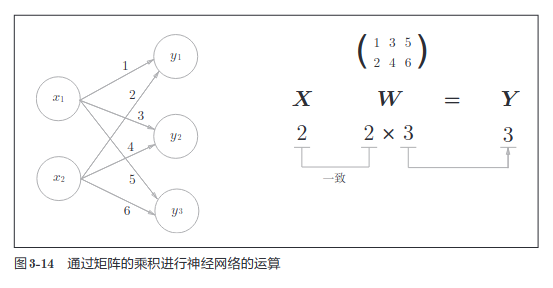

## 激活函数

$y$ = $h(b+w_1x_1 + w_2x_2)$  
b 是被称为偏置的参数，用于控制神经元被激活的容易程度；而 w1 和 w2
是表示各个信号的权重的参数，用于控制各个信号的重要性。


输入信号的总和会被函数 h(x) 转换，转换后的值就是输出 y。

刚才登场的 h（x）函数会将输入信号的总和转换为输出信号，这种函数
一般称为激活函数（activation function）。如“激活”一词所示，激活函数的
作用在于决定如何来激活输入信号的总和

### 阶跃函数
```
def step_function(x):
    if x > 0:
        return 1
    else:
        return 0
```
这个实现简单易于理解， 但参数x只能接受实数，但不能接受参数为 Numpy数组， 比如 `step_function(np.array([1.0 2.0]))`。 为了方便后面的操作， 我们把它改为支持 Numpy 数组的实现
```
def step_function(x):
    y = x > 0
    return y.astype(np.int)
```

### sigmod函数

神经网络中经常使用的一个激活函数就是sigmod函数

$h(x)$ = $1 \over 1 + exp(-x)$

```
def sigmod(x):
    return 1/(1 + np.exp(-x))
```

这个实现没有什么难度， 当 x 为 Numpy 数组时， 结果也是正确的

sigmoid 函数是一条平
滑的曲线，输出随着输入发生连续性的变化。而阶跃函数以 0 为界，输出发
生急剧性的变化。sigmoid 函数的平滑性对神经网络的学习具有重要意义

另一个不同点是，相对于阶跃函数只能返回 0 或 1，sigmoid 函数可以返
回 0.731 . . .、0.880 . . . 等实数（这一点和刚才的平滑性有关）。也就是说，感
知机中神经元之间流动的是 0 或 1 的二元信号，而神经网络中流动的是连续
的实数值信号。

阶跃函数和 sigmoid 函数还有其他共同点，就是两者均为非线性函数。
sigmoid 函数是一条曲线，阶跃函数是一条像阶梯一样的折线，两者都属于
非线性的函数

### ReLU函数
阶跃函数和 sigmoid 函数。在
神经网络发展的历史上，sigmoid 函数很早就开始被使用了，而最近则主要
使用 ReLU（Rectified Linear Unit）函数。
```
def relu(x):
    if x > 0:
        return x
    else:
        return 0

# 为了方便 numpy
def relu(x):
    return np.maximum(x, 0)
```

### 神经网络的内积



结点的个数对应着转换矩阵的列数， 每一列对应着一个结点的参数 
矩阵的行数对应着每个节点输入参数的个数

$a_1^{(1)}=w_{1 1}^{(1)}x_1+w_{1 2}^{(1)}x_2+b_1^{(1)}$

上角的 表示层数， (1) 表示为第一层的权重

下角的 第一个参数 表示 输出层的 第几个神经元
下角的 第二个参数 表示 输入层的 第几个神经元

整个神经网络的表示

```python
def init_network():
    network = {}
    network["w1"] = np.array([[0.1, 0.3, 0.5], [0.2, 0.4, 0.6]])
    network["b1"] = np.array([0.1, 0.2, 0.3])
    network["w2"] = np.array([[0.1, 0.4], [0.2, 0.5], [0.3, 0.6]])
    network["b2"] = np.array([0.1, 0.2])
    network["w3"] = np.array([[0.1, 0.3], [0.2, 0.4]])
    network["b3"] = np.array([0.1, 0.2])
    return network

def forward(network, x):
    W1, W2, W3 = network["w1"],network["w2"],network["w3"]
    b1, b2, b3 = network["b1"],network["b2"],network["b3"]

    a1 = np.dot(x, W1) + b1
    z1 = sigmod(a1)
    a2 = np.dot(z1, W2) + b2
    z2 = sigmod(a2)
    a3 = np.dot(z2, W3) + b3
    y = identity_function(a3)

    return y

if __name__ == "__main__":
    network = init_network()
    x = np.array([1.0, 0.5])
    y = forward(network, x)
    print(y)
```

这里定义了 init_network() 和 forward() 函数。init_network() 函数会进
行权重和偏置的初始化，并将它们保存在字典变量 network 中。这个字典变
量 network 中保存了每一层所需的参数（权重和偏置）。forward() 函数中则封
装了将输入信号转换为输出信号的处理过程。
另外，这里出现了 forward（前向）一词，它表示的是从输入到输出方向
的传递处理。后面在进行神经网络的训练时，我们将介绍后向（backward，
从输出到输入方向）的处理。
至此，神经网络的前向处理的实现就完成了。通过巧妙地使用 NumPy
多维数组，我们高效地实现了神经网络

### 输出层的设计
神经网络可以用在分类问题和回归问题上，不过需要根据情况改变输出
层的激活函数。一般而言，回归问题用恒等函数，分类问题用 softmax 函数。

恒等函数会将输入按原样输出，对于输入的信息，不加以任何改动地直
接输出。因此，在输出层使用恒等函数时，输入信号会原封不动地被输出。

#### 分类问题中使用softmax函数

$y_i = {{e^{a_k}} \over {\sum_{i=1}^ne^{a_i}}}$

假设输出层共有 n 个神经元，计算第 k 个神经元的输出 yk。 分子是输入信号 a k 的指数函数，分母是所有输入信号的指数
函数的和。
```
def softmax(a):
    exp_a = np.exp(a)
    sum_exp_a = np.sum(exp_a)
    y = exp_a / sum_exp_a
    return y
```

上面的 softmax 函数的实现虽然正确描述了公式，但在计算机的运算
上有一定的缺陷。这个缺陷就是溢出问题。softmax 函数的实现中要进行指
数函数的运算，但是此时指数函数的值很容易变得非常大。比如，$e^{10}$ 的值
会超过 20000，$e^{100}$ 会变成一个后面有 40 多个 0 的超大值，$e^{1000}$ 的结果会返回
一个表示无穷大的 inf。如果在这些超大值之间进行除法运算，结果会出现“不确定”的情况。

$y_k$ = $e^{a_k} \over {\sum_{i=1}^ne^{a_i}}$ = $Ce^{a^k} \over C \sum_{i=1}^ne^{a_i}$ 
= $e^{a_k + logC} \over \sum_{i=1}^ne^{a_i+logC}$ = $e^{a_k + C^*} \over \sum_{i=1}^ne^{a_i+C^*}$  

这说明，在进行 softmax 的指数函数的运算时，加上（或者减去）
某个常数并不会改变运算的结果。这里的 C  可以使用任何值，但是为了防
止溢出，一般会使用输入信号中的最大值。我们来看一个具体的例子。

```
>>> a = np.array([1010, 1000, 990])
>>> np.exp(a) / np.sum(np.exp(a)) # softmax 函数的运算
array([ nan, nan, nan]) # 没有被正确计算
>>>
>>> c = np.max(a) # 1010
>>> a - c
array([ 0, -10, -20])
>>>
>>> np.exp(a - c) / np.sum(np.exp(a - c))
array([ 9.99954600e-01, 4.53978686e-05, 2.06106005e-09])
```

所以现在可以修改一下 softmax 函数

```
def softmax(a):
    c = np.max(a)
    exp_a = np.exp(a - c) # 溢出对策
    sum_exp_a = np.sum(exp_a)
    y = exp_a / sum_exp_a
    return y
```

#### softmax 函数的特征
softmax 函数的输出是 0.0 到 1.0 之间的实数。并且，softmax
函数的输出值的总和是 1。输出总和为 1 是 softmax 函数的一个重要性质。正
因为有了这个性质，我们才可以把 softmax 函数的输出解释为“概率”

这里需要注意的是，即便使用了 softmax 函数，各个元素之间的大小关
系也不会改变。这是因为指数函数（y = exp(x)）是单调递增函数。实际上，
上例中 a 的各元素的大小关系和 y 的各元素的大小关系并没有改变。比如，a
的最大值是第 2 个元素，y 的最大值也仍是第 2 个元素。
一般而言，神经网络只把输出值最大的神经元所对应的类别作为识别结果。
并且，即便使用 softmax 函数，输出值最大的神经元的位置也不会变。因此，
神经网络在进行分类时，输出层的 softmax 函数可以省略。在实际的问题中，
由于指数函数的运算需要一定的计算机运算量，因此输出层的 softmax 函数
一般会被省略。

求解机器学习问题的步骤可以分为“学习”和“推理”两个阶段。首
先，在学习阶段进行模型的学习，然后，在推理阶段，用学到的
模型对未知的数据进行推理（分类）。如前所述，推理阶段一般会省
略输出层的 softmax 函数。在输出层使用 softmax 函数是因为它和
神经网络的学习有关系

#### 输出层的神经元数量
输出层的神经元数量需要根据待解决的问题来决定。对于分类问题，输
出层的神经元数量一般设定为类别的数量。比如，对于某个输入图像，预测
是图中的数字 0 到 9 中的哪一个的问题（10 类别分类问题），
将输出层的神经元设定为 10 个。

### 手写数字识别
我们使用学习到的参
数，先实现神经网络的“推理处理”。这个推理处理也称为神经网络的前向
传播（forward propagation）。

和求解机器学习问题的步骤（分成学习和推理两个阶段进行）一样，
使用神经网络解决问题时，也需要首先使用训练数据（学习数据）进
行权重参数的学习；进行推理时，使用刚才学习到的参数，对输入
数据进行分类。

#### MNIST数据集
这里使用的数据集是 MNIST 手写数字图像集。MNIST 是机器学习领域
最有名的数据集之一，被应用于从简单的实验到发表的论文研究等各种场合。
实际上，在阅读图像识别或机器学习的论文时，MNIST 数据集经常作为实
验用的数据出现。
MNIST 数据集是由 0 到 9 的数字图像构成的（图 3-24）。训练图像有 6 万张，
测试图像有 1 万张，这些图像可以用于学习和推理。MNIST 数据集的一般
使用方法是，先用训练图像进行学习，再用学习到的模型度量能在多大程度
上对测试图像进行正确的分类。

MNIST 的图像数据是 28 像素 × 28 像素的灰度图像（1 通道），各个像素
的取值在 0 到 255 之间。每个图像数据都相应地标有“7”“2”“1”等标签。

Python 有 pickle 这个便利的功能。这个功能可以将程序运行中的对
象保存为文件。如果加载保存过的 pickle 文件，可以立刻复原之前
程序运行中的对象。用于读入 MNIST 数据集的 load_mnist() 函数内
部也使用了 pickle 功能（在第 2 次及以后读入时）。利用 pickle 功能，
可以高效地完成 MNIST 数据的准备工作。

现在尝试显示一下 mnist 的数据， 见 display.py [Page 72]

```python
x, t = get_data()
network = init_network()
accuracy_cnt = 0
for i in range(len(x)):
 y = predict(network, x[i])
 p = np.argmax(y) # 获取概率最高的元素的索引
 if p == t[i]:
 accuracy_cnt += 1
print("Accuracy:" + str(float(accuracy_cnt) / len(x)))
```

#### 批处理
批处理对计算机的运算大有利处，可以大幅缩短每张图像的处理时
间。那么为什么批处理可以缩短处理时间呢？这是因为大多数处理
数值计算的库都进行了能够高效处理大型数组运算的最优化。并且，
在神经网络的运算中，当数据传送成为瓶颈时，批处理可以减轻数
据总线的负荷（严格地讲，相对于数据读入，可以将更多的时间用在
计算上）。也就是说，批处理一次性计算大型数组要比分开逐步计算
各个小型数组速度更快。

```python
x, t = get_data()
network = init_network()
batch_size = 100 # 批数量
accuracy_cnt = 0
for i in range(0, len(x), batch_size):
 x_batch = x[i:i+batch_size]
 y_batch = predict(network, x_batch)
 p = np.argmax(y_batch, axis=1)
 accuracy_cnt += np.sum(p == t[i:i+batch_size])
print("Accuracy:" + str(float(accuracy_cnt) / len(x)))
```


### 神经网络的推理处理

预处理在神经网络（深度学习）中非常实用，其有效性已在提高识别
性能和学习的效率等众多实验中得到证明。在刚才的例子中，作为
一种预处理，我们将各个像素值除以 255，进行了简单的正规化。
实际上，很多预处理都会考虑到数据的整体分布。比如，利用数据
整体的均值或标准差，移动数据，使数据整体以 0 为中心分布，或
者进行正规化，把数据的延展控制在一定范围内。除此之外，还有
将数据整体的分布形状均匀化的方法，即数据白化（whitening）等。