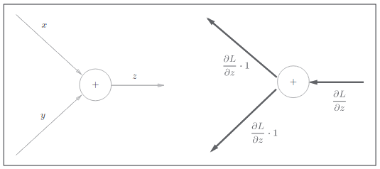
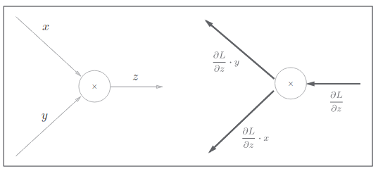
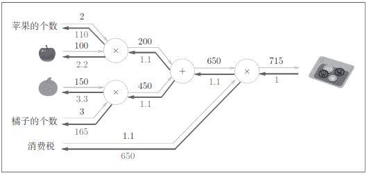
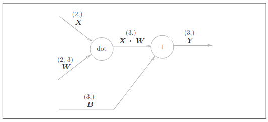
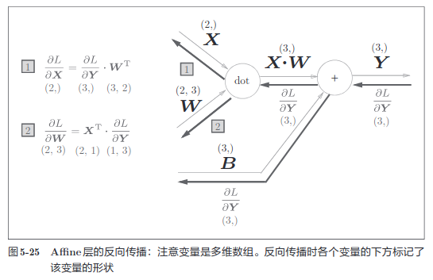
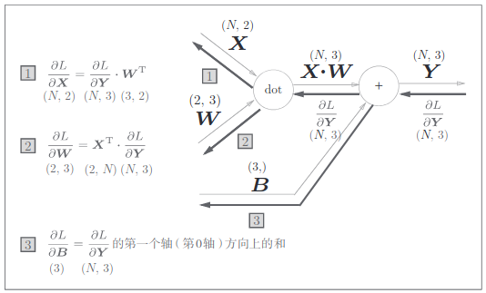
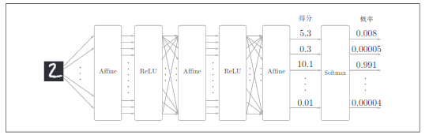

- [<font color=coral>反向传播法</font>](#font-colorcoral反向传播法font)
  - [<font color=deepskyblue>加法结点的反向传播</font>](#font-colordeepskyblue加法结点的反向传播font)
  - [<font color=deepskyblue>加法层的实现</font>](#font-colordeepskyblue加法层的实现font)
  - [<font color=deepskyblue>乘法结点的反向传播</font>](#font-colordeepskyblue乘法结点的反向传播font)
  - [<font color=deepskyblue>乘法层的实现</font>](#font-colordeepskyblue乘法层的实现font)
- [<font color=coral>激活函数层的实现</font>](#font-colorcoral激活函数层的实现font)
  - [<font color=deepskyblue>ReLU层的实现</font>](#font-colordeepskybluerelu层的实现font)
  - [<font color=deepskyblue>Sigmoid层的实现</font>](#font-colordeepskybluesigmoid层的实现font)
- [<font color=coral>Affine/Softmax层的实现</font>](#font-colorcoralaffinesoftmax层的实现font)
  - [<font color=deepskyblue>Affine层</font>](#font-colordeepskyblueaffine层font)
  - [<font color=deepskyblue>批版本的Affine层</font>](#font-colordeepskyblue批版本的affine层font)
  - [<font color=deepskyblue>Softmax-with-loss</font>](#font-colordeepskybluesoftmax-with-lossfont)
- [<font color=coral>误差反向传播法的实现</font>](#font-colorcoral误差反向传播法的实现font)
  - [<font color=deepskyblue>神经网络学习的全貌图</font>](#font-colordeepskyblue神经网络学习的全貌图font)
  - [<font color=deepskyblue>神经网络学习的全貌图</font>](#font-colordeepskyblue神经网络学习的全貌图font-1)
  - [<font color=deepskyblue>误差反向传播法 和 数值微分的 比较</font>](#font-colordeepskyblue误差反向传播法-和-数值微分的-比较font)
  - [<font color=deepskyblue>使用误差反向传播法学习</font>](#font-colordeepskyblue使用误差反向传播法学习font)

## <font color=coral>反向传播法</font>
### <font color=deepskyblue>加法结点的反向传播</font>
对于 $z = x + y$ 的导数可得下式：
$${ \theta z \over \theta x }= 1 $$
$${ \theta z \over \theta y }= 1 $$



### <font color=deepskyblue>加法层的实现</font>
层的实现中有两个共通的方法（接口）forward() 和 backward()。forward()
对应正向传播，backward() 对应反向传播
```python
class MulLayer:
    def __init__(self):
        self.x = None
        self.y = None
    
    def forward(self, x, y):
        self.x = x
        self.y = y
        out = x * y
        return out

    def backward(self, dout):
        dx = dout * self.y # 翻转 x 和 y
        dy = dout * self.x
        return dx, dy
```
使用这个乘法层的正向传播
```python
apple = 100
apple_num = 2
tax = 1.1

# layer
mul_apple_layer = MulLayer()
mul_tax_layer = MulLayer()

#forward
apple_price = mul_apple_layer.forward(apple, apple_num)
price = mul_tax_layer.forward(apple_price, tax)

print(price)
```
对于各个变量的导数可由 backward() 求出
```
# backward
dprice = 1
dapple_price, dtax = mul_tax_layer.backward(dprice)
dapple, dapple_num = mul_apple_layer.backward(dapple_price)

print(dapple, dapple_num, dtax)
```

### <font color=deepskyblue>乘法结点的反向传播</font>
对于 $z=xy$ 的导数可得下式
$${ \theta z \over \theta x }= y$$
$${ \theta z \over \theta x }= x$$




### <font color=deepskyblue>乘法层的实现</font>
```python
class AddLayer:
    def __init__(self):
        pass
    
    def forward(self, x, y):
        out = x + y
        return out

    def backward(self, dout):
        dx = dout
        dy = dout
        return dx, dy
```
以这个流程为例  


```python
apple = 100
apple_num = 2
orange = 150
orange_num = 3
tax = 1.1

# layer
mul_apple_layer = MulLayer()
mul_orange_layer = MulLayer()
add_apple_orange_layer = AddLayer()
mul_tax_layer = MulLayer

# forward
apple_price = mul_apple_layer.forward(apple, apple_num)
orange_price = mul_orange_layer.forward(orange, orange_num)
all_price = add_apple_orange_layer.forward(apple_price, orange_price)
price = mul_tax_layer.forward(all_price, tax)

# backward
dprice = 1
dall_price, dtax = mul_tax_layer.backward(dprice)
dapple_price, dorange_price = add_apple_orange_layer.backward(dall_price)
dorange, dorange_num = mul_orange_layer.backward(dorange_price)
dapple, dapple_num = mul_apple_layer.backward(dapple_price)
```

## <font color=coral>激活函数层的实现</font>
现在，我们将计算图的思路应用到神经网络中。这里，我们把构成神经
网络的层实现为一个类。先来实现激活函数的 ReLU 层和 Sigmoid 层。

### <font color=deepskyblue>ReLU层的实现</font>

激活函数 ReLU（Rectified Linear Unit）由下式表示
$$y=\begin{cases}
x & (x > 0) \\
0 & (x \le 0)    
\end{cases}$$

可以求出y关于x的导数
$${\theta y \over \theta x} = \begin{cases}
    1 & (x > 0) \\
    0 & (x \le 0)
\end{cases}$$

```python
class Relu:
    def __init__(self):
        self.mask = None

    def forward(self, x):
        self.mask = (x <= 0)
        out = x.copy()
        out[self.mask] = 0
        return out

    def backward(self, dout):
        dout[self.mask] = 0
        dx = dout
        return dx
```

Relu 类有实例变量 mask。这个变量 mask 是由 True/False 构成的 NumPy 数
组，它会把正向传播时的输入 x 的元素中小于等于 0 的地方保存为 True，其
他地方（大于 0 的元素）保存为 False。

```
>>> x = np.array( [[1.0, -0.5], [-2.0, 3.0]] )
>>> print(x)
[[ 1. -0.5]
[-2. 3. ]]
>>> mask = (x <= 0)
>>> print(mask)
[[False True]
[ True False]]
```

### <font color=deepskyblue>Sigmoid层的实现</font>
sigmoid函数的表示
$$y={1 \over 1 + e^{-x}}$$

求导可得
$${\theta y \over \theta x} = {e^{-x} \over (1+e^{-x})^2} = y(1-y)$$

实现方法
```python
class Sigmoid:
    def __init__(self):
        self.out = None

    def forward(self, x):
        out = 1 / (1 + np.exp(-x))
        self.out = out
        return out

    def backward(self, dout):
        dx = dout * (1.0 - self.out) * self.out
        return dx
```

## <font color=coral>Affine/Softmax层的实现</font>
### <font color=deepskyblue>Affine层</font>
神经网络的正向传播中进行的矩阵的乘积运算在几何学领域被称为“仿
射变换”A。因此，这里将进行仿射变换的处理实现为“Affine 层”
  
Affine层的计算图

在将这里进行的求矩阵的乘积与偏置的和的运算用计算图表示出来。
将乘积运算用“dot”节点表示的话，则 **np.dot(X, W) + B** 的运算可用上图
所示的计算图表示出来。另外，在各个变量的上方标记了它们的形状（比如，
计算图上显示了 X 的形状为 (2,)，X·W 的形状为 (3,) 等）。

现在我们来考虑图 5-24 的计算图的反向传播。以矩阵为对象的反向传播，
按矩阵的各个元素进行计算时，步骤和以标量为对象的计算图相同。实际写
一下的话，可以得到下式
$${\theta L \over \theta X} = {\theta L \over \theta Y} * W^T$$
$${\theta L \over \theta X} = X^T * {\theta L \over \theta Y}$$



### <font color=deepskyblue>批版本的Affine层</font>
前面介绍的Affine层的输入 X 是以单个数据为对象的。现在我们考虑 N
个数据一起进行正向传播的情况，也就是批版本的 Affine层。



与刚刚不同的是，现在输入 X 的形状是 (N, 2)。之后就和前面一样，在
计算图上进行单纯的矩阵计算。反向传播时，如果注意矩阵的形状，就可以
和前面一样推导出 ${\theta L \over \theta X}$ 和 ${\theta L \over \theta W}$。  

加上偏置时，需要特别注意。正向传播时，偏置被加到 X·W 的各个
数据上。比如，N = 2（数据为 2 个）时，偏置会被分别加到这 2 个数据（各自
的计算结果）上，具体的例子如下所示。

```
>>> X_dot_W = np.array([[0, 0, 0], [10, 10, 10]])
>>> B = np.array([1, 2, 3])
>>>
>>> X_dot_W
array([[ 0, 0, 0],
[ 10, 10, 10]])
>>> X_dot_W + B
array([[ 1, 2, 3],
[11, 12, 13]])
```

正向传播时，偏置会被加到每一个数据（第 1 个、第 2 个......）上。因此，
反向传播时，各个数据的反向传播的值需要汇总为偏置的元素。用代码表示
的话，如下所示。

```
>>> dY = np.array([[1, 2, 3,], [4, 5, 6]])
>>> dY
array([[1, 2, 3],
[4, 5, 6]])
>>>
>>> dB = np.sum(dY, axis=0)
>>> dB
array([5, 7, 9])
```

综上所述，Affine 的实现如下所示。

```python
class Affine:
    def __init__(self, W, b):
        self.W = W
        self.b = b
        self.x = None
        self.dW = None
        self.db = None

    def forward(self, x):
        self.x = x
        out = np.dot(x, self.W) + self.b
        return out

    def backward(self, dout):
        dx = np.dot(dout, self.W.T)
        self.dW = np.dot(self.x.T, dout)
        self.db = np.sum(dout, axis=0)
        return dx
```

### <font color=deepskyblue>Softmax-with-loss</font>

最后介绍一下输出层的 softmax 函数。前面我们提到过，softmax 函数
会将输入值正规化之后再输出。比如手写数字识别时，Softmax 层的输出如下



输入图像通过 Affine层和 ReLU 层进行转换，10 个输入通过 Softmax 层进行正
规化。在这个例子中，“0”的得分是 5.3，这个值经过 Softmax 层转换为 0.008
（0.8%）；“2”的得分是 10.1，被转换为 0.991（99.1%）

下面来实现 Softmax 层。考虑到这里也包含作为损失函数的交叉熵误
差（cross entropy error），所以称为“Softmax-with-Loss 层”。Softmax-with-
Loss 层（Softmax 函数和交叉熵误差）的计算图如图 5-29 所示。

softmax 函 数 记 为 Softmax 层，交 叉 熵 误 差 记 为
Cross Entropy Error 层。这里假设要进行 3 类分类，从前面的层接收 3 个输
入（得分）。如图 5-30 所示，Softmax 层将输入（a1, a2, a3）正规化，输出（y1,
y2, y3）。Cross Entropy Error 层接收 Softmax 的输出（y1, y2, y3）和教师标签（t1,
t2, t3），从这些数据中输出损失 L


Softmax 层的反向传播得到了
（y1 − t1, y2 − t2, y3 − t3）这样“漂亮”的结果。由于（y1, y2, y3）是 Softmax 层的
输出，（t1, t2, t3）是监督数据，所以（y1 − t1, y2 − t2, y3 − t3）是 Softmax 层的输
出和教师标签的差分。

```python
class SoftmaxWithLoss:
    def __init__(self):
        self.loss = None # 损失
        self.y = None # softmax 的输出
        self.t = None # 监督数据（one-hot vector）

    def forward(self, x, t):
        self.t = t
        self.y = softmax(x)
        self.loss = cross_entropy_error(self.y, self.t)
        return self.loss

    def backward(self, dout=1):
        batch_size = self.t.shape[0]
        dx = (self.y - self.t) / batch_size
        return dx
```

## <font color=coral>误差反向传播法的实现</font>
### <font color=deepskyblue>神经网络学习的全貌图</font>

+ 前提  
神经网络中有合适的权重和偏置，调整权重和偏置以便拟合训练数据的
过程称为学习。神经网络的学习分为下面 4 个步骤。
+ **步骤 1（mini-batch）**  
从训练数据中随机选择一部分数据。
+ **步骤 2（计算梯度）**  
计算损失函数关于各个权重参数的梯度。
+ **步骤 3（更新参数）**  
将权重参数沿梯度方向进行微小的更新。
+ **步骤 4（重复）**  
重复步骤 1、步骤 2、步骤 3

之前介绍的误差反向传播法会在步骤 2 中出现。上一章中，我们利用数
值微分求得了这个梯度。数值微分虽然实现简单，但是计算要耗费较多的时
间。和需要花费较多时间的数值微分不同，误差反向传播法可以快速高效地
计算梯度。

### <font color=deepskyblue>神经网络学习的全貌图</font>
误差反向传播法 TwoLayerNet 的代码实现
```python
import sys, os
sys.path.append(os.pardir)
import numpy as np
from common.layers import *
from common.gradient import numerical_gradient
from collections import OrderedDict

class TwoLayerNet:
    def __init__(self, input_size, hidden_size, output_size,
        weight_init_std=0.01):
        # 初始化权重
        self.params = {}
        self.params['W1'] = weight_init_std * \
                            np.random.randn(input_size, hidden_size)
        self.params['b1'] = np.zeros(hidden_size)
        self.params['W2'] = weight_init_std * \ 
                            np.random.randn(hidden_size, output_size)
        self.params['b2'] = np.zeros(output_size)
        
        # 生成层
        self.layers = OrderedDict()
        self.layers['Affine1'] = Affine(self.params['W1'], self.params['b1'])
        self.layers['Relu1'] = Relu()
        self.layers['Affine2'] = Affine(self.params['W2'], self.params['b2'])
        self.lastLayer = SoftmaxWithLoss()

    def predict(self, x):
        for layer in self.layers.values():
            x = layer.forward(x)
        return x
    
    # x: 输入数据 , t: 监督数据
    def loss(self, x, t):
        y = self.predict(x)
        return self.lastLayer.forward(y, t)

    def accuracy(self, x, t):
        y = self.predict(x)
        y = np.argmax(y, axis=1)
        if t.ndim != 1 : t = np.argmax(t, axis=1)
            accuracy = np.sum(y == t) / float(x.shape[0])
        return accuracy

    # x: 输入数据 , t: 监督数据
    def numerical_gradient(self, x, t):
        loss_W = lambda W: self.loss(x, t)
        grads = {}
        grads['W1'] = numerical_gradient(loss_W, self.params['W1'])
        grads['b1'] = numerical_gradient(loss_W, self.params['b1'])
        grads['W2'] = numerical_gradient(loss_W, self.params['W2'])
        grads['b2'] = numerical_gradient(loss_W, self.params['b2'])
        return grads

    def gradient(self, x, t):
        # forward
        self.loss(x, t)
        # backward
        dout = 1
        dout = self.lastLayer.backward(dout)
        layers = list(self.layers.values())
        layers.reverse()
        for layer in layers:
            dout = layer.backward(dout)
            # 设定
            grads = {}
            grads['W1'] = self.layers['Affine1'].dW
            grads['b1'] = self.layers['Affine1'].db
            grads['W2'] = self.layers['Affine2'].dW
            grads['b2'] = self.layers['Affine2'].db
        return grads
```

### <font color=deepskyblue>误差反向传播法 和 数值微分的 比较</font>
一种是基于数值微分的方
法，另一种是解析性地求解数学式的方法。后一种方法通过使用误差反向传
播法，即使存在大量的参数，也可以高效地计算梯度。

数值微分的计算很耗费时间，而且如果有误差反向传播法的（正确的）
实现的话，就没有必要使用数值微分的实现了。那么数值微分有什么用呢？
实际上，在确认误差反向传播法的实现是否正确时，是需要用到数值微分的。

数值微分的优点是实现简单，因此，一般情况下不太容易出错。而误差
反向传播法的实现很复杂，容易出错。所以，经常会比较数值微分的结果和
误差反向传播法的结果，以确认误差反向传播法的实现是否正确。确认数值
微分求出的梯度结果和误差反向传播法求出的结果是否一致（严格地讲，是
非常相近）的操作称为梯度确认（gradient check）。梯度确认的代码实现如下
所示（源代码在 ch05/gradient_check.py 中）。

```python
import sys, os
sys.path.append(os.pardir)
import numpy as np
from dataset.mnist import load_mnist
from two_layer_net import TwoLayerNet

# 读入数据
(x_train, t_train), (x_test, t_test) = \ load_mnist(normalize=True, one_hot_label = True)
network = TwoLayerNet(input_size=784, hidden_size=50, output_size=10)
x_batch = x_train[:3]
t_batch = t_train[:3]
grad_numerical = network.numerical_gradient(x_batch, t_batch)
grad_backprop = network.gradient(x_batch, t_batch)

# 求各个权重的绝对误差的平均值
for key in grad_numerical.keys():
    diff = np.average( np.abs(grad_backprop[key] - grad_numerical[key]) )
    print(key + ":" + str(diff))
```

### <font color=deepskyblue>使用误差反向传播法学习</font>
最后，我们来看一下使用了误差反向传播法的神经网络的学习的实现。
```python
import sys, os
sys.path.append(os.pardir)
import numpy as np
from dataset.mnist import load_mnist
from two_layer_net import TwoLayerNet

# 读入数据
(x_train, t_train), (x_test, t_test) = \
        load_mnist(normalize=True, one_hot_label=True)

network = TwoLayerNet(input_size=784, hidden_size=50, output_size=10)

iters_num = 10000
train_size = x_train.shape[0]
batch_size = 100
learning_rate = 0.1
train_loss_list = []
train_acc_list = []
test_acc_list = []

iter_per_epoch = max(train_size / batch_size, 1)

for i in range(iters_num):
    batch_mask = np.random.choice(train_size, batch_size)
    x_batch = x_train[batch_mask]
    t_batch = t_train[batch_mask]

    # 通过误差反向传播法求梯度
    grad = network.gradient(x_batch, t_batch)

    # 更新
    for key in ('W1', 'b1', 'W2', 'b2'):
        network.params[key] -= learning_rate * grad[key]
    
    loss = network.loss(x_batch, t_batch)
    train_loss_list.append(loss)

    if i % iter_per_epoch == 0:
        train_acc = network.accuracy(x_train, t_train)
        test_acc = network.accuracy(x_test, t_test)
        train_acc_list.append(train_acc)
        test_acc_list.append(test_acc)
        print(train_acc, test_acc)
```