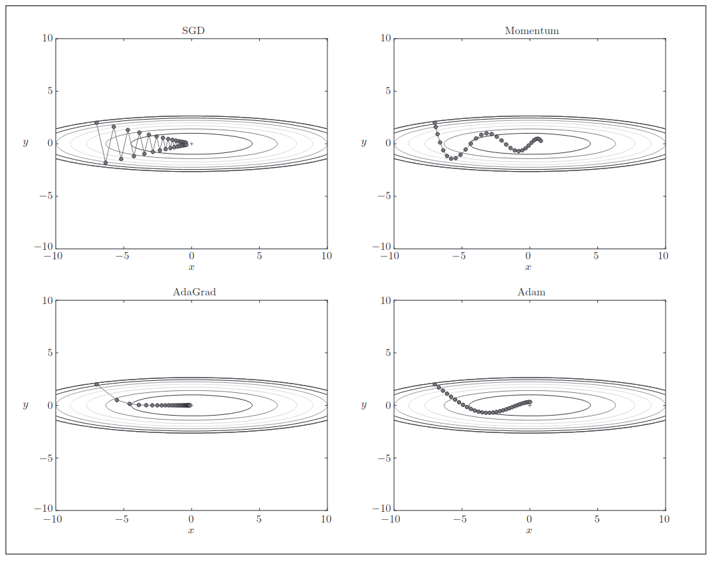
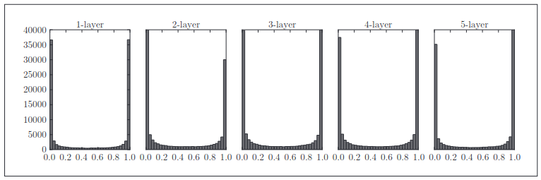
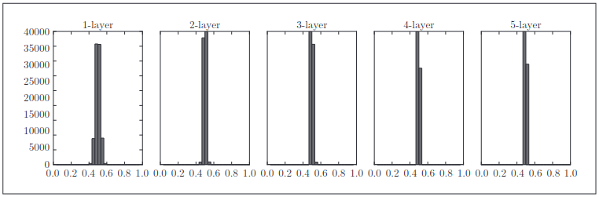
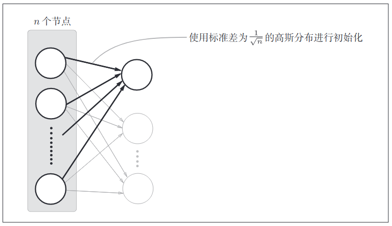
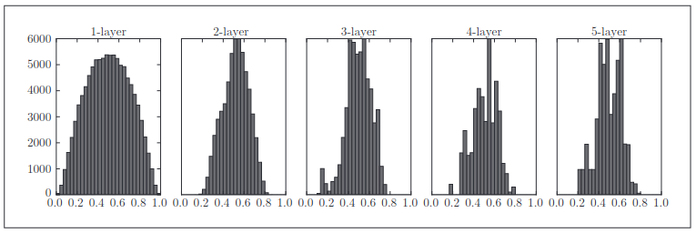
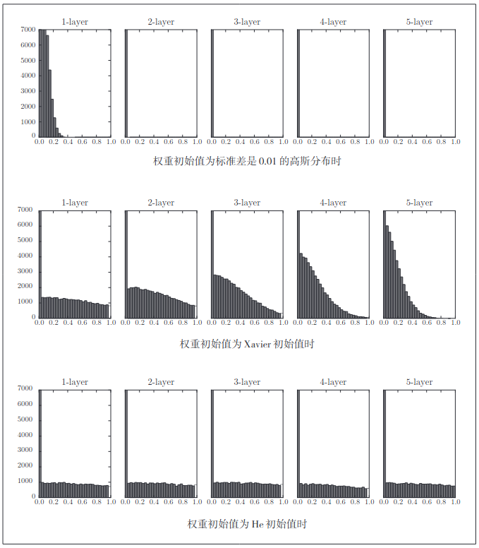
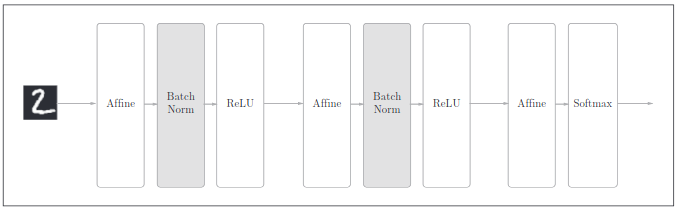
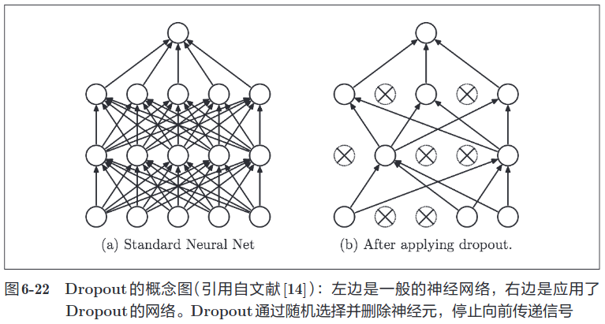

- [<font color=coral>参数的更新</font>](#font-colorcoral参数的更新font)
  - [<font color=deepskyblue>SGD 随机梯度下降法</font>](#font-colordeepskybluesgd-随机梯度下降法font)
  - [<font color=deepskyblue>Momentum</font>](#font-colordeepskybluemomentumfont)
  - [<font color=deepskyblue>AdaGrad</font>](#font-colordeepskyblueadagradfont)
  - [<font color=deepskyblue>Adam</font>](#font-colordeepskyblueadamfont)
  - [<font color=deepskyblue>几种方法的比较</font>](#font-colordeepskyblue几种方法的比较font)
- [<font color=coral>权重的初始值</font>](#font-colorcoral权重的初始值font)
  - [<font color=deepskyblue>可以将权重初始值设为0吗</font>](#font-colordeepskyblue可以将权重初始值设为0吗font)
  - [<font color=deepskyblue>隐藏层的激活值的分布</font>](#font-colordeepskyblue隐藏层的激活值的分布font)
  - [<font color=deepskyblue>ReLU的权重初始值</font>](#font-colordeepskybluerelu的权重初始值font)
- [<font color=deepskyblue>Batch Normalization</font>](#font-colordeepskybluebatch-normalizationfont)
  - [<font color=deepskyblue>Batch Normalication 的算法</font>](#font-colordeepskybluebatch-normalication-的算法font)
- [<font color=coral>正则化</font>](#font-colorcoral正则化font)
  - [<font color=deepskyblue>过拟合</font>](#font-colordeepskyblue过拟合font)
  - [<font color=deepskyblue>权值衰减</font>](#font-colordeepskyblue权值衰减font)
  - [<font color=deepskyblue>Dropout</font>](#font-colordeepskybluedropoutfont)
- [<font color=coral>超参数的验证</font>](#font-colorcoral超参数的验证font)
  - [<font color=deepskyblue>验证数据</font>](#font-colordeepskyblue验证数据font)
  - [<font color=deepskyblue>超参数的最优化</font>](#font-colordeepskyblue超参数的最优化font)
  - [<font color=deepskyblue>超参数最优化的实现</font>](#font-colordeepskyblue超参数最优化的实现font)

## <font color=coral>参数的更新</font>
### <font color=deepskyblue>SGD 随机梯度下降法</font>
SGD的更新方式如下式
$$W \leftarrow \eta {\theta L \over \theta W}$$
这里把需要更新的权重参数记为$W$，把损失函数关于$W$的梯度记为 $\theta L \over \theta W$。  
$\eta$ 表示学习率，实际上会取 0.01 或 0.001 这些事先决定好的值。

虽然 SGD 简单，并且容易实现，但是在解决某些问题时可能没有效率。
这里，在指出 SGD 的缺点之际，我们来思考一下求下面这个函数的最小值
的问题。
$$f(x,y)={1\over20}x^2 + y^2$$

这个梯度的特征是，y 轴方向上大，x 轴方向上小。换句话说，
就是 y 轴方向的坡度大，而 x 轴方向的坡度小。这里需要注意的是，虽然式
（6.2）的最小值在 (x, y) = (0, 0) 处，但是图 6-2 中的梯度在很多地方并没有指
向 (0, 0)。

我们来尝试对图 6-1 这种形状的函数应用 SGD。从 (x, y) = (−7.0, 2.0) 处
（初始值）开始搜索，结果如图 6-3 所示。
在图 6-3 中，SGD 呈“之”字形移动。这是一个相当低效的路径。也就是说，
SGD 的缺点是，如果函数的形状非均向（anisotropic），比如呈延伸状，搜索
的路径就会非常低效。因此，我们需要比单纯朝梯度方向前进的 SGD 更聪
明的方法。SGD 低效的根本原因是，梯度的方向并没有指向最小值的方向

### <font color=deepskyblue>Momentum</font>
Momentum 是“动量”的意思，和物理有关。用数学式表示 Momentum 方
法，如下所示。
$$v \leftarrow \alpha v-\eta {\theta L \over \theta W}$$
$$W \leftarrow W + v$$
和前面的 SGD 一样，W 表示要更新的权重参数， 表示损失函数关
于 W 的梯度，η 表示学习率。这里新出现了一个变量 v，对应物理上的速度。
式（6.3）表示了物体在梯度方向上受力，在这个力的作用下，物体的速度增
加这一物理法则。如图 6-4 所示，Momentum 方法给人的感觉就像是小球在
地面上滚动。

### <font color=deepskyblue>AdaGrad</font>
在神经网络的学习中，学习率（数学式中记为 η）的值很重要。学习率过小，
会导致学习花费过多时间；反过来，学习率过大，则会导致学习发散而不能
正确进行。

在关于学习率的有效技巧中，有一种被称为**学习率衰减**（learning rate
decay）的方法，即随着学习的进行，使学习率逐渐减小。实际上，一开始“多”
学，然后逐渐“少”学的方法，在神经网络的学习中经常被使用。

逐渐减小学习率的想法，相当于将“全体”参数的学习率值一起降低。
而 AdaGrad 进一步发展了这个想法，针对“一个一个”的参数，赋予其“定
制”的值。

AdaGrad 会为参数的每个元素适当地调整学习率，与此同时进行学习
（AdaGrad 的 Ada 来自英文单词 Adaptive，即“适当的”的意思）。下面，让
我们用数学式表示 AdaGrad 的更新方法。
$$h \leftarrow h+{\theta L \over \theta W} * {\theta L \over \theta W}$$
$$W \leftarrow W-\eta {1 \over \sqrt{h}}{\theta L \over \theta W}$$

和前面的 SGD 一样，W 表示要更新的权重参数， $\theta L \over \theta W$表示损失函数关
于 W 的梯度，η 表示学习率。这里新出现了变量 h，如式 (6.5) 所示，它保
存了以前的所有梯度值的平方和（式（6.5）中的  表示对应矩阵元素的乘法）。
然后，在更新参数时，通过乘以$1 \over \sqrt{h}$ ，就可以调整学习的尺度。这意味着，
参数的元素中变动较大（被大幅更新）的元素的学习率将变小。也就是说，
可以按参数的元素进行学习率衰减，使变动大的参数的学习率逐渐减小。

AdaGrad 会记录过去所有梯度的平方和。因此，学习越深入，更新
的幅度就越小。实际上，如果无止境地学习，更新量就会变为 0，
完 全 不 再 更 新。为 了 改 善 这 个 问 题，可 以 使 用 RMSProp [7] 方 法。
RMSProp 方法并不是将过去所有的梯度一视同仁地相加，而是逐渐
地遗忘过去的梯度，在做加法运算时将新梯度的信息更多地反映出来。
这种操作从专业上讲，称为“指数移动平均”，呈指数函数式地减小
过去的梯度的尺度。

### <font color=deepskyblue>Adam</font> 
Momentum 参照小球在碗中滚动的物理规则进行移动，AdaGrad 为参
数的每个元素适当地调整更新步伐。如果将这两个方法融合在一起会怎么样呢？这就是Adam方法的基本思路。

Adam 是 2015 年提出的新方法。它的理论有些复杂，直观地讲，就是融
合了 Momentum 和 AdaGrad 的方法。通过组合前面两个方法的优点，有望
实现参数空间的高效搜索。此外，进行超参数的“偏置校正”也是 Adam 的特征。
这里不再进行过多的说明，详细内容请参考原作者的论文。关于 Python
的实现，common/optimizer.py 中将其实现为了 Adam 类，有兴趣的读者可以参考

### <font color=deepskyblue>几种方法的比较</font>
根据使用的方法不同，参数更新的路径也不同。只看这
个图的话，AdaGrad 似乎是最好的，不过也要注意，结果会根据要解决的问
题而变。并且，很显然，超参数（学习率等）的设定值不同，结果也会发生变化。


很多研究中至今仍在使用 SGD。Momentum 和 AdaGrad 也是值得一试
的方法。最近，很多研究人员和技术人员都喜欢用 Adam。本书将主要使用
SGD 或者 Adam，读者可以根据自己的喜好多多尝试。

## <font color=coral>权重的初始值</font>

在神经网络的学习中，权重的初始值特别重要。实际上，设定什么样的
权重初始值，经常关系到神经网络的学习能否成功。本节将介绍权重初始值
的推荐值，并通过实验确认神经网络的学习是否会快速进行。

### <font color=deepskyblue>可以将权重初始值设为0吗</font>
后面我们会介绍抑制过拟合、提高泛化能力的技巧——权值衰减（weight
decay）。简单地说，权值衰减就是一种以减小权重参数的值为目的进行学习
的方法。通过减小权重参数的值来抑制过拟合的发生。  

如果想减小权重的值，一开始就将初始值设为较小的值才是正途。实际上，
在这之前的权重初始值都是像 0.01 * np.random.randn(10, 100) 这样，使用
由高斯分布生成的值乘以 0.01 后得到的值（标准差为 0.01 的高斯分布）。
如果我们把权重初始值全部设为 0 以减小权重的值，会怎么样呢？从结
论来说，将权重初始值设为 0 不是一个好主意。事实上，将权重初始值设为
0 的话，将无法正确进行学习。  

为什么不能将权重初始值设为 0 呢？严格地说，为什么不能将权重初始
值设成一样的值呢？这是因为在误差反向传播法中，所有的权重值都会进行
相同的更新。比如，在 2 层神经网络中，假设第 1 层和第 2 层的权重为 0。这
样一来，正向传播时，因为输入层的权重为 0，所以第 2 层的神经元全部会
被传递相同的值。第 2 层的神经元中全部输入相同的值，这意味着反向传播
时第 2 层的权重全部都会进行相同的更新（回忆一下“乘法节点的反向传播”的内容）。
因此，权重被更新为相同的值，并拥有了对称的值（重复的值）。
这使得神经网络拥有许多不同的权重的意义丧失了。为了防止“权重均一化”
（严格地讲，是为了瓦解权重的对称结构），必须随机生成初始值。

### <font color=deepskyblue>隐藏层的激活值的分布</font>
观察隐藏层的激活值 A（激活函数的输出数据）的分布，可以获得很多启
发。这里，我们来做一个简单的实验，观察权重初始值是如何影响隐藏层的
激活值的分布的。这里要做的实验是，向一个 5 层神经网络（激活函数使用
sigmoid 函数）传入随机生成的输入数据，用直方图绘制各层激活值的数据分
布。这个实验参考了斯坦福大学的课程 CS231n。

进行实验的源代码在 ch06/weight_init_activation_histogram.py 中，下
面展示部分代码。

```python
import numpy as np
import matplotlib.pyplot as plt

def sigmoid(x):
    return 1 / (1 + np.exp(-x))

x = np.random.randn(1000, 100) # 1000 个数据, 生成一个 1000*100 的二维随机矩阵

node_num = 100 # 各隐藏层的节点（神经元）数
hidden_layer_size = 5 # 隐藏层有 5 层
activations = {} # 激活值的结果保存在这里

for i in range(hidden_layer_size):
    if i != 0:
        x = activations[i-1]

    w = np.random.randn(node_num, node_num) * 1 # 生成 100 * 100 的随机矩阵

    z = np.dot(x, w)
    a = sigmoid(z) # sigmoid 函数
    activations[i] = a
```

**notice**： numpy.random.randn(d1, d2, d3, ... ,dn)
+ randn函数返回一个或一组样本， 具有标准正态分布
+ dn 表示每个维度的长度
+ 返回值为指定维度的 array

这里假设神经网络有 5 层，每层有 100 个神经元。然后，用高斯分布随
机生成 1000 个数据作为输入数据，并把它们传给 5 层神经网络。激活函数使
用 sigmoid 函数，各层的激活值的结果保存在 activations 变量中。这个代码
段中需要注意的是权重的尺度。虽然这次我们使用的是标准差为 1 的高斯分
布，但实验的目的是通过改变这个尺度（标准差），观察激活值的分布如何变
化。现在，我们将保存在 activations 中的各层数据画成直方图。



从图 6-10 可知，各层的激活值呈偏向 0 和 1 的分布。这里使用的 sigmoid
函数是 S 型函数，随着输出不断地靠近 0（或者靠近 1），它的导数的值逐渐接
近 0。因此，偏向 0 和 1 的数据分布会造成反向传播中梯度的值不断变小，最
后消失。这个问题称为梯度消失（gradient vanishing）。层次加深的深度学习
中，梯度消失的问题可能会更加严重。

下面，将权重的标准差设为 0.01，进行相同的实验。实验的代码只需要
把设定权重初始值的地方换成下面的代码即可。
```python
# w = np.random.randn(node_num, node_num) * 1
w = np.random.randn(node_num, node_num) * 0.01
```

来看一下结果。使用标准差为 0.01 的高斯分布时，各层的激活值的分布
如图 6-11 所示。



这次呈集中在 0.5 附近的分布。因为不像刚才的例子那样偏向 0 和 1，所
以不会发生梯度消失的问题。但是，激活值的分布有所偏向，说明在表现力
上会有很大问题。为什么这么说呢？因为如果有多个神经元都输出几乎相同
的值，那它们就没有存在的意义了。比如，如果 100 个神经元都输出几乎相
同的值，那么也可以由 1 个神经元来表达基本相同的事情。因此，激活值在
分布上有所偏向会出现“表现力受限”的问题。

各层的激活值的分布都要求有适当的广度。为什么呢？因为通过
在各层间传递多样性的数据，神经网络可以进行高效的学习。反
过来，如果传递的是有所偏向的数据，就会出现梯度消失或者“表
现力受限”的问题，导致学习可能无法顺利进行。

接着，我们尝试使用 Xavier Glorot 等人的论文 [9] 中推荐的权重初始值（俗
称“Xavier 初始值”）。现在，在一般的深度学习框架中，Xavier 初始值已被
作为标准使用。比如，Caffe 框架中，通过在设定权重初始值时赋予 xavier 参数，
就可以使用 Xavier 初始值。

Xavier 的论文中，为了使各层的激活值呈现出具有相同广度的分布，推导了合适的权重尺度。推导出的结论是，如果前一层的节点数为 n，则初始
值使用标准差为$1 \over \sqrt{n}$的分布



使用 Xavier 初始值后，前一层的节点数越多，要设定为目标节点的初始
值的权重尺度就越小。现在，我们使用 Xavier 初始值进行实验。进行实验的
代码只需要将设定权重初始值的地方换成如下内容即可（因为此处所有层的
节点数都是 100，所以简化了实现）。
```python
node_num = 100 # 前一层的节点数
w = np.random.randn(node_num, node_num) / np.sqrt(node_num)
```

使用 Xavier 初始值后的结果如图 6-13 所示。从这个结果可知，越是后
面的层，图像变得越歪斜，但是呈现了比之前更有广度的分布。因为各层间
传递的数据有适当的广度，所以 sigmoid 函数的表现力不受限制，有望进行
高效的学习。



图 6-13 的分布中，后面的层的分布呈稍微歪斜的形状。如果用 tanh
函数（双曲线函数）代替 sigmoid 函数，这个稍微歪斜的问题就能得
到改善。实际上，使用 tanh 函数后，会呈漂亮的吊钟型分布。tanh
函数和 sigmoid 函数同是 S 型曲线函数，但 tanh 函数是关于原点 (0, 0)
对称的 S 型曲线，而 sigmoid 函数是关于 (x, y)=(0, 0.5) 对称的 S 型曲
线。众所周知，用作激活函数的函数最好具有关于原点对称的性质。

### <font color=deepskyblue>ReLU的权重初始值</font>

Xavier 初始值是以激活函数是线性函数为前提而推导出来的。因为
sigmoid 函数和 tanh 函数左右对称，且中央附近可以视作线性函数，所以适
合使用 Xavier 初始值。

但当激活函数使用 ReLU 时，一般推荐使用 ReLU 专
用的初始值，也就是 Kaiming He 等人推荐的初始值，也称为“He 初始值”。
当前一层的节点数为 n 时，He 初始值使用标准差为$\sqrt{2 \over n}$的高斯分布。当
Xavier 初始值是 时，（直观上）可以解释为，因为 ReLU 的负值区域的值
为 0，为了使它更有广度，所以需要 2 倍的系数。

现在来看一下激活函数使用 ReLU 时激活值的分布。我们给出了 3 个实
验的结果（图 6-14），依次是权重初始值为标准差是 0.01 的高斯分布（下文简
写为“std = 0.01”）时、初始值为 Xavier 初始值时、初始值为 ReLU 专用的
“He 初始值”时的结果。



观察实验结果可知，当“std = 0.01”时，各层的激活值非常小 A。神经网
络上传递的是非常小的值，说明逆向传播时权重的梯度也同样很小。这是很
严重的问题，实际上学习基本上没有进展。

接下来是初始值为 Xavier 初始值时的结果。在这种情况下，随着层的加深，
偏向一点点变大。实际上，层加深后，激活值的偏向变大，学习时会出现梯
度消失的问题。而当初始值为 He 初始值时，各层中分布的广度相同。由于
即便层加深，数据的广度也能保持不变，因此逆向传播时，也会传递合适的值。

**总结一下，当激活函数使用 ReLU 时，权重初始值使用 He 初始值，当
激活函数为 sigmoid 或 tanh 等 S 型曲线函数时，初始值使用 Xavier 初始值。
这是目前的最佳实践。**

## <font color=deepskyblue>Batch Normalization</font>
在上一节，我们观察了各层的激活值分布，并从中了解到如果设定了合
适的权重初始值，则各层的激活值分布会有适当的广度，从而可以顺利地进
行学习。那么，为了使各层拥有适当的广度，“强制性”地调整激活值的分布
会怎样呢？实际上，Batch Normalization方法就是基于这个想法而产生的。

### <font color=deepskyblue>Batch Normalication 的算法</font>
Batch Norm 有以下优点:
+ 可以使学习快速进行（可以增大学习率）。
+ 不那么依赖初始值（对于初始值不用那么神经质）。
+ 抑制过拟合（降低 Dropout 等的必要性）。

如前所述，Batch Norm 的思路是调整各层的激活值分布使其拥有适当
的广度。为此，要向神经网络中插入对数据分布进行正规化的层，即 Batch
Normalization 层



Batch Norm，顾名思义，以进行学习时的 mini-batch 为单位，按 mini-
batch 进行正规化。具体而言，就是进行使数据分布的均值为 0、方差为 1 的
正规化。用数学式表示的话，如下所示。
$$\mu_b \leftarrow {1\over m} \sum_1^mx_i$$
$$\sigma_B^2 \leftarrow {1\over m}\sum_1^m(x_i-\mu_B$$
$$\bar{x}_i \leftarrow {{x_i-\mu_B} \over {\sqrt{\sigma_B^2+\epsilon}}}$$

这里对 mini-batch 的 m 个输入数据的集合 B = {$x_1$, $x_2$, . . . , $x_m$} 求均值
$μ_B$ 和方差 $\sigma$。然后，对输入数据进行均值为 0、方差为 1（合适的分布）的
正规化。式中的 ε 是一个微小值（比如，$10^{-7}$ 等），它是为了防止出现
除以 0 的情况

上式所做的是将 mini-batch 的输入数据 {$x_1$, $x_2$, . . . , $x_m$} 变换为 均值为0、方差为1的数据 {$\hat{x}_1$,$\hat{x}_2$,...,$\hat{x}_m$}, 非常简单。 通过将这个处理插入到
激活函数的前面（或者后面），可以减小数据分布的偏向。

接着，Batch Norm 层会对正规化后的数据进行缩放和平移的变换，用
数学式可以如下表示。

$$y_i \leftarrow \hat{x}_i + \beta$$

上面就是 Batch Norm 的算法。这个算法是神经网络上的正向传播。如
果使用第 5 章介绍的计算图，Batch Norm 可以表示为下图。


Batch Norm 的反向传播的推导有些复杂，这里我们不进行介绍。不过
如果使用上图的计算图来思考的话，Batch Norm的反向传播或许也能比较
轻松地推导出来。Frederik Kratzert 的 博 客“Understanding the backward
pass through Batch Normalization Layer”里有详细说明，感兴趣的读者
可以参考一下。

## <font color=coral>正则化</font>
机器学习的问题中，过拟合是一个很常见的问题。过拟合指的是只能拟
合训练数据，但不能很好地拟合不包含在训练数据中的其他数据的状态。机
器学习的目标是提高泛化能力，即便是没有包含在训练数据里的未观测数据，
也希望模型可以进行正确的识别。我们可以制作复杂的、表现力强的模型，但是相应地，抑制过拟合的技巧也很重要。
### <font color=deepskyblue>过拟合</font>
发生过拟合的原因， 主要有以下两个
+ 模型拥有大量参数， 表现力强
+ 训练数据少

### <font color=deepskyblue>权值衰减</font>
权值衰减是一直以来经常被使用的一种抑制过拟合的方法。该方法通过
在学习的过程中对大的权重进行惩罚，来抑制过拟合。很多过拟合原本就是
因为权重参数取值过大才发生的。


神经网络的学习目的是减小损失函数的值。这时，例如为
损失函数加上权重的平方范数（L2 范数）

用符号表示的话，如果将权重记为 W，L2 范数的权值衰减就是 ${1 \over 2} \lambda W^2$，然
后将这个${1 \over 2} \lambda W^2$加到损失函数上。这里，λ 是控制正则化强度的超参数。λ
设置得越大，对大的权重施加的惩罚就越重。此外， ${1 \over 2} \lambda W^2$开头的$1\over 2$是用于将${1 \over 2} \lambda W^2$的求导结果变成 λW 的调整用常量。  

对于所有权重，权值衰减方法都会为损失函数加上 。因此，在求权
重梯度的计算中，要为之前的误差反向传播法的结果加上正则化项的导数λW。

**Introduce**:  
L2 范数相当于各个元素的平方和。用数学式表示的话，假设有权重
W = ($w_1$, $w_2$, . . . , $w_n$)，则 L2 范数可用$\sqrt{w_1^2 + w_2^2+ ... + w_n^2}$计算
出来。除了 L2 范数，还有 L1 范数、L ∞范数等。L1 范数是各个元
素的绝对值之和，相当于 |$w_1$| + |$w_2$| + . . . + |$w_n$|。L∞范数也称为
Max 范数，相当于各个元素的绝对值中最大的那一个。L2 范数、L1
范数、L∞范数都可以用作正则化项，它们各有各的特点，不过这里
我们要实现的是比较常用的 L2 范数。

### <font color=deepskyblue>Dropout</font>
作为抑制过拟合的方法，前面我们介绍了为损失函数加上权重的 L2 范
数的权值衰减方法。该方法可以简单地实现，在某种程度上能够抑制过拟合。
但是，如果网络的模型变得很复杂，只用权值衰减就难以应对了。在这种情
况下，我们经常会使用 Dropout 方法。

Dropout 是一种在学习的过程中随机删除神经元的方法。训练时，随机
选出隐藏层的神经元，然后将其删除。被删除的神经元不再进行信号的传递，
如图 6-22 所示。训练时，每传递一次数据，就会随机选择要删除的神经元。
然后，测试时，虽然会传递所有的神经元信号，但是对于各个神经元的输出，
要乘上训练时的删除比例后再输出。



下面我们来实现 Dropout。这里的实现重视易理解性。不过，因为训练
时如果进行恰当的计算的话，正向传播时单纯地传递数据就可以了（不用乘
以删除比例），所以深度学习的框架中进行了这样的实现。关于高效的实现，
可以参考 Chainer 中实现的 Dropout。

```python
class Dropout:
    def __init__(self, dropout_ratio=0.5):
        self.dropout_ratio = dropout_ratio
        self.mask = None

    def forward(self, x, train_flg=True):
        if train_flg:
            self.mask = np.random.rand(*x.shape) > self.dropout_ratio
            return x * self.mask
        else:
            return x * (1.0 - self.dropout_ratio)

    def backward(self, dout):
        return dout * self.mask
```

这里的要点是，每次正向传播时，self.mask 中都会以 False 的形式保
存要删除的神经元。self.mask 会随机生成和 x 形状相同的数组，并将值比
dropout_ratio 大的元素设为 True。反向传播时的行为和 ReLU 相同。也就是说，
正向传播时传递了信号的神经元，反向传播时按原样传递信号；正向传播时
没有传递信号的神经元，反向传播时信号将停在那里。

机器学习中经常使用集成学习。所谓集成学习，就是让多个模型单
独进行学习，推理时再取多个模型的输出的平均值。用神经网络的
语境来说，比如，准备 5 个结构相同（或者类似）的网络，分别进行
学习，测试时，以这 5 个网络的输出的平均值作为答案。实验告诉我们，
通过进行集成学习，神经网络的识别精度可以提高好几个百分点。
这个集成学习与 Dropout 有密切的关系。这是因为可以将 Dropout
理解为，通过在学习过程中随机删除神经元，从而每一次都让不同
的模型进行学习。并且，推理时，通过对神经元的输出乘以删除比
例（比如，0.5 等），可以取得模型的平均值。也就是说，可以理解成，
Dropout 将集成学习的效果（模拟地）通过一个网络实现了。

## <font color=coral>超参数的验证</font>
神经网络中，除了权重和偏置等参数，**超参数（hyper-parameter）** 也经
常出现。这里所说的超参数是指，比如各层的神经元数量、batch 大小、参
数更新时的学习率或权值衰减等。如果这些超参数没有设置合适的值，模型
的性能就会很差。虽然超参数的取值非常重要，但是在决定超参数的过程中
一般会伴随很多的试错。本节将介绍尽可能高效地寻找超参数的值的方法。

### <font color=deepskyblue>验证数据</font>
之前我们使用的数据集分成了训练数据和测试数据，训练数据用于学习，
测试数据用于评估泛化能力。由此，就可以评估是否只过度拟合了训练数据
（是否发生了过拟合），以及泛化能力如何等。

下面我们要对超参数设置各种各样的值以进行验证。这里要注意的是，
不能使用测试数据评估超参数的性能。这一点非常重要，但也容易被忽视。

为什么不能用测试数据评估超参数的性能呢？这是因为如果使用测试数
据调整超参数，超参数的值会对测试数据发生过拟合。换句话说，用测试数
据确认超参数的值的“好坏”，就会导致超参数的值被调整为只拟合测试数据。
这样的话，可能就会得到不能拟合其他数据、泛化能力低的模型。

因此，调整超参数时，必须使用超参数专用的确认数据。用于调整超参
数的数据，一般称为 **验证数据（validation data）** 。我们使用这个验证数据来
评估超参数的好坏。

训练数据用于参数（权重和偏置）的学习，验证数据用于超参数的性
能评估。为了确认泛化能力，要在最后使用（比较理想的是只用一次）
测试数据。

根据不同的数据集，有的会事先分成训练数据、验证数据、测试数据三
部分，有的只分成训练数据和测试数据两部分，有的则不进行分割。在这种
情况下，用户需要自行进行分割。如果是 MNIST 数据集，获得验证数据的
最简单的方法就是从训练数据中事先分割 20% 作为验证数据，代码如下所示。

```python
(x_train, t_train), (x_test, t_test) = load_mnist()

# 打乱训练数据
x_train, t_train = shuffle_dataset(x_train, t_train)

# 分割验证数据
validation_rate = 0.20
validation_num = int(x_train.shape[0] * validation_rate)

x_val = x_train[:validation_num]
t_val = t_train[:validation_num]
x_train = x_train[validation_num:]
t_train = t_train[validation_num:]
```

这里，分割训练数据前，先打乱了输入数据和教师标签。这是因为数据
集的数据可能存在偏向（比如，数据从“0”到“10”按顺序排列等）。这里使
用的 shuffle_dataset 函数利用了 np.random.shuffle，在 common/util.py 中有
它的实现。

### <font color=deepskyblue>超参数的最优化</font>
进行超参数的最优化时，逐渐缩小超参数的“好值”的存在范围非常重要。
所谓逐渐缩小范围，是指一开始先大致设定一个范围，从这个范围中随机选
出一个超参数（采样），用这个采样到的值进行识别精度的评估；然后，多次
重复该操作，观察识别精度的结果，根据这个结果缩小超参数的“好值”的范围。
通过重复这一操作，就可以逐渐确定超参数的合适范围。

超参数的范围只要“大致地指定”就可以了。所谓“大致地指定”，是指
像 0.001（$10^{−3}$）到 1000（$10^3$）这样，以“10 的阶乘”的尺度指定范围（也表述
为“用对数尺度（log scale）指定”）。

在超参数的最优化中，要注意的是深度学习需要很长时间（比如，几天
或几周）。因此，在超参数的搜索中，需要尽早放弃那些不符合逻辑的超参数。
于是，在超参数的最优化中，减少学习的 epoch，缩短一次评估所需的时间
是一个不错的办法。
以上就是超参数的最优化的内容，简单归纳一下，如下所示。

+ 步骤0  
  设定超参数的范围
+ 步骤1  
  从设定的超参数范围中随机采样。
+ 步骤2  
  使用步骤 1 中采样到的超参数的值进行学习，通过验证数据评估识别精
度（但是要将 epoch 设置得很小）。
+ 步骤3  
  重复步骤 1 和步骤 2（100 次等），根据它们的识别精度的结果，缩小超参
数的范围。

反复进行上述操作，不断缩小超参数的范围，在缩小到一定程度时，从
该范围中选出一个超参数的值。这就是进行超参数的最优化的一种方法。

这里介绍的超参数的最优化方法是实践性的方法。不过，这个方
法与其说是科学方法，倒不如说有些实践者的经验的感觉。在超
参数的最优化中，如果需要更精炼的方法，可以使用贝叶斯最优
化（Bayesian optimization）。贝叶斯最优化运用以贝叶斯定理为中
心的数学理论，能够更加严密、高效地进行最优化。详细内容请
参 考 论 文“Practical Bayesian Optimization of Machine Learning
Algorithms”等。

### <font color=deepskyblue>超参数最优化的实现</font>
如 前 所 述，通 过 从 0.001（$10^{−3}$）到 1000（$10^3$
）这 样 的 对 数 尺 度 的 范 围
中随机采样进行超参数的验证。这在 Python 中可以写成 10 ** np.random.
uniform(-3, 3)。在该实验中，权值衰减系数的初始范围为 $10^{−8}$ 到 $10^{−4}$，学
习率的初始范围为 $10^{−6}$ 到 $10^{−2}$。此时，超参数的随机采样的代码如下所示。
```
weight_decay = 10 ** np.random.uniform(-8, -4)
lr = 10 ** np.random.uniform(-6, -2)
```

像这样进行随机采样后，再使用那些值进行学习。之后，多次使用各种
超参数的值重复进行学习，观察合乎逻辑的超参数在哪里。这里省略了具体
实现，只列出了结果。进行超参数最优化的源代码在 ch06/hyperparameter_
optimization.py 中，请大家自由参考。
下面我们就以权值衰减系数为 $10^{−8}$ 到 $10^{−4}$、学习率为 $10^{−6}$ 到 $10^{−2}$ 的范围
进行实验，结果如图 6-24 所示。