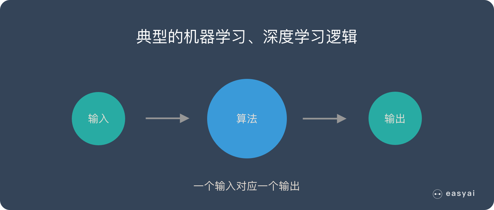
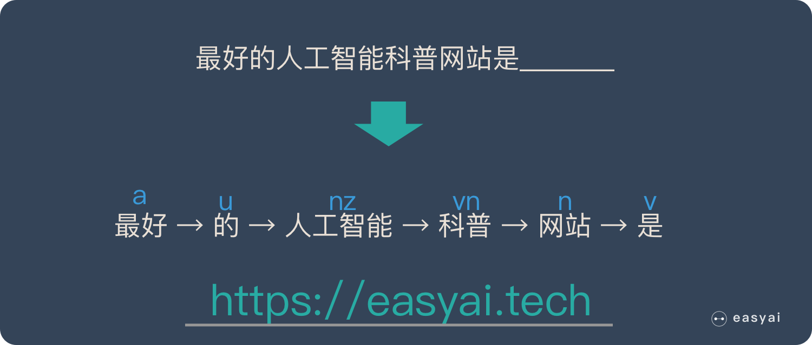
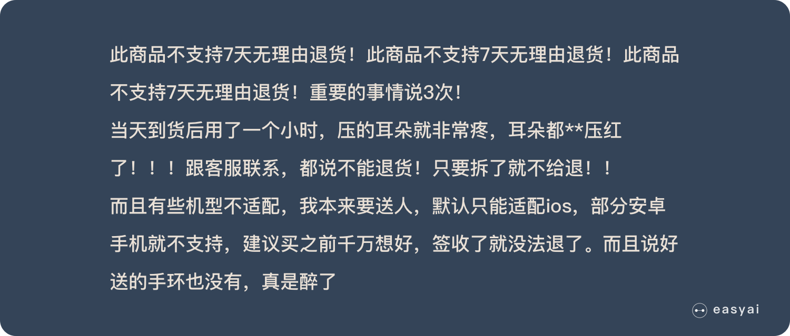

[循环神经网络](https://easyai.tech/ai-definition/rnn/)

- [为什么需要RNN？ 独特价值是什么？](#为什么需要rnn-独特价值是什么)
- [RNN的基本原理](#rnn的基本原理)
- [RNN的优化算法](#rnn的优化算法)
- [RNN的应用和使用场景](#rnn的应用和使用场景)
- [总结](#总结)

卷积神经网络 已经很强大了， 为什么还需要RNN

接下来会用通俗易懂的方式解释 RNN 的独特价值 ---- 处理序列数据。 同时还会说明 RNN 的一些缺陷和他的变种算法

## 为什么需要RNN？ 独特价值是什么？
卷积神经网络 和 普通的算法大部分都是输入输出的一一对应， 也就是一个输入得到一个输出。 不同的输入之间是没有联系的

但是有的时候， 一个输入是不够的

为了填好上面的空， 取前面任何一个词都不合适， 我们不但需要知道前面的所有的词， 还需要知道词语之间的次序

这种需要处理 "序列数据 - 一串相互依赖的数据流" 的场景就需要使用RNN来解决

经典的集中序列数据：
+ 文章中的文字内容
+ 语音里的音频内容
+ 股票市场中的价格走势

RNN 之所以能够有效的处理序列数据， 主要是基于他的比较特殊的运行原理

## RNN的基本原理

传统神经网络的结构比较简单： 输入层 - 隐藏层 - 输出层

RNN 跟传统神经网络最大的却别在于每次都会将前一次的输出结果，带到下一次的隐藏层中一起训练

下面用一个具体的案例来看看RNN是如何工作的：

假如需要判断用户的说话意图（问天气，问世间，设置闹钟）， 用户说一句 "what time is it?" 我们需要线对这句话进行分词， 然后按照顺序输入RNN， 我们先将 "what" 作为 RNN 的输入， 得到输出 "01"

然后我们按照顺序， 将 time 输入到 RNN 网络， 得到输出 "02"

这个过程我们可以看到， 输入 "time" 的时候， 前面 “what” 的输出也产生了影响 （隐藏层中有一半是黑色的）

以此类推， 前面所有的输入都对未来的输出产生影响， 大家可以看到圆形隐藏层中包含了前面所有的颜色

当我们判断意图的时候， 只需要最后一层的输出 “05”， 如下图所示

RNN 的缺点也比较明显

通过上面的例子， 我们已经发现， 短期的记忆影响比较大， 但是长期的记忆影响就很小， 这就是 RNN 存在的短期记忆问题
+ RNN有短期记忆问题， 无法处理很长的输入序列
+ 训练RNN需要投入极大地成本

由于 RNN 的短期记忆问题， 后来又出现了 记忆RNN 的优化算法

## RNN的优化算法

RNN 到 LSTM ---- 长短期记忆网络

RNN 是一种死板的逻辑， 越晚的输入影响越大， 越早输入影响越小， 且无法改变这个逻辑

LSTM 做的最大的改变就是打破了这种死板的逻辑， 而改用了一套灵活的逻辑 ---- 只保留重要的信息， 简单说就是抓重点

举个例子， 我们先快速阅读下面这段话

当我们阅读完之后， 可能会只记住一下几个重点

## RNN的应用和使用场景

## 总结