- [<font color=coral>整体结构</font>](#font-colorcoral整体结构font)
- [<font color=coral>卷积层</font>](#font-colorcoral卷积层font)
  - [<font color=deepskyblue>全连接层存在的问题</font>](#font-colordeepskyblue全连接层存在的问题font)
  - [<font color=deepskyblue>卷积运算</font>](#font-colordeepskyblue卷积运算font)
  - [<font color=deepskyblue>填充</font>](#font-colordeepskyblue填充font)
  - [<font color=deepskyblue>步幅</font>](#font-colordeepskyblue步幅font)
  - [<font color=deepskyblue>3维数据的卷积运算</font>](#font-colordeepskyblue3维数据的卷积运算font)
  - [<font color=deepskyblue>结合方块思考</font>](#font-colordeepskyblue结合方块思考font)
  - [<font color=deepskyblue>批处理</font>](#font-colordeepskyblue批处理font)
- [<font color=coral>池化层</font>](#font-colorcoral池化层font)
- [<font color=coral>卷积层和池化层的实现</font>](#font-colorcoral卷积层和池化层的实现font)
  - [<font color=deepskyblue>4维数组</font>](#font-colordeepskyblue4维数组font)
  - [<font color=deepskyblue>基于 im2col 的展开</font>](#font-colordeepskyblue基于-im2col-的展开font)
  - [<font color=deepskyblue>卷积层的实现</font>](#font-colordeepskyblue卷积层的实现font)
  - [<font color=deepskyblue>池化层的实现</font>](#font-colordeepskyblue池化层的实现font)
- [<font color=deepskyblue>CNN的实现</font>](#font-colordeepskybluecnn的实现font)

本章的主题是卷积神经网络（Convolutional Neural Network，CNN）。
CNN 被用于图像识别、语音识别等各种场合，在图像识别的比赛中，基于
深度学习的方法几乎都以 CNN 为基础。本章将详细介绍 CNN 的结构，并用
Python 实现其处理内容。

## <font color=coral>整体结构</font>
首先，来看一下 CNN 的网络结构，了解 CNN 的大致框架。CNN 和之
前介绍的神经网络一样，可以像乐高积木一样通过组装层来构建。不过，
CNN 中新出现了卷积层（Convolution 层）和池化层（Pooling 层）。卷积层和
池化层将在下一节详细介绍，这里我们先看一下如何组装层以构建 CNN。

之前介绍的神经网络中，相邻层的所有神经元之间都有连接，这称为全
连接（fully-connected）。另外，我们用 Affine 层实现了全连接层。如果使用
这个 Affine 层，一个 5 层的全连接的神经网络就可以通过图 7-1 所示的网络结
构来实现

如图 7-1 所示，全连接的神经网络中，Affine 层后面跟着激活函数 ReLU
层（或者 Sigmoid 层）。这里堆叠了 4 层“Affine-ReLU”组合，然后第 5 层是
Affine 层，最后由 Softmax 层输出最终结果（概率）。

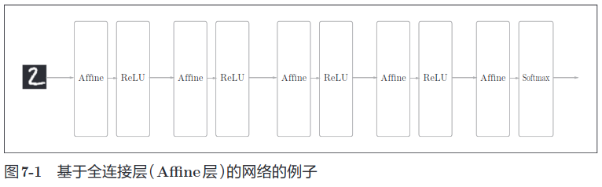
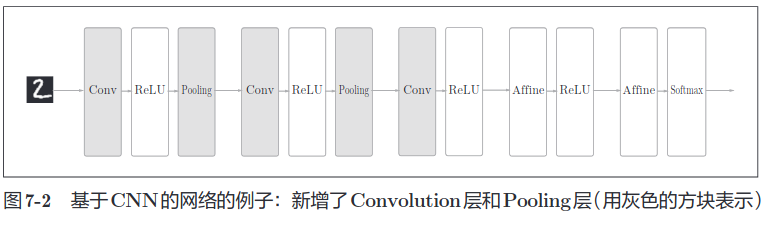

如 图 7-2 所 示，CNN 中 新 增 了 Convolution 层 和 Pooling 层。CNN 的
层 的 连 接 顺序是“Convolution - ReLU -（Pooling）”（Pooling 层有时会被省
略）。这可以理解为之前的“Affine - ReLU”连接被替换成了“Convolution -
ReLU -（Pooling）”连接。

还 需 要 注 意 的 是，在 图 7-2 的 CNN 中，靠 近 输 出 的 层 中 使 用 了 之 前
的“Affine - ReLU”组 合。此 外，最 后 的 输 出 层 中 使 用 了 之 前 的“Affine -
Softmax”组合。这些都是一般的 CNN 中比较常见的结构。

## <font color=coral>卷积层</font>
CNN 中出现了一些特有的术语，比如填充、步幅等。此外，各层中传
递的数据是有形状的数据（比如，3 维数据），这与之前的全连接网络不同，
因此刚开始学习 CNN 时可能会感到难以理解。本节我们将花点时间，认真
学习一下 CNN 中使用的卷积层的结构。

### <font color=deepskyblue>全连接层存在的问题</font>
之前介绍的全连接的神经网络中使用了全连接层（Affine 层）。在全连接
层中，相邻层的神经元全部连接在一起，输出的数量可以任意决定。

全连接层存在什么问题呢？那就是数据的形状被“忽视”了。比如，输
入数据是图像时，图像通常是高、长、通道方向上的 3 维形状。但是，向全
连接层输入时，需要将 3 维数据拉平为 1 维数据。实际上，前面提到的使用
了 MNIST 数据集的例子中，输入图像就是 1 通道、高 28 像素、长 28 像素
的（1, 28, 28）形状，但却被排成 1 列，以 784 个数据的形式输入到最开始的
Affine 层。

图像是 3 维形状，这个形状中应该含有重要的空间信息。比如，空间上
邻近的像素为相似的值、RBG 的各个通道之间分别有密切的关联性、相距
较远的像素之间没有什么关联等，3 维形状中可能隐藏有值得提取的本质模
式。但是，因为全连接层会忽视形状，将全部的输入数据作为相同的神经元
（同一维度的神经元）处理，所以无法利用与形状相关的信息。

而卷积层可以保持形状不变。当输入数据是图像时，卷积层会以 3 维
数据的形式接收输入数据，并同样以 3 维数据的形式输出至下一层。因此，
在 CNN 中，可以（有可能）正确理解图像等具有形状的数据。

另 外，CNN 中，有 时 将 卷 积 层 的 输 入 输 出 数 据 称 为 **特 征 图** （feature
map）。其中，卷积层的输入数据称为 **输入特征图** （input feature map），输出
数据称为 **输出特征图** （output feature map）。本书中将“输入输出数据”和“特
征图”作为含义相同的词使用。

### <font color=deepskyblue>卷积运算</font>
卷积层进行的处理就是卷积运算。卷积运算相当于图像处理中的“滤波
器运算”。在介绍卷积运算时，我们来看一个具体的例子

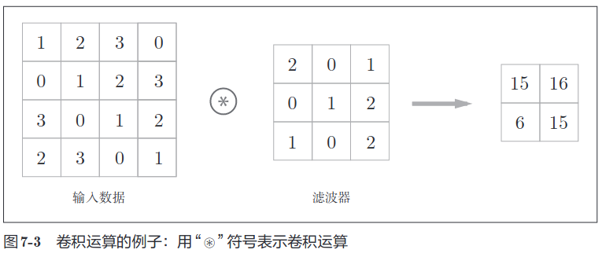
如图 7-3 所示，卷积运算对输入数据应用滤波器。在这个例子中，输入
数据是有高长方向的形状的数据，滤波器也一样，有高长方向上的维度。假
设用（height, width）表示数据和滤波器的形状，则在本例中，输入大小是
(4, 4)，滤波器大小是 (3, 3)，输出大小是 (2, 2)。另外，有的文献中也会用“核”
这个词来表示这里所说的“滤波器”。

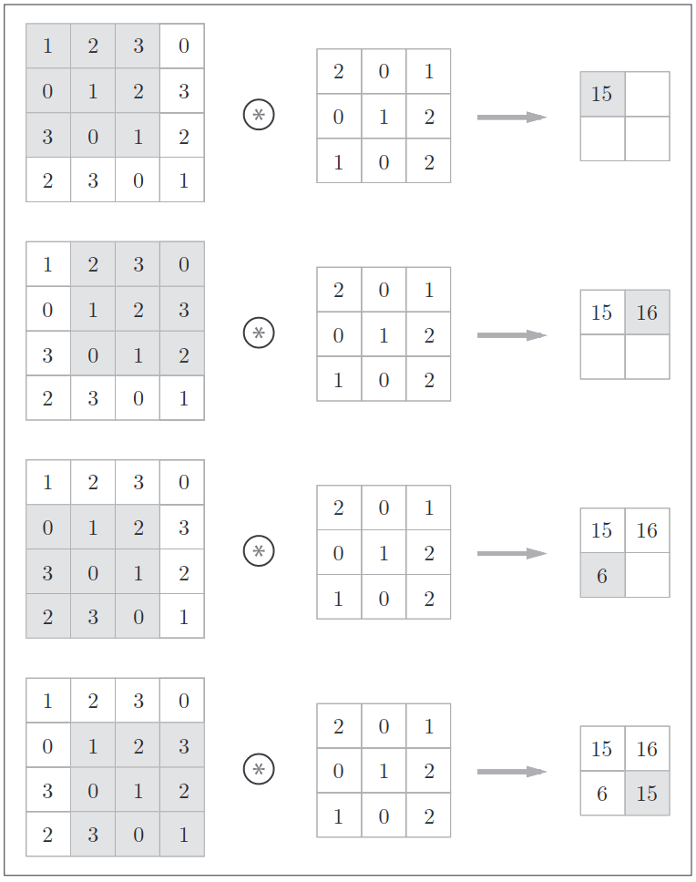

对于输入数据，卷积运算以一定间隔滑动滤波器的窗口并应用。这里所
说的窗口是指图 7-4 中灰色的 3 × 3 的部分。如图 7-4 所示，将各个位置上滤
波器的元素和输入的对应元素相乘，然后再求和（有时将这个计算称为乘积
累加运算）。然后，将这个结果保存到输出的对应位置。将这个过程在所有
位置都进行一遍，就可以得到卷积运算的输出。

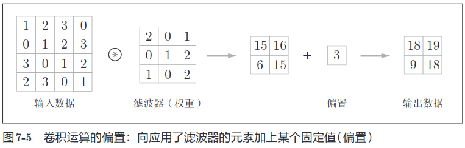

在全连接的神经网络中，除了权重参数，还存在偏置。CNN 中，滤波
器的参数就对应之前的权重。并且，CNN 中也存在偏置。图 7-3 的卷积运算
的例子一直展示到了应用滤波器的阶段。包含偏置的卷积运算的处理流如图
7-5 所示。

如图 7-5 所示，向应用了滤波器的数据加上了偏置。偏置通常只有 1 个
（1 × 1）（本例中，相对于应用了滤波器的 4 个数据，偏置只有 1 个），这个值
会被加到应用了滤波器的所有元素上。

### <font color=deepskyblue>填充</font>
在进行卷积层的处理之前，有时要向输入数据的周围填入固定的数据（比
如 0 等），这称为填充（padding），是卷积运算中经常会用到的处理。比如，
在图 7-6 的例子中，对大小为 (4, 4) 的输入数据应用了幅度为 1 的填充。“幅
度为 1 的填充”是指用幅度为 1 像素的 0 填充周围。

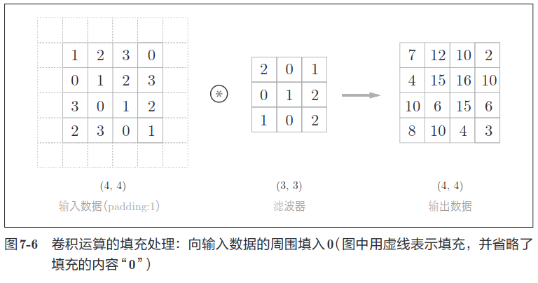

如图 7-6 所示，通过填充，大小为 (4, 4) 的输入数据变成了 (6, 6) 的形状。
然后，应用大小为 (3, 3) 的滤波器，生成了大小为 (4, 4) 的输出数据。这个例
子中将填充设成了 1，不过填充的值也可以设置成 2、3 等任意的整数。在图 7-5
的例子中，如果将填充设为 2，则输入数据的大小变为 (8, 8)；如果将填充设
为 3，则大小变为 (10, 10)。

使用填充主要是为了调整输出的大小。比如，对大小为 (4, 4) 的输入
数据应用 (3, 3) 的滤波器时，输出大小变为 (2, 2)，相当于输出大小
比输入大小缩小了 2 个元素。这在反复进行多次卷积运算的深度网
络中会成为问题。为什么呢？因为如果每次进行卷积运算都会缩小
空间，那么在某个时刻输出大小就有可能变为 1，导致无法再应用
卷积运算。为了避免出现这样的情况，就要使用填充。在刚才的例
子中，将填充的幅度设为 1，那么相对于输入大小 (4, 4)，输出大小
也保持为原来的 (4, 4)。因此，卷积运算就可以在保持空间大小不变
的情况下将数据传给下一层。

### <font color=deepskyblue>步幅</font>
应用滤波器的位置间隔称为步幅（stride）。之前的例子中步幅都是 1，如
果将步幅设为 2，则如图 7-7 所示，应用滤波器的窗口的间隔变为 2 个元素。

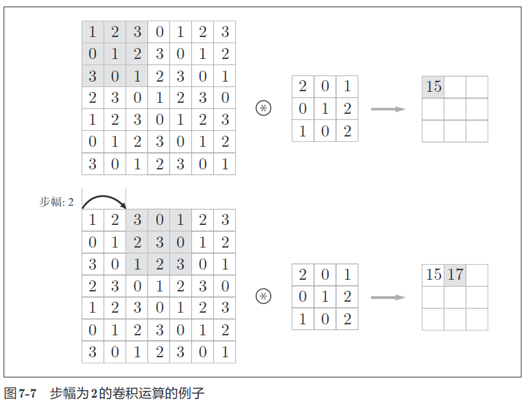

在图 7-7 的例子中，对输入大小为 (7, 7) 的数据，以步幅 2 应用了滤波器。
通过将步幅设为 2，输出大小变为 (3, 3)。像这样，步幅可以指定应用滤波器
的间隔。
综上，增大步幅后，输出大小会变小。而增大填充后，输出大小会变大。
如果将这样的关系写成算式，会如何呢？接下来，我们看一下对于填充和步
幅，如何计算输出大小。
这里，假设输入大小为 (H, W)，滤波器大小为 (FH, FW)，输出大小为
(OH, OW)，填充为 P，步幅为 S。此时，输出大小可通过式 (7.1) 进行计算。

$$OH= {{H+2P-FH} \over S} + 1$$
$$OW= {{W+2P-FH} \over S} + 1$$

当输出大小无法
除尽时（结果是小数时），需要采取报错等对策。顺便说一下，根据深度学习
的框架的不同，当值无法除尽时，有时会向最接近的整数四舍五入，不进行
报错而继续运行。

### <font color=deepskyblue>3维数据的卷积运算</font>
之前的卷积运算的例子都是以有高、长方向的 2 维形状为对象的。但是，
图像是 3 维数据，除了高、长方向之外，还需要处理通道方向。这里，我们按
照与之前相同的顺序，看一下对加上了通道方向的3维数据进行卷积运算的例子。

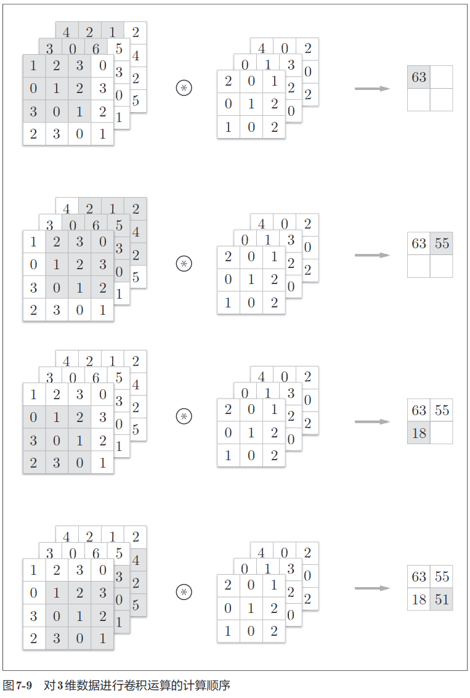

图 7-8 是卷积运算的例子，图 7-9 是计算顺序。这里以 3 通道的数据为例，
展示了卷积运算的结果。和 2 维数据时（图 7-3 的例子）相比，可以发现纵深
方向（通道方向）上特征图增加了。通道方向上有多个特征图时，会按通道
进行输入数据和滤波器的卷积运算，并将结果相加，从而得到输出。


需要注意的是，在 3 维数据的卷积运算中，输入数据和滤波器的通道数
要设为相同的值。在这个例子中，输入数据和滤波器的通道数一致，均为 3。
滤波器大小可以设定为任意值（不过，每个通道的滤波器大小要全部相同）。
这个例子中滤波器大小为 (3, 3)，但也可以设定为 (2, 2)、(1, 1)、(5, 5) 等任
意值。再强调一下，通道数只能设定为和输入数据的通道数相同的值（本例
中为 3）。

### <font color=deepskyblue>结合方块思考</font>
将数据和滤波器结合长方体的方块来考虑，3 维数据的卷积运算会很
容易理解。方块是如图 7-10 所示的 3 维长方体。把 3 维数据表示为多维数组
时，书 写 顺 序 为（channel, height, width）。比 如，通 道 数 为 C、高 度 为 H、
长度为 W 的数据的形状可以写成（C, H, W）。滤波器也一样，要按（channel,
height, width）的顺序书写。比如，通道数为 C、滤波器高度为 FH（Filter
Height）、长度为 FW（Filter Width）时，可以写成（C, FH, FW）。

### <font color=deepskyblue>批处理</font>
神经网络的处理中进行了将输入数据打包的批处理。之前的全连接神经
网络的实现也对应了批处理，通过批处理，能够实现处理的高效化和学习时
对 mini-batch 的对应。

我们希望卷积运算也同样对应批处理。为此，需要将在各层间传递的数
据保存为 4 维数据。具体地讲，就是按 (batch_num, channel, height, width)
的顺序保存数据。比如，将图 7-12 中的处理改成对 N 个数据进行批处理时，
数据的形状如图 7-13 所示。

图 7-13 的批处理版的数据流中，在各个数据的开头添加了批用的维度。
像这样，数据作为 4 维的形状在各层间传递。这里需要注意的是，网络间传
递的是 4 维数据，对这 N 个数据进行了卷积运算。也就是说，批处理将 N 次
的处理汇总成了 1 次进行。

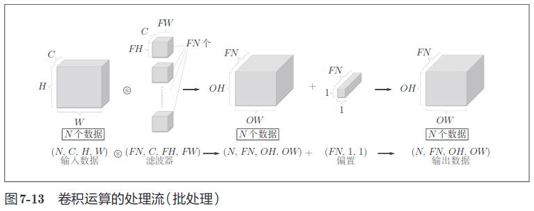

## <font color=coral>池化层</font>
池化是缩小高、长方向上的空间的运算。比如，如图 7-14 所示，进行将
2 × 2 的区域集约成 1 个元素的处理，缩小空间大小。
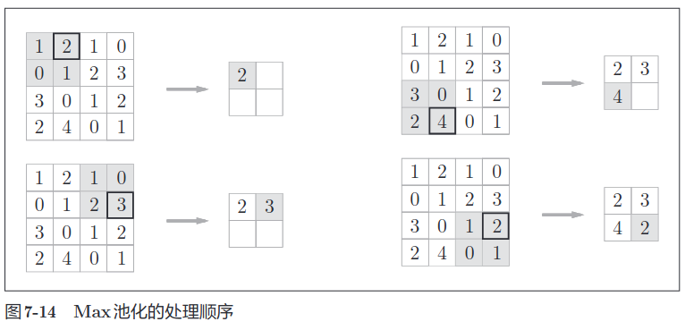

图 7-14 的例子是按步幅 2 进行 2 × 2 的 Max 池化时的处理顺序。“Max
池化”是获取最大值的运算，“2 × 2”表示目标区域的大小。如图所示，从
2 × 2 的区域中取出最大的元素。此外，这个例子中将步幅设为了 2，所以
2 × 2 的窗口的移动间隔为 2 个元素。另外，一般来说，池化的窗口大小会
和步幅设定成相同的值。比如，3 × 3 的窗口的步幅会设为 3，4 × 4 的窗口
的步幅会设为 4 等。

除了 Max 池化之外，还有 Average 池化等。相对于 Max 池化是从
目标区域中取出最大值，Average 池化则是计算目标区域的平均值。
在图像识别领域，主要使用 Max 池化。因此，本书中说到“池化层”
时，指的是 Max 池化。

**池化层的特征**
池化层有以下特征。
+ 没有要学习的参数
    池化层和卷积层不同，没有要学习的参数。池化只是从目标区域中取最大值（或者平均值），所以不存在要学习的参数。
+ 通道数不发生变化
    经过池化运算，输入数据和输出数据的通道数不会发生变化。如图 7-15所示，计算是按通道独立进行的。

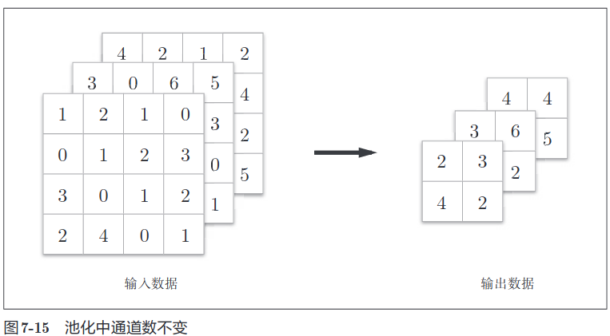

**对微小的位置变化具有鲁棒性（健壮）**  
输入数据发生微小偏差时，池化仍会返回相同的结果。因此，池化对
输入数据的微小偏差具有鲁棒性。比如，3 × 3 的池化的情况下，如图
7-16 所示，池化会吸收输入数据的偏差（根据数据的不同，结果有可
能不一致）。

## <font color=coral>卷积层和池化层的实现</font>
前面我们详细介绍了卷积层和池化层，本节我们就用 Python 来实现这
两个层。和第 5 章一样，也给进行实现的类赋予 forward 和 backward 方法，并
使其可以作为模块使用。

大家可能会感觉卷积层和池化层的实现很复杂，但实际上，通过使用某
种技巧，就可以很轻松地实现。本节将介绍这种技巧，将问题简化，然后再
进行卷积层的实现。

### <font color=deepskyblue>4维数组</font>
如前所述，CNN 中各层间传递的数据是 4 维数据。所谓 4 维数据，比如
数据的形状是 (10, 1, 28, 28)，则它对应 10 个高为 28、长为 28、通道为 1 的数
据。用 Python 来实现的话，如下所示。

```
>>> x = np.random.rand(10, 1, 28, 28) # 随机生成数据
>>> x.shape
(10, 1, 28, 28)
```

这里，如果要访问第 1 个数据，只要写 x[0] 就可以了（注意 Python 的索
引是从 0 开始的）。同样地，用 x[1] 可以访问第 2 个数据。
```
>>> x[0].shape # (1, 28, 28)
>>> x[1].shape # (1, 28, 28)
```
如果要访问第 1 个数据的第 1 个通道的空间数据，可以写成下面这样。
```
>>> x[0, 0] # 或者 x[0][0]
```
像这样，CNN 中处理的是 4 维数据，因此卷积运算的实现看上去会很复
杂，但是通过使用下面要介绍的 im2col 这个技巧，问题就会变得很简单。

### <font color=deepskyblue>基于 im2col 的展开</font>
如果老老实实地实现卷积运算，估计要重复好几层的 for 语句。这样的
实现有点麻烦，而且，NumPy 中存在使用 for 语句后处理变慢的缺点（NumPy
中，访问元素时最好不要用 for 语句）。这里，我们不使用 for 语句，而是使
用 im2col 这个便利的函数进行简单的实现。

im2col 是一个函数，将输入数据展开以适合滤波器（权重）。如图 7-17 所示，
对 3 维的输入数据应用 im2col 后，数据转换为 2 维矩阵（正确地讲，是把包含
批数量的 4 维数据转换成了 2 维数据）。

im2col 会把输入数据展开以适合滤波器（权重）。具体地说，如图 7-18 所示，
对于输入数据，将应用滤波器的区域（3 维方块）横向展开为 1 列。im2col 会
在所有应用滤波器的地方进行这个展开处理。

在图 7-18 中，为了便于观察，将步幅设置得很大，以使滤波器的应用区
域不重叠。而在实际的卷积运算中，滤波器的应用区域几乎都是重叠的。在
滤波器的应用区域重叠的情况下，使用 im2col 展开后，展开后的元素个数会
多于原方块的元素个数。因此，使用 im2col 的实现存在比普通的实现消耗更
多内存的缺点。但是，汇总成一个大的矩阵进行计算，对计算机的计算颇有
益处。比如，在矩阵计算的库（线性代数库）等中，矩阵计算的实现已被高
度最优化，可以高速地进行大矩阵的乘法运算。因此，通过归结到矩阵计算
上，可以有效地利用线性代数库

im2col 这个名称是“image to column”的缩写，翻译过来就是“从
图 像 到 矩 阵”的 意 思。Caffe、Chainer 等 深 度 学 习 框 架 中 有 名 为
im2col 的函数，并且在卷积层的实现中，都使用了 im2col。

使用 im2col 展开输入数据后，之后就只需将卷积层的滤波器（权重）纵
向展开为 1 列，并计算 2 个矩阵的乘积即可（参照图 7-19）。这和全连接层的
Affi ne层进行的处理基本相同。
如图 7-19 所示，基于 im2col 方式的输出结果是 2 维矩阵。因为 CNN 中
数据会保存为 4 维数组，所以要将 2 维输出数据转换为合适的形状。以上就
是卷积层的实现流程。

### <font color=deepskyblue>卷积层的实现</font>
本书提供了 im2col 函数，并将这个 im2col 函数作为黑盒（不关心内部实现）
使用。im2col 的实现内容在 common/util.py 中，它的实现（实质上）是一个 10
行左右的简单函数。有兴趣的读者可以参考。
im2col 这一便捷函数具有以下接口。

im2col (input_data, filter_h, filter_w, stride=1, pad=0)
+ input_data―由（数据量，通道，高，长）的4维数组构成的输入数据
+ filter_h―滤波器的高
+ filter_w―滤波器的长
+ stride―步幅
+ pad―填充

im2col 会考虑滤波器大小、步幅、填充，将输入数据展开为 2 维数组。现在，
我们来实际使用一下这个 im2col。
```
import sys, os
sys.path.append(os.pardir)
from common.util import im2col

x1 = np.random.rand(1, 3, 7, 7)
col1 = im2col(x1, 5, 5, stride=1, pad=0)
print(col1.shape) # (9, 75)

x2 = np.random.rand(10, 3, 7, 7) # 10 个数据
col2 = im2col(x2, 5, 5, stride=1, pad=0)
print(col2.shape) # (90, 75)
```
这里举了两个例子。第一个是批大小为 1、通道为 3 的 7 × 7 的数据，第
二个的批大小为 10，数据形状和第一个相同。

分别对其应用 im2col 函数，在
这两种情形下，第 2 维的元素个数均为 75。这是滤波器（通道为 3、大小为
5 × 5）的元素个数的总和。批大小为 1 时，im2col 的结果是 (9, 75)。而第 2
个例子中批大小为 10，所以保存了 10 倍的数据，即 (90, 75)。
现在使用im2col 来实现卷积层。这里我们将卷积层实现为名为Convolution
的类。

```
class Convolution:
    def __init__(self, W, b, stride=1, pad=0):
        self.W = W
        self.b = b
        self.stride = stride
        self.pad = pad

    def forward(self, x):
        FN, C, FH, FW = self.W.shape
        N, C, H, W = x.shape
        out_h = int(1 + (H + 2*self.pad - FH) / self.stride)
        out_w = int(1 + (W + 2*self.pad - FW) / self.stride)

        col = im2col(x, FH, FW, self.stride, self.pad)
        col_W = self.W.reshape(FN, -1).T # 滤波器的展开
        out = np.dot(col, col_W) + self.b

        out = out.reshape(N, out_h, out_w, -1).transpose(0, 3, 1, 2)
        return out
```

卷积层的初始化方法将滤波器（权重）、偏置、步幅、填充作为参数接收。
滤 波 器 是 (FN, C, FH, FW) 的 4 维 形 状。另 外，FN、C、FH、FW 分 别 是 Filter
Number（滤波器数量）、Channel、Filter Height、Filter Width 的缩写。
这里用粗体字表示 Convolution 层的实现中的重要部分。在这些粗体字
部分，用 im2col 展开输入数据，并用 reshape 将滤波器展开为 2 维数组。然后，
计算展开后的矩阵的乘积。

展开滤波器的部分（代码段中的粗体字）如图 7-19 所示，将各个滤波器
的方块纵向展开为 1 列。这里通过 reshape(FN,-1) 将参数指定为 -1，这是
reshape 的一个便利的功能。通过在 reshape 时指定为 -1，reshape 函数会自
动计算 -1 维度上的元素个数，以使多维数组的元素个数前后一致。比如，
(10, 3, 5, 5) 形状的数组的元素个数共有 750 个，指定 reshape(10,-1) 后，就
会转换成 (10, 75) 形状的数组。

forward 的实现中，最后会将输出大小转换为合适的形状。转换时使用了
NumPy 的 transpose 函数。transpose 会更改多维数组的轴的顺序。如图 7-20
所示，通过指定从 0 开始的索引（编号）序列，就可以更改轴的顺序。

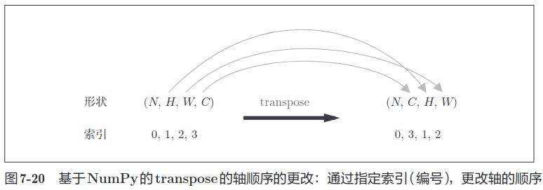

以上就是卷积层的 forward 处理的实现。通过使用 im2col 进行展开，基
本上可以像实现全连接层的 Affine 层一样来实现（5.6 节）。接下来是卷积层
的反向传播的实现，因为和 Affine 层的实现有很多共通的地方，所以就不再
介绍了。但有一点需要注意，在进行卷积层的反向传播时，必须进行 im2col
的逆处理。这可以使用本书提供的 col2im 函数（col2im 的实现在 common/util.py 中）来进行。除了使用 col2im 这一点，卷积层的反向传播和 Affi ne层的实
现方式都一样。卷积层的反向传播的实现在 common/layer.py 中，有兴趣的读
者可以参考。

### <font color=deepskyblue>池化层的实现</font>
池化层的实现和卷积层相同，都使用 im2col 展开输入数据。不过，池化
的情况下，在通道方向上是独立的，这一点和卷积层不同。具体地讲，如图
7-21 所示，池化的应用区域按通道单独展开。

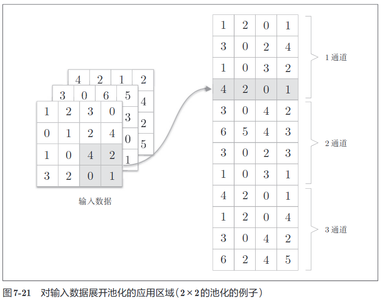

像这样展开之后，只需对展开的矩阵求各行的最大值，并转换为合适的
形状即可（图 7-22）。

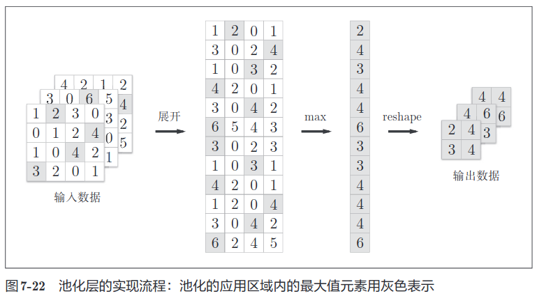

上面就是池化层的 forward 处理的实现流程。下面来看一下 Python 的实
现示例。

```python
class Pooling:
    def __init__(self, pool_h, pool_w, stride=1, pad=0):
        self.pool_h = pool_h
        self.pool_w = pool_w
        self.stride = stride
        self.pad = pad

    def forward(self, x):
        N, C, H, W = x.shape
        out_h = int(1 + (H - self.pool_h) / self.stride)
        out_w = int(1 + (W - self.pool_w) / self.stride)

        # 展开 (1)
        col = im2col(x, self.pool_h, self.pool_w, self.stride, self.pad)
        col = col.reshape(-1, self.pool_h*self.pool_w)

        # 最大值 (2)
        out = np.max(col, axis=1)

        # 转换 (3)
        out = out.reshape(N, out_h, out_w, C).transpose(0, 3, 1, 2)
        return out
```
如图 7-22 所示，池化层的实现按下面 3 个阶段进行。
1. 展开输入数据。
2. 求各行的最大值。
3. 转换为合适的输出大小

关于池化层的 backward 处理，之前已经介绍过相关内容，这里就不再介绍了。
另外，池化层的 backward 处理可以参考 ReLU 层的实现中使用的 max 的反向
传播（5.5.1 节）。池化层的实现在 common/layer.py 中，有兴趣的读者可以参考。

## <font color=deepskyblue>CNN的实现</font>
