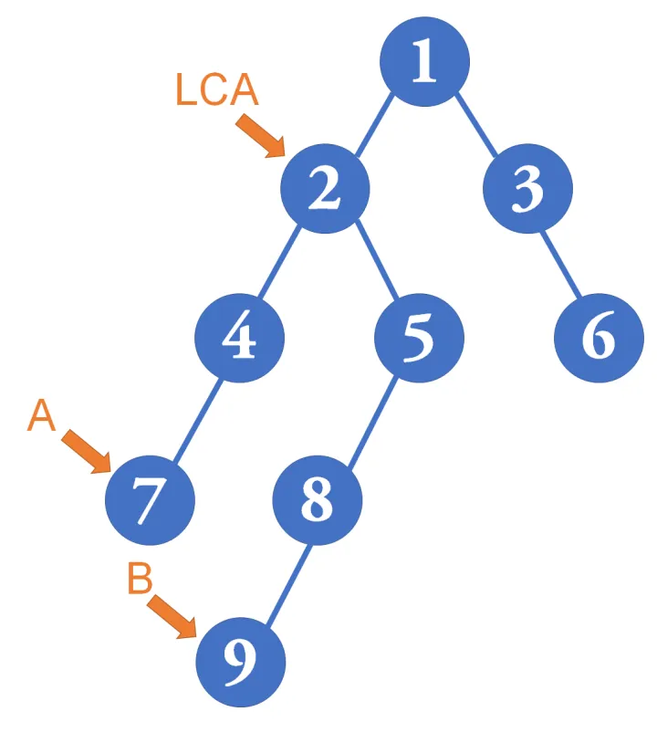
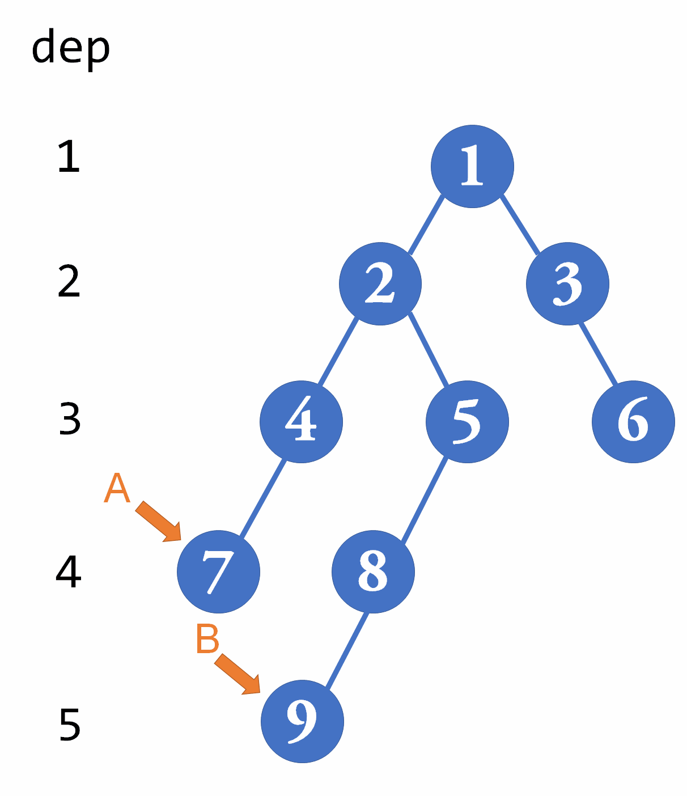

# 最近公共祖先
当我们处理树上点与点关系的问题时（例如，最简单的，树上两点的距离），常常需要获知树上两点的最近公共祖先（Lowest Common Ancestor，LCA）。如下图所示：


## 一般的做法：
首先进行一趟dfs，求出每个点的深度：
```python
int dep[MAXN];
bool vis[MAXN];
void dfs(int cur, int fath = 0)
{
    if (vis[cur])
        return;
    vis[cur] = true;
    dep[cur] = dep[fath] + 1; // 每个点的深度等于父节点的深度+1
    for (int eg = head[cur]; eg != 0; eg = edges[eg].next)
        dfs(edges[eg].to, cur);
}
```
现在A点的深度比B点深，所以我们先让B点往上“爬”，爬到与A点深度相等为止。然后A点和B点再一起往上爬，直到两点相遇，那一点即为LCA：

这样下来，每次查询LCA的最坏时间复杂度是 的。

有时候，我们需要进行很多次查询，这时朴素的 复杂度就不够用了。我们考虑空间换时间的倍增算法。