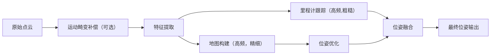

# LOAM （Lidar Odometry and Mapping）

LOAM 是激光SLAM领域的里程碑式工作，其核心思想是将复杂的SLAM问题拆分为两个并行的优化问题。

## LOAM 整体架构

核心思想：运动分解与频率分离

```
高频运动（10Hz）：
  └── 激光里程计 (Lidar Odometry)
        └── 特征提取 + 扫描间配准
        └── 输出：高频但漂移较大的位姿

低频运动（1Hz）：
  └── 激光建图 (Lidar Mapping)  
        └── 特征匹配到全局地图
        └── 输出：低频但精确的位姿变换

最终融合：
  └── 10Hz里程计 + 1Hz建图修正 = 实时、精确的位姿估计
```

## 代码流程详解



## 详细模块解析

### 特征提取模块

从单帧点云中提取 distinctive 的特征点（边缘点、平面点）

```cpp
// 伪代码：特征提取核心逻辑
void extractFeatures(PointCloud& scan, FeaturePoints& features) {
    // 1. 计算点云曲率
    for each point in scan {
        // 计算当前点前后5个点的距离方差作为曲率
        curvature = calculateSmoothness(point, neighbors);
        point.curvature = curvature;
    }
    
    // 2. 分类特征点
    for each laser beam separately {  // 对每个激光线单独处理
        // 将扫描线分为4个区域，避免特征聚集
        subregions = splitScanIntoRegions(scan);
        
        for each subregion {
            // 按曲率排序，选取边缘特征（曲率大）
            edge_points = selectPointsWithLargestCurvature(2, subregion);
            // 选取平面特征（曲率小）  
            planar_points = selectPointsWithSmallestCurvature(4, subregion);
        }
    }
    
    // 3. 剔除不可靠特征
    removeUnreliableFeatures(features);
}
```

### 激光里程计模块 （高频，10Hz）

```cpp
class LidarOdometry {
public:
    void processScan(PointCloud& current_scan, double scan_time) {
        // 1. 特征提取
        extractFeatures(current_scan, current_features);
        
        if (!system_initialized) {
            // 第一帧，初始化
            last_features = current_features;
            return;
        }
        
        // 2. 特征关联：当前帧特征 ↔ 上一帧特征
        for (int iter = 0; iter < max_iterations; iter++) {
            // 2.1 建立数据关联
            correspondences = findCorrespondences(current_features, last_features);
            
            // 2.2 构建点到线/点到面距离残差
            residuals.clear();
            jacobians.clear();
            
            for each edge_point in current_features.edge_points {
                // 找到上一帧中对应的边缘线
                line = findCorrespondingLine(edge_point, last_features);
                // 计算点到直线的距离
                distance = pointToLineDistance(edge_point, line);
                residuals.push_back(distance);
            }
            
            for each planar_point in current_features.planar_points {
                // 找到上一帧中对应的平面
                plane = findCorrespondingPlane(planar_point, last_features);
                // 计算点到平面的距离  
                distance = pointToPlaneDistance(planar_point, plane);
                residuals.push_back(distance);
            }
            
            // 2.3 非线性优化求解位姿变换
            transform = levenbergMarquardtOptimize(residuals, jacobians);
        }
        
        // 3. 运动畸变补偿（可选，基于匀速模型）
        if (enable_deskewing) {
            compensateMotion(transform, scan_time);
        }
        
        // 4. 发布高频位姿
        publishOdometry(transform, scan_time);
        
        last_features = current_features;
    }
};
```

### 激光建图模块（低频， 1HZ）

```cpp
class LidarMapping {
public:
    void processScan(PointCloud& scan, Pose& odom_pose) {
        // 1. 将当前帧变换到地图坐标系
        transformed_scan = transformPointCloud(scan, odom_pose);
        
        // 2. 体素滤波降采样
        downsampled_scan = voxelFilter(transformed_scan, 0.2m);
        
        // 3. 特征提取（与里程计相同）
        extractFeatures(downsampled_scan, current_features);
        
        // 4. 与全局地图特征匹配
        for (int iter = 0; iter < max_mapping_iterations; iter++) {
            // 4.1 数据关联：当前特征 ↔ 地图特征
            correspondences = findMapCorrespondences(current_features, global_map);
            
            // 4.2 构建优化问题
            residuals.clear();
            for each feature in current_features {
                if (feature is edge_point) {
                    // 在地图中找到最近的5个边缘点，拟合直线
                    nearest_points = kdtreeEdgeMap.findNearest(feature, 5);
                    line = fitLine(nearest_points);
                    distance = pointToLineDistance(feature, line);
                } else { // planar point
                    // 在地图中找到最近的5个平面点，拟合平面
                    nearest_points = kdtreePlanarMap.findNearest(feature, 5);
                    plane = fitPlane(nearest_points);
                    distance = pointToPlaneDistance(feature, plane);
                }
                residuals.push_back(distance);
            }
            
            // 4.3 优化求解精确位姿变换
            precise_transform = optimizeTransform(residuals);
        }
        
        // 5. 更新全局地图
        updateGlobalMap(transformed_scan, precise_transform);
        
        // 6. 发布优化后的位姿和地图
        publishMapAndPose(precise_transform);
    }
};
```

## 关键算法细节

### 特征关联策略

#### 边缘特征关联

```cpp
// 在上一帧中找到对应的边缘线
Line findCorrespondingLine(Point& current_edge, FeaturePoints& last_features) {
    // 在上一帧中找到最近的两个边缘点
    point1 = findClosestEdgePoint(current_edge, last_features.edge_points);
    point2 = findClosestEdgePointInAdjacentBeams(point1, current_edge);
    
    // 用两个点确定一条直线
    return Line(point1, point2);
}
```

#### 平面特征关联

```cpp
// 在上一帧中找到对应的平面
Plane findCorrespondingPlane(Point& current_planar, FeaturePoints& last_features) {
    // 在上一帧中找到最近的三个平面点（不在同一直线上）
    point1 = findClosestPlanarPoint(current_planar, last_features.planar_points);
    point2 = findClosestInAdjacentBeam(point1, current_planar);
    point3 = findClosestInSameBeamButFar(point1, point2);
    
    // 用三个点确定一个平面
    return Plane(point1, point2, point3);
}
```

### 距离残差计算

#### 点到直线距离

```cpp
double pointToLineDistance(Point& point, Line& line) {
    // 直线方向向量
    Eigen::Vector3d direction = (line.p2 - line.p1).normalized();
    // 点到直线上任意点的向量
    Eigen::Vector3d diff = point - line.p1;
    // 垂直距离 = |(point - p1) × direction|
    return diff.cross(direction).norm();
}
```

#### 点到平面距离

```cpp
double pointToPlaneDistance(Point& point, Plane& plane) {
    // 平面法向量
    Eigen::Vector3d normal = (plane.p2 - plane.p1).cross(plane.p3 - plane.p1).normalized();
    // 点到平面距离 = |(point - p1) · normal|
    return std::abs((point - plane.p1).dot(normal));
}
```

### 非线性优化

使用LM算法优化位姿变换 $T=[t_x, t_y, t_z, θ_x, θ_y, θ_z]

```cpp
Eigen::Matrix4d optimizeTransform(Residuals& residuals, Jacobians& jacobians) {
    // LM算法核心
    for (int iter = 0; iter < max_iters; iter++) {
        // 计算Hessian矩阵和梯度
        H = jacobians.transpose() * jacobians;
        g = jacobians.transpose() * residuals;
        
        // 添加阻尼因子
        H += lambda * Eigen::MatrixXd::Identity(6, 6);
        
        // 求解增量方程
        delta = H.ldlt().solve(-g);
        
        // 更新位姿
        T = T * exponentialMap(delta);
        
        // 判断收敛
        if (delta.norm() < epsilon) break;
    }
    return T;
}
```

## 性能优化技巧

### KD-Tree 加速搜索

```cpp
// 使用FLANN或nanoflann加速最近邻搜索
#include <nanoflann.hpp>
typedef nanoflann::KDTreeEigenMatrixAdaptor<PointCloud> KDTree;
```

### 多线程处理

```cpp
// 里程计和建图在不同线程运行
std::thread odom_thread(&LidarOdometry::run, &odom);
std::thread mapping_thread(&LidarMapping::run, &mapping);
```

### 地图管理策略

```cpp
// 滑动窗口地图管理
void updateGlobalMap(PointCloud& new_scan) {
    if (global_map.size() > max_map_points) {
        // 移除最老的点云块
        global_map.erase(global_map.begin());
    }
    global_map.push_back(new_scan);
}
```
