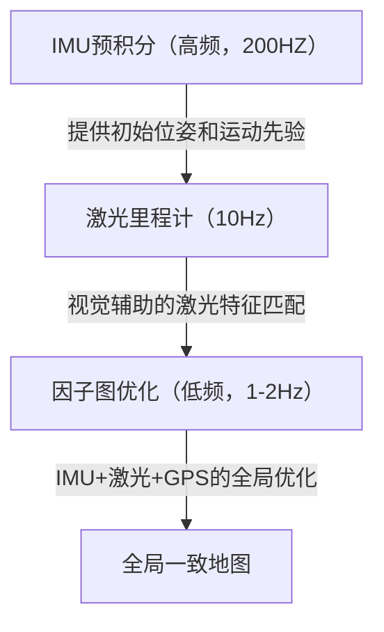
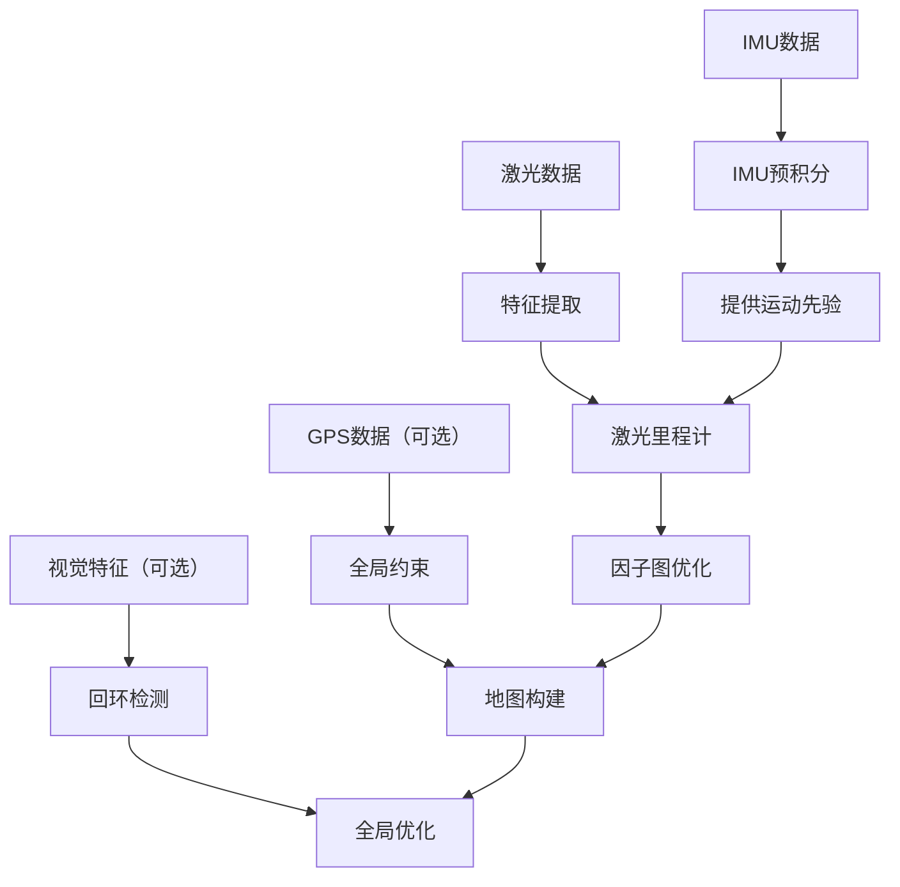

# LIO-SAM (Lidar-Inertial Odometry and Mapping via Smoothing and Mapping)

LIOSAM 是 LOAM 的重要演进，将IMU紧密耦合到激光SLAM框架中。让我详细解析LIOSAM的代码架构和流程。

## LIOSAM 整体架构

核心思想：紧耦合的Lidar-IMU融合



与 LOAM 的关键区别

| 特性 | LOAM | LIOSAM |
| ---- | ---- | ---- |
| IMU使用 | 松耦合（可选运动补偿）| 紧耦合（因子图优化）|
| 优化框架 | 扫描到扫描/扫描到地图 | 因子图优化（iSAM2）|
| 回环检测 | 无 | 视觉词袋+ICP |
| 全局一致性 | 有限 | 强（全局位姿图）|

### 整体流程图



## 核心模块详解

### IMU预积分模块

在激光扫描间隔内精确估计运动

```cpp
class IMUPreintegration {
public:
    void processIMU(const sensor_msgs::Imu& imu_msg) {
        // 1. IMU数据预处理
        imu_data = preprocessIMU(imu_msg);
        
        // 2. 预积分计算（在两帧激光之间）
        if (new_lidar_frame_available) {
            // 重置预积分器
            preintegrator.reset();
        } else {
            // 累积预积分量
            preintegrator.integrate(imu_data.dt, imu_data.acc, imu_data.gyro);
        }
        
        // 3. 提供高频位姿预测
        predicted_pose = predictPoseFromIMU(preintegrator);
        publishPredictedOdometry(predicted_pose);
    }
    
    PreintegrationResult getPreintegrationResult() {
        // 返回两帧激光之间的相对运动估计
        return preintegrator.getResult();
    }
};
```

### 激光里程计模块（紧耦合）

```cpp
class LaserOdometryLIOSAM {
public:
    void processLidar(const PointCloud& laser_cloud) {
        // 1. 特征提取（改进的LOAM方法）
        extractFeatures(laser_cloud, features);
        
        // 2. IMU辅助的初始位姿估计
        initial_pose = getIMUPredictedPose();
        
        // 3. 基于IMU先验的激光匹配
        for (int iter = 0; iter < max_iters; iter++) {
            // 3.1 数据关联（使用IMU提供的初始猜测）
            correspondences = findCorrespondencesWithIMUPrior(features, last_features, initial_pose);
            
            // 3.2 构建优化问题（包含IMU约束）
            ceres::Problem problem;
            
            // 激光残差（点到线/面）
            for (auto& edge_corr : edge_correspondences) {
                auto* cost_function = LidarEdgeFactor::Create(edge_corr);
                problem.AddResidualBlock(cost_function, loss_function, 
                                       pose[0], pose[1], pose[2], 
                                       pose[3], pose[4], pose[5]);
            }
            
            // IMU残差（预积分约束）
            auto* imu_cost_function = IMUFactor::Create(preintegration);
            problem.AddResidualBlock(imu_cost_function, nullptr, 
                                   pose, speed, bias);
            
            // 3.3 求解优化问题
            ceres::Solver::Solve(options, &problem, &summary);
        }
        
        // 4. 发布激光里程计结果
        publishLidarOdometry(optimized_pose);
        
        // 5. 为因子图优化准备数据
        prepareForFactorGraph(optimized_pose, features);
    }
};
```

### 因子图优化模块（核心创新）

```cpp
class FactorGraphOptimizer {
private:
    ISAM2 isam2;
    Values current_estimate;
    NonlinearFactorGraph graph;
    
public:
    void addLidarFactor(const Pose& pose, const FeaturePoints& features) {
        // 1. 添加激光因子
        auto lidar_factor = LidarFactor::Create(pose, features, covariance);
        graph.add(lidar_factor);
        
        // 2. 添加IMU因子（如果可用）
        if (imu_preintegration_available) {
            auto imu_factor = CombinedIMUFactor::Create(preintegration);
            graph.add(imu_factor);
        }
        
        // 3. 添加GPS因子（如果可用）
        if (gps_data_available && isGPSValid()) {
            auto gps_factor = GPSFactor::Create(gps_measurement, gps_covariance);
            graph.add(gps_factor);
        }
        
        // 4. 添加回环闭合因子
        if (loop_closure_detected) {
            auto loop_factor = BetweenFactor::Create(loop_pose_from, loop_pose_to, 
                                                   loop_transform, loop_covariance);
            graph.add(loop_factor);
        }
        
        // 5. 执行增量优化
        isam2.update(graph, initial_estimate);
        current_estimate = isam2.calculateEstimate();
        
        // 6. 重置因子图为空（iSAM2特性）
        graph.resize(0);
        initial_estimate.clear();
    }
    
    Pose getOptimizedPose(int frame_id) {
        return current_estimate.at<Pose>(Symbol('x', frame_id));
    }
};
```

### 回环检测模块

```cpp
class LoopClosureDetector {
public:
    bool detectLoopClosure(const PointCloud& current_scan, 
                          const Pose& current_pose) {
        // 1. 候选回环检测（基于距离和视觉词袋）
        candidates = findLoopCandidates(current_pose, history_poses);
        
        for (auto& candidate : candidates) {
            // 2. 视觉词袋匹配
            double score = visualBoWMatch(current_scan, candidate.scan);
            if (score < visual_threshold) continue;
            
            // 3. ICP精细匹配
            bool icp_success = false;
            Transform loop_transform;
            double fitness_score;
            
            std::tie(icp_success, loop_transform, fitness_score) = 
                performICPRegistration(current_scan, candidate.scan);
            
            if (icp_success && fitness_score < icp_threshold) {
                // 4. 几何一致性验证
                if (geometricVerification(loop_transform)) {
                    addLoopClosureConstraint(current_pose, candidate.pose, loop_transform);
                    return true;
                }
            }
        }
        return false;
    }
    
private:
    vector<LoopCandidate> findLoopCandidates(const Pose& current_pose, 
                                           const PoseArray& history) {
        vector<LoopCandidate> candidates;
        
        for (int i = 0; i < history.size(); i += skip_frames) {
            double distance = (current_pose.position - history[i].position).norm();
            
            // 时间接近的帧跳过（避免短时间回环）
            if (abs(i - current_frame_id) < min_loop_interval) continue;
            
            // 基于距离的初步筛选
            if (distance < loop_search_radius) {
                candidates.emplace_back(i, history[i], distance);
            }
        }
        
        // 按距离排序，取前K个
        sort(candidates.begin(), candidates.end());
        if (candidates.size() > max_candidates) {
            candidates.resize(max_candidates);
        }
        
        return candidates;
    }
};
```

## 关键算法改进细节

###  紧耦合的因子图结构

```cpp
// 因子图结构示例
Graph:
- PriorFactor:     初始位姿先验
- BetweenFactor:   相邻帧间的激光/IMU约束  
- CombinedIMUFactor: IMU预积分约束
- GPSFactor:       GPS全局约束（可选）
- LidarFactor:     激光扫描匹配约束
- LoopFactor:      回环闭合约束
```

### IMU预积分的紧耦合

IMU不再仅仅是运动补偿，而是作为优化因子直接参与位姿估计

```cpp
// IMU因子实现
class IMUFactor : public NoiseModelFactor {
public:
    Vector evaluateError(const Pose3& pose_i, const Vector3& vel_i, 
                        const Pose3& pose_j, const Vector3& vel_j,
                        const IMUBias& bias) const override {
        // 计算预积分残差
        PreintegratedImuMeasurements preint = preintegration_;
        
        // 姿态残差
        Vector3 r_R = preint.deltaR().log();
        
        // 速度残差  
        Vector3 r_v = vel_j - vel_i - gravity * delta_t;
        
        // 位置残差
        Vector3 r_p = pose_j.translation() - pose_i.translation() 
                     - vel_i * delta_t - 0.5 * gravity * delta_t * delta_t;
        
        return Vector9(r_R, r_v, r_p);
    }
};
```

### LIOSAM 改进了LOAM的特征选择策略：

```cpp
void AdaptiveFeatureExtraction::extractFeatures(const PointCloud& cloud) {
    // 1. 基于点云密度的自适应曲率阈值
    double density = calculatePointDensity(cloud);
    double adaptive_threshold = base_threshold * (1.0 + density_weight * density);
    
    // 2. 动态特征数量调整
    int max_features = calculateMaxFeatures(cloud.size(), motion_speed);
    
    // 3. 考虑IMU运动信息的特征稳定性评估
    for (auto& point : cloud) {
        double stability = calculateFeatureStability(point, imu_motion);
        if (stability < stability_threshold) continue;
        
        // 其余与LOAM类似的特征选择逻辑
        // ...
    }
}
```

## 性能优势分析

| 场景 | LOAM | LIOSAM | 改进幅度 |
| ---- | ---- | ---- | ---- |
| 快速旋转 | 轨迹断裂 | 平滑稳定 | >50% |
| GPS遮挡 | 严重漂移 | 轻微漂移 | >70% |
| 长时序运行 | 累积误差大 | 全局一致 | >60% |
| 计算效率 | 较高 | 稍低但可接受 |-10% |
