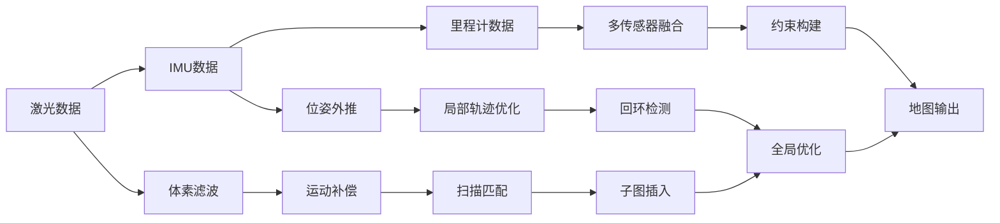

# Cartographer

Cartographer 是 Google 开源的实时同步定位与建图（SLAM）系统，以其子图（Submap）和分支定界（Branch-and-Bound）扫描匹配而闻名。让我详细解析其架构和流程。

## Cartographer 核心架构

```
前端（Local SLAM）
├── 扫描匹配（实时）
├── 子图构建
└── 位姿外推

后端（Global SLAM）
├── 回环检测
├── 位姿图优化
└── 全局一致性
```

与 LOAM/LIOSAM 的关键区别

| 特性 | LOAM/LIOSAM | Cartographer |
| 匹配方法 | 特征点匹配 | 概率栅格地图匹配 |
| 地图表示 | 点云/特征点 | 概率栅格子图 |
| 优化框架 | 因子图/ICP | 位姿图+Ceres优化 |
| 回环检测 | 视觉词袋+ICP | 分支定界扫描匹配 |
| 适用场景 | 小规模建图 | 大规模建图 |

## Cartographer 完整流程



## 核心模块详解

### 局部SLAM (前端)

扫描匹配（Real-Time Correlative Scan Matcher）

```cpp
class LocalTrajectoryBuilder {
public:
    // 处理激光扫描的核心函数
    std::unique_ptr<MatchingResult> AddRangeData(
        const sensor::TimedPointCloudData& range_data) {
        
        // 1. 运动畸变补偿
        auto undistorted_point_cloud = RemoveMotionDistortion(range_data);
        
        // 2. 体素滤波降采样
        auto filtered_point_cloud = VoxelFilter(undistorted_point_cloud, 0.05f);
        
        // 3. 扫描匹配（核心算法）
        auto pose_estimate = ScanMatch(
            time, filtered_point_cloud, 
            current_submap->grid(),  // 当前子图
            initial_pose_estimate    // 来自IMU/里程计的初始估计
        );
        
        // 4. 将扫描插入子图
        current_submap->InsertRangeData(filtered_point_cloud, pose_estimate);
        
        // 5. 判断是否需要创建新子图
        if (ShouldCreateNewSubmap(pose_estimate)) {
            FinishSubmap();
            CreateNewSubmap();
        }
        
        return std::make_unique<MatchingResult>(pose_estimate, std::move(filtered_point_cloud));
    }
};
```

概率栅格地图

```cpp
class ProbabilityGrid {
public:
    // 更新栅格占据概率（Hit/Miss更新）
    void SetProbability(const Eigen::Array2i& cell_index, float probability) {
        auto& cell = cells_[cell_index];
        
        // 使用odds更新公式
        float odds = probability / (1.0f - probability);
        float old_odds = cell / (1.0f - cell);
        float new_odds = old_odds * odds;
        
        cell = new_odds / (1.0f + new_odds);
    }
    
    // 检查栅格是否被占据
    bool IsOccupied(const Eigen::Array2i& cell_index) const {
        return cells_[cell_index] > occupied_threshold_;
    }
};
```

### 全局SLAM（后端）

位姿图优化（Pose Graph Optimization）

```cpp
class PoseGraph {
private:
    struct Constraint {
        int submap_id;          // 子图ID
        int scan_id;            // 扫描ID  
        transform::Rigid3d relative_pose;  // 相对位姿
        Eigen::Matrix<double, 6, 6> covariance;  // 协方差矩阵
    };
    
    std::vector<Constraint> constraints_;
    std::map<int, transform::Rigid3d> submap_poses_;
    std::map<int, transform::Rigid3d> scan_poses_;

public:
    void RunFinalOptimization() {
        ceres::Problem problem;
        
        // 添加位姿图约束
        for (const auto& constraint : constraints_) {
            auto* cost_function = SpaCostFunction::Create(constraint.relative_pose);
            problem.AddResidualBlock(
                cost_function, 
                new ceres::HuberLoss(0.5),  // Huber损失函数
                submap_poses_[constraint.submap_id].data(),
                scan_poses_[constraint.scan_id].data()
            );
        }
        
        // 添加里程计约束（如果可用）
        AddOdometryConstraints(problem);
        
        // 执行优化
        ceres::Solver::Summary summary;
        ceres::Solve(options, &problem, &summary);
    }
};
```

### 分支定界扫描匹配（Branch-and-Bound）

这是Cartographer最核心的创新算法：

```cpp
class FastCorrelativeScanMatcher {
public:
    struct Candidate {
        int scan_index;
        float score;
        transform::Rigid2d pose;
    };
    
    Candidate BranchAndBoundScanMatch(
        const sensor::PointCloud& point_cloud,
        const ProbabilityGrid& grid,
        const transform::Rigid2d& initial_pose) {
        
        // 1. 生成候选位姿（多分辨率）
        auto candidates = GenerateCandidates(initial_pose, search_window);
        
        // 2. 分支定界搜索
        float best_score = -1.0f;
        Candidate best_candidate;
        
        while (!candidates.empty()) {
            Candidate candidate = candidates.top();
            candidates.pop();
            
            // 边界检查：如果当前分支的最好可能得分都不如已知最优解，则剪枝
            if (candidate.score < best_score) continue;
            
            if (IsLeafCandidate(candidate)) {
                // 叶子节点：计算实际得分
                float real_score = ComputeRealScore(point_cloud, grid, candidate.pose);
                if (real_score > best_score) {
                    best_score = real_score;
                    best_candidate = candidate;
                }
            } else {
                // 非叶子节点：生成子候选并计算得分上界
                auto children = GenerateChildren(candidate);
                for (auto& child : children) {
                    float upper_bound = ComputeScoreUpperBound(child, grid);
                    if (upper_bound > best_score) {
                        child.score = upper_bound;
                        candidates.push(child);
                    }
                }
            }
        }
        
        return best_candidate;
    }
};
```

## 子图管理系统

子图创建和管理

```cpp
class SubmapCollection {
private:
    std::vector<std::unique_ptr<Submap>> submaps_;
    int current_submap_index_ = 0;
    
public:
    // 创建新子图
    void CreateNewSubmap(const transform::Rigid3d& origin) {
        auto new_submap = std::make_unique<Submap>(
            origin, 
            kSubmapSize,      // 子图尺寸（如100x100米）
            kResolution       // 分辨率（如0.05米/像素）
        );
        
        submaps_.push_back(std::move(new_submap));
        current_submap_index_ = submaps_.size() - 1;
    }
    
    // 判断是否需要创建新子图
    bool ShouldCreateNewSubmap(const transform::Rigid3d& current_pose) const {
        if (submaps_.empty()) return true;
        
        auto& current_submap = *submaps_[current_submap_index_];
        double distance = (current_pose.translation() - 
                         current_submap.origin().translation()).norm();
        
        // 当机器人远离子图中心一定距离时创建新子图
        return distance > kMaxSubmapDistance;
    }
    
    // 完成当前子图（不再插入新数据）
    void FinishSubmap(int submap_id) {
        submaps_[submap_id]->Finish();
    }
};
```

## 多传感器融合

IMU和里程计数据处理

```cpp
class PoseExtrapolator {
public:
    // 使用IMU进行位姿预测
    transform::Rigid3d ExtrapolatePose(common::Time time) {
        // 1. IMU积分（角速度）
        const auto angular_velocity_from_imu = angular_velocity_tracker_.ComputeAngularVelocity();
        const transform::Rigid3d rotation = 
            transform::Rigid3d::Rotation(IntegrateAngularVelocity(angular_velocity_from_imu, time));
        
        // 2. 里程计积分（线速度）
        const auto velocity_from_odometry = odometry_tracker_.ComputeVelocity();
        const transform::Rigid3d translation =
            transform::Rigid3d::Translation(IntegrateVelocity(velocity_from_odometry, time));
        
        // 3. 融合结果
        return last_pose_ * rotation * translation;
    }
    
private:
    // 卡尔曼滤波融合多传感器数据
    void UpdateKalmanFilter(const sensor::ImuData& imu_data,
                           const sensor::OdometryData& odom_data) {
        // 预测步骤
        Eigen::Matrix<double, 15, 15> F;  // 状态转移矩阵
        Eigen::Matrix<double, 15, 15> Q;  // 过程噪声协方差
        
        state_ = F * state_;  // 状态预测
        covariance_ = F * covariance_ * F.transpose() + Q;  // 协方差预测
        
        // 更新步骤（IMU）
        if (imu_data) {
            Eigen::Matrix<double, 6, 15> H_imu;  // IMU观测矩阵
            Eigen::Matrix<double, 6, 6> R_imu;    // IMU观测噪声
            
            Eigen::Matrix<double, 6, 1> innovation = imu_data - H_imu * state_;
            Eigen::Matrix<double, 15, 6> K = covariance_ * H_imu.transpose() * 
                                           (H_imu * covariance_ * H_imu.transpose() + R_imu).inverse();
            
            state_ = state_ + K * innovation;
            covariance_ = (Eigen::Matrix<double, 15, 15>::Identity() - K * H_imu) * covariance_;
        }
    }
};
```

## 回环检测优化

多分辨率栅格匹配

```cpp
class LoopClosing {
public:
    struct LoopClosure {
        int submap_id;
        int scan_id;
        transform::Rigid3d transform;
        float score;
    };
    
    std::vector<LoopClosure> DetectLoopClosures(
        int newest_submap_id, const sensor::PointCloud& point_cloud) {
        
        std::vector<LoopClosure> closures;
        
        // 1. 候选子图选择（基于空间接近性）
        auto candidate_submaps = FindCandidateSubmaps(newest_submap_id);
        
        for (int candidate_id : candidate_submaps) {
            // 2. 多分辨率匹配
            for (int resolution_level = kMaxResolutionLevel; 
                 resolution_level >= 0; --resolution_level) {
                
                // 获取对应分辨率的栅格地图
                const auto& grid = GetGridAtResolution(candidate_id, resolution_level);
                
                // 3. 分支定界匹配
                auto match_result = BranchAndBoundMatch(point_cloud, grid);
                
                if (match_result.score > kLoopClosureThreshold) {
                    closures.push_back({
                        candidate_id, 
                        newest_submap_id, 
                        match_result.pose, 
                        match_result.score
                    });
                    break;  // 找到匹配即停止
                }
            }
        }
        
        return closures;
    }
};
```

## 总结

Cartographer 的核心优势：

1. 分层架构：清晰的前端/后端分离，支持大规模建图
2. 概率栅格：鲁棒的地图表示，对噪声不敏感
3. 分支定界：高效的全局最优扫描匹配
4. 子图管理：自然支持大规模环境建图
5. 多传感器融合：灵活的传感器支持框架

适用场景：

+ 大规模室内建图：办公室、工厂、商场
+ 长期定位：服务机器人、AGV
+ 多楼层建图：3D Cartographer支持
+ 基础设施检测：管道、隧道检测
