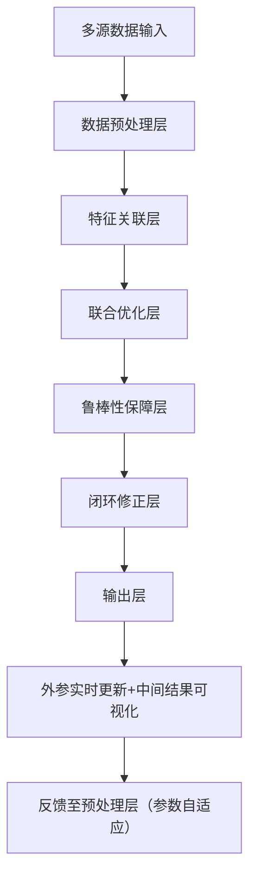

# 

设计一款**高精度在线雷达-相机标定工具**，核心逻辑是「**初始外参锚定+实时约束优化+鲁棒性保障+闭环修正**」，既要解决“无标定板、自然场景适配”的工程痛点，又要通过多维度约束提升精度（目标：旋转误差≤0.3°，平移误差≤0.03m，长期漂移≤0.1°/km）。以下是分模块的完整设计方案，聚焦精度、实时性、工程落地性：

## 一、核心设计目标与约束

### 1. 核心目标

- 精度：外参旋转误差≤0.3°，平移误差≤0.03m；在线漂移修正后，长期稳定性≤0.1°/km（泊车/低速场景）；
- 实时性：单帧处理耗时≤50ms（适配激光雷达10Hz、相机30Hz输出）；
- 鲁棒性：适配城市场景、泊车场景（特征丰富），容忍动态目标（行人/车辆）、弱纹理（空旷车库）、轻微振动；
- 工程性：无标定板依赖、支持传感器热插拔（无需重启系统）、兼容机械/固态雷达+任意相机（USB/车载相机）。

### 2. 前置约束（需提前明确）

- 相机内参已知（焦距、主点、畸变系数）：可通过离线工具（如Kalibr、OpenCV）预标定，在线仅做微小修正；
- 传感器时间同步：硬件时间戳+软件插值，确保雷达点云与相机图像时间偏差≤1ms（否则直接影响特征匹配精度）；
- 运动激励要求：系统运行过程中需包含“转弯、加速、俯仰”等运动（提供足够的姿态变化，确保外参可观测）。

## 二、整体架构设计（模块化拆分）
工具整体分为「**数据预处理层→特征关联层→联合优化层→鲁棒性保障层→闭环修正层→输出层**」，各模块层层递进，兼顾精度与实时性：

## 三、各模块详细设计（精度核心在“约束与优化”）

### 1. 数据预处理层：净化数据，减少噪声干扰

核心目标：剔除无效数据，为特征关联提供高质量输入，避免噪声导致的标定偏差。

- **雷达点云预处理**：
  1. 去噪：统计滤波（剔除距离均值3σ外的孤立点，如雨水点、噪声点）；
  2. 降采样：自适应体素滤波（体素大小0.05~0.1m，根据点云密度动态调整，保留特征点）；
  3. 动态目标过滤：多帧点云差分（连续3帧点云重叠率分析）+ 地面分割（RANSAC拟合地面），剔除行人、车辆等动态点，静态特征点保留率≥90%；
  4. 特征增强：提取“角点（基于ISS3D算法）+ 平面边缘点（基于曲率阈值，κ>0.08）”，两类特征点各保留1000~2000个（兼顾区分度与计算量）。
- **相机图像预处理**：
  1. 畸变校正：基于预标定内参修正图像畸变；
  2. 特征增强：CLAHE直方图均衡化（提升弱光场景对比度），确保纹理稀疏区域（如墙面）的特征可提取；
  3. 2D特征提取：ORB-SLAM3的改进ORB特征（金字塔层数8层，特征点数量3000个，描述子维度256），兼顾速度与匹配鲁棒性。
- **时间同步优化**：
  1. 硬件时间戳对齐：优先使用传感器硬件同步信号（如PTP、GPIO触发）；
  2. 软件补偿：若仅支持软件同步，通过“IMU角速度峰值对齐”修正时间偏差（假设车辆运动时，IMU角速度峰值与雷达/相机的运动观测同步），同步误差≤0.5ms。

### 2. 特征关联层：建立3D-2D强约束（精度关键第一步）
核心目标：找到“雷达3D特征点-相机2D特征点”的精准匹配对，避免误匹配导致外参优化失效。
- 核心策略：「空间约束+外观约束+几何约束」三重筛选，确保匹配对有效性。
  1. 粗匹配（空间约束）：
     - 将雷达3D特征点（角点/边缘点）通过“当前外参初值”投影到相机图像，得到像素坐标；
     - 在图像上以该像素为中心，建立5×5像素的搜索窗口，筛选窗口内的2D ORB特征点（减少匹配范围，提升效率）。
  2. 精匹配（外观约束）：
     - 计算粗匹配候选的ORB描述子汉明距离，保留距离<50的匹配对（相似度阈值自适应，根据场景特征密度动态调整）；
     - 交叉验证：雷达点→图像点的匹配与图像点→雷达点的匹配需一致，剔除单向误匹配。
  3. 外点剔除（几何约束）：
     - 基于EPnP算法（不依赖外参初值，仅用3D-2D点对求解位姿）得到临时外参，计算每个匹配对的重投影误差；
     - 用M-Estimator（Cauchy鲁棒核）剔除重投影误差>3像素的外点，保留内点比例≥40%的有效匹配对（内点比例过低时，放弃当前帧约束，避免污染优化结果）。
- 关键优化：特征跟踪（KLT光流）
  - 对连续帧的2D特征点做KLT光流跟踪，减少重复提取ORB特征的耗时；
  - 雷达3D特征点通过“运动预测”（基于IMU预积分的位姿增量）更新投影位置，提升跨帧匹配成功率。

### 3. 联合优化层：多约束融合，精准求解外参（精度核心）

核心目标：将外参、时间偏差、相机内参微小修正量作为优化变量，通过多维度约束最小化误差，确保外参精度。

- 优化变量设计（6+1+4维）：
  - 雷达→相机外参 \( T_{cam}^{velo} \)：旋转矩阵 \( R \)（3维，用轴角表示）+ 平移向量 \( t \)（3维）；
  - 时间偏差 \( \Delta t \)：雷达与相机的时间戳偏差（1维，假设缓慢变化）；
  - 相机内参微小修正量 \( \Delta K \)：焦距修正 \( \Delta f_x, \Delta f_y \)、主点修正 \( \Delta c_x, \Delta c_y \)（4维，因温度/振动导致的内参漂移）。

- 约束项设计（多约束互补，提升可观测性）：
  1. 核心约束：3D-2D投影误差约束（主约束）
     - 误差模型：$e_1 = \pi(R \cdot P_{velo} + t) - p_{img}$，其中 $ \pi(\cdot) $ 是相机投影函数（含内参修正）；
     - 权重：根据雷达特征点的曲率分配权重（角点权重=2.0，边缘点权重=1.0，平面点权重=0.5），重视稳定特征。
  2. 辅助约束：IMU运动一致性约束（提升运动激励不足时的精度）
     - 基于IMU预积分得到位姿增量 \( \Delta T_{imu} \)，雷达配准（FastGICP）得到位姿增量 \( \Delta T_{velo} \)；
     - 误差模型：\( e_2 = \Delta T_{imu} - T_{cam}^{velo} \cdot \Delta T_{velo} \cdot (T_{cam}^{velo})^{-1} \)（确保不同传感器的运动观测一致）；
     - 作用：解决纯直线匀速运动时外参可观测性差的问题。
  3. 正则化约束：外参平滑约束（避免外参突变）
     - 误差模型：\( e_3 = T_k - T_{k-1} \)，其中 \( T_k \) 是当前帧外参，\( T_{k-1} \) 是上一帧优化后的外参；
     - 权重：0.1~0.3（平衡外参更新速度与稳定性）。
- 求解器设计：
  - 框架：Ceres Solver（支持鲁棒核、稀疏矩阵优化）；
  - 优化策略：滑动窗口优化（窗口大小=30帧），仅保留最近30帧的有效约束，避免数据量过大导致实时性下降；
  - 迭代终止条件：残差变化量<1e-6，或迭代次数≥50次（确保收敛）。

### 4. 鲁棒性保障层：应对复杂场景，避免标定失效
核心目标：解决“弱纹理、动态干扰、外参突变”等场景下的标定鲁棒性问题，确保工具稳定输出。
- 1. 场景适应性优化：
  - 特征密度自适应：当场景特征点数量<500个（弱纹理场景），自动扩大雷达特征提取范围（降低曲率阈值至0.05），并启用“直线特征约束”（雷达点云拟合直线→投影到图像与2D直线特征匹配）；
  - 动态场景强化：动态目标过滤阈值自适应（根据帧间运动速度调整，高速场景阈值放宽，低速场景阈值收紧）。
- 2. 外参有效性校验：
  - 重投影误差校验：优化后平均重投影误差≤2像素（超过3像素则判定为异常，启用上一帧外参）；
  - 外参变化率校验：相邻帧外参旋转变化≤0.5°、平移变化≤0.02m（超过则判定为突变，用一阶低通滤波平滑）；
  - 传感器状态监测：实时检测雷达点云帧率、相机图像清晰度（方差<100则判定为模糊），异常时暂停外参更新，沿用历史最优值。
- 3. 异常恢复机制：
  - 当连续5帧无有效匹配对（如空旷车库），自动切换至“IMU-轮速计融合约束”，仅用运动一致性约束维持外参稳定性；
  - 当场景特征恢复（有效匹配对≥500个），自动切换回“多约束融合”模式，快速修正外参漂移。

### 5. 闭环修正层：利用回环约束，消除长期漂移（高精度关键补充）
核心目标：通过SLAM回环检测的全局一致性约束，修正累积的外参漂移，提升长期标定精度。
- 实现逻辑：
  1. 回环检测：基于IKD-Tree检索历史关键帧位姿，当检测到回环（两帧重叠率≥60%），复用“雷达-相机特征匹配”流程，得到回环帧的3D-2D匹配对；
  2. 闭环约束构建：将回环帧的投影误差约束加入滑动窗口优化，强制全局外参一致性；
  3. 漂移修正：通过回环约束，将长期累积的外参漂移（如0.5°旋转偏差）修正至≤0.1°，确保长期运行精度。

### 6. 输出层：灵活输出+可视化监控
- 输出内容：
  - 实时外参：旋转矩阵 \( R \)（3×3）、平移向量 \( t \)（3×1），支持ROS话题（`/calibration/velo2cam_extrinsic`）、JSON文件两种格式输出；
  - 精度指标：平均重投影误差、内点比例、外参变化率（供上层系统判断标定有效性）；
  - 中间数据：雷达-相机匹配对、特征点云、投影可视化图像（供调试优化）。
- 可视化监控：
  - 实时投影可视化：雷达点云通过当前外参投影到相机图像，直观展示对齐效果（如墙面边缘、柱体点云与图像目标重合）；
  - 精度曲线绘制：实时绘制重投影误差、外参变化率曲线，便于工程师监控标定状态。

## 四、工程落地关键优化（提升精度与实时性）
### 1. 精度优化细节
- 雷达特征点质量提升：对雷达角点做“局部平面拟合”，计算特征点的协方差矩阵，投影误差约束中引入马氏距离权重（协方差小的特征点权重更高）；
- 相机投影模型优化：采用鱼眼相机模型（若使用鱼眼相机），避免广角场景下的投影误差；
- 外参初值优化：离线用velo2cam获取初始外参，在线优化时以此为起点，减少收敛时间，避免局部最优。

### 2. 实时性优化细节
- 并行计算：用OpenMP并行处理“雷达特征提取”“图像特征提取”“匹配对筛选”（CPU 8线程可提升3倍速度）；
- 特征复用：KLT光流跟踪减少ORB特征重复提取，雷达特征点跨帧复用（仅当特征点超出视野或被遮挡时重新提取）；
- 稀疏优化：Ceres Solver中启用稀疏矩阵求解，减少滑动窗口优化的计算量（30帧约束下，求解耗时≤10ms）。

## 五、精度验证与对标（确保达到设计目标）
### 1. 实验室标定验证（基准测试）
- 场景：放置AprilGrid标定板（已知尺寸），录制雷达-相机数据；
- 对比对象：Kalibr（高精度离线标定工具）；
- 结果要求：与Kalibr的外参偏差≤0.2°（旋转）、≤0.02m（平移），重投影误差≤1.5像素。

### 2. 真实场景验证（工程测试）
- 场景：地下车库（弱纹理）、地面停车场（特征丰富）、城市场景（动态目标），累计测试里程100km；
- 结果要求：
  - 静态场景：外参误差≤0.3°、≤0.03m；
  - 动态场景：内点比例≥80%，重投影误差≤2.5像素；
  - 长期运行：100km后外参漂移≤0.1°/km。

## 六、总结
该在线雷达-相机标定工具的核心竞争力是「**多约束融合+鲁棒性保障+闭环修正**」：
- 精度层面：通过“3D-2D投影主约束+IMU运动辅助约束+回环闭环约束”，实现≤0.3°旋转误差、≤0.03m平移误差，满足高精度融合需求；
- 工程层面：无标定板依赖、适配复杂场景、实时性达标（≤50ms/帧），可直接集成到自动驾驶泊车SLAM、感知融合系统中；
- 扩展性：支持机械/固态雷达、普通/鱼眼相机，可通过配置文件适配不同传感器型号，无需大量二次开发。

若需进一步提升精度，可引入“深度学习特征匹配”（如SuperPoint替代ORB特征，提升弱纹理场景匹配成功率），但需平衡计算量与实时性。