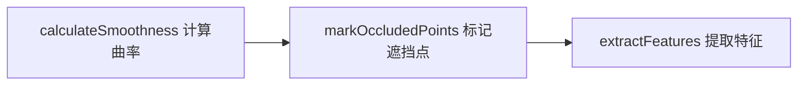

# 点云特征点的提取和配准

## 角点/平面点特征提取

###  calculateSmoothness 曲率计算 

曲率 = 二阶导数, 这里使用二阶差分来近似

这段代码计算的并非严格数学意义上的二阶导数，但核心思想与二阶导数一致 —— 通过量化 “局部测距值的变化率的变化” 来反映点的平滑程度（曲率），本质是一种离散化的 “近似二阶导数”，专门适配激光雷达点云的 “有序性”（按扫描线时序排列）。

#### 原理讲解

1. 首先计算雷达各个点的径向测距值 $r_i = \sqrt{x^2 + y^2 + z^2}$
2. 计算某一点的一阶差分：$f^,(r) = r_i - r_{i-1}$
3. 计算耨个点的二阶差分：$f^{,,}(r) = (r_{i+1} - r_i) - (r_i - r_{i-1}) = r_{i+1} + r_{i-1} - 2r_i = \Delta^2r_i$

#### 流程讲解

1. 为了强化局部形状的特征（减少噪声），代码取第i点的前后 5 个点（共 10 个邻点）
2. 左边的一阶差分 $A = (r_i - r_{i-1}) + (r_i - r_{i-2})+ (r_i - r_{i-3})+ (r_i - r_{i-4})+ (r_i - r_{i-5})$
3. 右边的一阶差分 $B = (r_{i+1} - r_i) + (r_{i+2} - r_i) + (r_{i+3} - r_i) + (r_{i+4} - r_i) + (r_{i+5} - r_i)$
4. 那么 i 点的二阶差分 $\Delta^2r_i = B - A = (r_{i-5} + r_{i-4} + r_{i-3} + r_{i-2} + r_{i-1} + r_{i+1} + r_{i+2} + r_{i+3} + r_{i+4}+ r_{i+5}) - 10r_i$
5. 因为我们只关心曲率的大小，不关心曲率的正负，所以适应 $(\Delta^2r_i)^2$ 替代 $\Delta^2$

###  markOccludedPoints 标记遮挡点 

提取的特征点只希望包含物体内部的特点，所以排除

+ 相邻点差距大于0.3m的点
+ 连续帧的深度变化大于2%， 也就是排除可能和激光束平行的平面

###  extractFeatures 提取特征 

提取两种特征，分别是曲率最大的角点和曲率最小的平面点

#### 流程讲解

1. 将一个扫描线分割成六份，并对每份中的曲率按照大小进行排序
2. 选择前20个曲率最大且超过阈值的点，每选择一个曲率最大点，标记前后10个点，防止角点聚集
3. 如果当前的曲率小于阈值，标记前后10个点，防止平面点聚集, 不仅要防止扫描线内的平面点，还要防止扫描线间的，因此最后还需要通过降采样，减少平面点

-----

## ISS 关键点 特征提取（Intrinsic Shape Signatures 内在形状特征）

从无序，稀疏的点云中，筛选出"几何结构稳定，代表性强"的关键点，既保留点云的核心形状信息，又能有效降维，后续可搭配 FPFH/SHOT 等描述子用于匹配、配准或 SLAM 回环检测。

下面是ISS特征点提取的4个核心步骤

### 确定每个点的自适应邻域

避免固定邻域（比如固定找 50 个邻居）导致的问题（近距离点云邻域过密、远距离点云邻域过疏）；

用 “球查询”（Ball Query），给每个点设置一个 “邻域半径 r”，找以该点为中心、r 为半径的球内所有点作为邻域；r 不是固定值，而是根据点云密度自适应（比如点云密的区域 r 小，疏的区域 r 大），或直接用 “k 近邻 + 距离阈值” 混合查询（保证邻域点数足够，又不跨度过大）。

### 计算邻域的协方差矩阵和特征值

用协方差矩阵描述邻域点的分布形状，特征值反映分布的 “伸展方向”（类似 LIO-Sam 计算曲率的逻辑，但 ISS 用 3 个特征值做判断）；

做法：

1. 计算邻域内所有点的均值（中心点）；
2. 构建协方差矩阵 $\Sigma = \frac{1}{k} \sum_{i=1}^k (p_i - \bar{p})(p_i - \bar{p})^T$（k 是邻域点数，$p_i$ 是邻域点，$\bar{p}$ 是均值）；
3. 对协方差矩阵做特征值分解，得到 3 个特征值 $\lambda_1 \geq \lambda_2 \geq \lambda_3$。

特征值的物理意义:

1. $\lambda_1$：邻域点在 “主方向”（分布最广的方向）的离散程度；
2. $\lambda_2$：次主方向的离散程度；
3. $\lambda_3$：垂直于主方向的离散程度；

### 用特征值比例筛选候选关键点

只保留 “几何结构突出” 的点（比如角点、棱边点，排除平面点、孤立噪点）

核心规则（ISS 的核心创新）：只有满足以下两个比例条件的点，才被选为候选关键点：

1. $\lambda_2 / \lambda_1 < \alpha$（主方向和次主方向差异大，说明点在 “主方向” 上很突出，不是平面或球面点）；
2. $\lambda_3 / \lambda_2 < \beta$（次主方向和垂直方向差异大，说明点在 “垂直方向” 上很紧凑，是局部极值点）；

参数说明（工程常用值）：$\alpha = 0.5$、$\beta = 0.5$（可根据场景调整：结构化场景 α/β 可设小，非结构化场景可设大）；

筛选逻辑：

+ 平面点：\(\lambda_2 / \lambda_1 \approx 1\)，不满足第一个条件，被剔除；
+ 球面点：\(\lambda_3 / \lambda_2 \approx 1\)，不满足第二个条件，被剔除；
+ 角点 / 棱边点：满足两个条件，成为候选关键点。

### 非极大值抑制（NMS），去重冗余关键点

避免同一物理结构（比如同一条棱边）上提取过多相邻的关键点，减少后续计算量；

1. 给每个候选关键点计算一个 “显著性分数”（比如 \(s = \lambda_3\)，值越大说明点越 “突出”）；
2. 在每个候选点的邻域内（比如半径 2r），只保留分数最高的那个关键点，其余冗余点被剔除；

结果：最终得到的 ISS 关键点，是 “分布均匀、几何结构稳定、代表性强” 的核心点。

+ 若 LIO-Sam 在非结构化场景（比如野外、施工区域）中匹配不稳定，可将 “角点提取” 替换为 ISS 关键点（保留平面点，用 ISS 替代角点），提升匹配鲁棒性；
+ 若追求极致实时性（比如嵌入式 CPU 运行），LIO-Sam 原有的曲率筛选更优；若允许轻微算力增加，ISS 是更好的选择。

## FPFH 局部特征描述子（Fast Point Feature Histograms）

ISS 的核心作用是从海量点云中筛选少量关键样本（比如 10 万点的点云，筛选后只剩 500 个 ISS 关键点），解决两个问题：

+ 降维：避免后续计算对所有点处理（算力浪费）；
+ 去噪：只保留几何结构稳定的点（剔除平面点、孤立噪点）。

但 ISS 的短板很明显：只输出关键点的 “3D 坐标”，没有任何 “辨识度” 信息， 因为它们只有坐标，没有描述 “周围长什么样” 的特征。

+ FPFH（Fast Point Feature Histograms）是 简化版的 PFH（Point Feature Histograms），核心目的是：用 “关键点邻域内所有点对的几何关系”，构建统计直方图，再将直方图展平为向量
+ 局部结构的本质是 “点与点之间的相对姿态”，用 “法向量夹角 + 点对距离” 就能完整描述这种姿态，再通过直方图统计，让描述子对噪声、轻微形变鲁棒。
+ FPFH 的输出是一个向量（称为 “局部特征描述子向量”），默认是 125 维（工程中最常用），也可通过参数调整维度。

### 数据准备

+ 原始点云 P（含所有点的 3D 坐标 $\mathbf{p}_i = (x_i, y_i, z_i)$）；
+ 关键点 $\mathbf{p}_q$（比如 ISS 提取的关键点，是 P 中的一个点）；
+ 关键点的邻域点集 $N(\mathbf{p}_q)$（用球查询 /k 近邻得到，比如以 $\mathbf{p}_q$ 为中心、半径 r 的球内所有点，记为 $\{\mathbf{p}_1, \mathbf{p}_2, ..., \mathbf{p}_k\}$，k 是邻域点数）；
+ 所有点的法向量 $\{\mathbf{n}_q, \mathbf{n}_1, \mathbf{n}_2, ..., \mathbf{n}_k\}$ $(\mathbf{n}_q$ 是关键点的法向量，$\mathbf{n}_i$ 是邻域点 $\mathbf{p}_i$ 的法向量，均为单位向量）。

### 构建 “扩展邻域”（FPFH 与 PFH 的核心区别）

+ 目的：PFH 会计算 “邻域内所有点对（$\mathbf{p}_i, \mathbf{p}_j$）” 的关系（O (k²) 复杂度），FPFH 简化为 “关键点与每个邻域点（$\mathbf{p}_q, \mathbf{p}_i$）+ 邻域点之间的直接邻居（$\mathbf{p}_i, \mathbf{p}_j$，且 $\mathbf{p}_j$ 也是 $\mathbf{p}_i$ 的邻域点）” 的关系（O (kn) 复杂度），既保留核心信息，又降低计算量；

+ 做法：
  1. 先取关键点 $\mathbf{p}_q$ 的直接邻域 $N(\mathbf{p}_q)$（k 个点）；
  2. 再取每个 $\mathbf{p}_i \in N(\mathbf{p}_q)$ 的邻域 $N(\mathbf{p}_i)$；
  3. 合并这些邻域，去重后得到 “扩展邻域” $N'(\mathbf{p}_q)$（包含 \(\mathbf{p}_q\)、直接邻域、邻域的邻域，数量约为 2k~3k）；
+ 作用：保证覆盖关键点周围足够的局部结构，避免因 “直接邻域太小” 导致描述子信息不足。

### 对扩展邻域内的 “有效点对”，计算 4 个几何参数

+ 目的：对每一对 “有效点对”，提取 4 个能描述其相对姿态的参数（3 个角度 + 1 个距离），这些参数是构建直方图的基础；

+ 对于统一邻域集的点对
  + $\mathbf{p}_a = \mathbf{p}_q$ 且 $\mathbf{p}_b \in N(\mathbf{p}_q)$（关键点与直接邻域点）；
  + $\mathbf{p}_a \in N(\mathbf{p}_q)$ 且 $\mathbf{p}_b \in N(\mathbf{p}_a)$（邻域点与其直接邻域点）；

+ 几何参数的计算
  + 向量 $\mathbf{u} = \mathbf{n}_a$（点 $\mathbf{p}_a$ 的法向量）；
  + 向量 $\mathbf{v} = \frac{\mathbf{p}_b - \mathbf{p}_a}{\|\mathbf{p}_b - \mathbf{p}_a\|}$（点对的单位方向向量）；
  + 向量 $\mathbf{w} = \mathbf{u} \times \mathbf{v}$（$\mathbf{u}$ 和 $\mathbf{v}$ 的叉乘，垂直于两者构成的平面）；
  
  则 4 个参数为：
  
  1. $\alpha = \mathbf{v} \cdot \mathbf{n}_b$（点 \(\mathbf{p}_b\) 的法向量与点对方向的夹角，范围 [-1, 1]）；
  2. $\phi = \mathbf{u} \cdot \frac{\mathbf{p}_b - \mathbf{p}_a}{\|\mathbf{p}_b - \mathbf{p}_a\|}$（点 $\mathbf{p}_a$ 的法向量与点对方向的夹角，范围 [-1, 1]）；
  3. $\theta = \arctan2(\mathbf{w} \cdot \mathbf{n}_b, \mathbf{u} \cdot \mathbf{n}_b)$（点 $\mathbf{p}_b$ 的法向量在 $\mathbf{u}-\mathbf{v}$ 平面的旋转角，范围 [-π, π]）；
  4. $d = \|\mathbf{p}_b - \mathbf{p}_a\|$（点对之间的距离，范围 [0, r]，r 是邻域半径）；
  
  直观理解：这 4 个参数完整描述了 “点 $\mathbf{p}_b$ 相对于点 $\mathbf{p}_a$ 的位置和姿态关系”—— 3 个角度描述方向，1 个距离描述尺度。

### 对 4 个参数分别做 “分箱统计”（构建直方图）

+ 目的：将离散的点对参数，转化为连续的统计直方图，让描述子对噪声和轻微位置偏差鲁棒；

+ 做法：

  1. 对每个参数，根据其取值范围，划分成若干个 “区间（bin）”；
  2. 对所有有效点对的参数，统计每个区间内的点对数量（即直方图的 “高度”）；

+ 工程常用参数（决定输出向量维度）：
  + $\alpha$：范围 [-1, 1]，划分 11 个 bin；
  + $\phi$：范围 [-1, 1]，划分 11 个 bin；
  + $\theta$：范围 [-π, π]，划分 11 个 bin；
  + d：范围 [0, r]，划分 1 个 bin（默认不细分，因为距离对尺度敏感，细分后鲁棒性下降；若场景尺度固定，可划分 5~11 个 bin）；
  
+ 直方图维度计算：
  
  + 每个参数的 bin 数相乘，即 $11 \times 11 \times 11 \times 1 = 1331$？不！FPFH 做了简化：
  + 之前说的 125 维是 “简化版 FPFH”，由 PCL 默认实现，实际是将每个角度的 bin 数调整为 5 个：$5 \times 5 \times 5 = 125$，平衡精度和维度）

### FPFH 特有的 “加权统计”（区别于 PFH）

+ 对 “关键点与直接邻域点” 的点对（$\mathbf{p}_q, \mathbf{p}_i$），权重设为 1.0；
+ 对 “邻域点与其直接邻域点” 的点对（$\mathbf{p}_i, \mathbf{p}_j$），权重设为 $\frac{1}{d_{ij}}$（$d_{ij}$ 是两点距离，距离越近权重越高）；
+ 统计直方图时，每个点对的参数计入对应 bin 时，乘以其权重（而非简单计数）；
+ 作用：让描述子更聚焦于 “关键点周围的核心结构”，减少远处邻域点的干扰。

### 直方图归一化 + 展平为向量（最终输出）

+ 目的：将直方图转化为固定维度的向量，方便后续匹配（向量相似度计算）；
+ 做法：
  + 归一化：将直方图的所有 bin 值除以总权重和（让向量的 L1 范数为 1），消除点对数量不同导致的尺度差异；
  + 展平：将 3 维直方图（$\alpha$ 维度 × $\phi$ 维度 × $\theta$ 维度）按顺序展平为 1 维向量；
+ 输出：
  + 默认维度：$5 \times 5 \times 5 = 125$ 维（PCL 默认设置，每个角度 5 个 bin）；
  + 可选维度：若每个角度设 11 个 bin，输出 $11 \times 11 \times 11 = 1331$ 维（精度更高，但计算量和存储量更大）。
