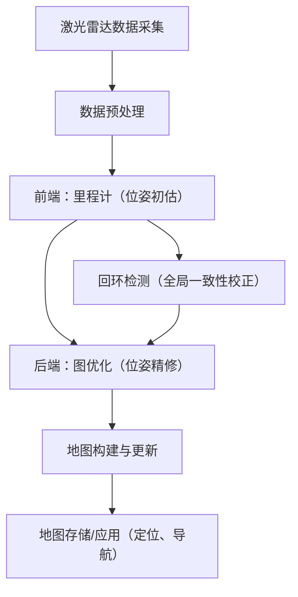

# 激光SLAM的总体流程

激光 SLAM（激光雷达即时定位与地图构建）的核心目标是：

在未知环境中，仅通过激光雷达数据，实时估计传感器（或载体）的 6DoF 位姿（x,y,z,roll,pitch,yaw），并构建全局一致的 3D 环境地图。

其总体流程可分为「数据预处理→前端里程计→后端优化→回环检测→地图构建」五大核心模块，部分场景会引入传感器融合（如 IMU、视觉）提升鲁棒性。以下结合车载、机器人等实际应用场景，详细拆解各模块的功能、关键算法及工程实践细节：

## 一、激光 SLAM 总体流程框架（从数据到地图的完整链路）

各模块的核心逻辑：

+ 前端：快速计算相邻帧之间的相对位姿，提供 “粗定位” 结果；
+ 后端：融合多帧位姿约束、回环约束，解决前端累积误差，输出 “精定位”；
+ 回环检测：识别已遍历环境，提供全局约束，避免地图漂移；
+ 地图构建：基于优化后的位姿，将点云拼接为全局一致的地图。

## 二、各核心模块详细拆解（含算法原理 + 工程细节）

### 1. 数据预处理：原始点云的 “清洁与降维”

激光雷达输出的原始点云包含噪声、冗余点（如地面、动态物体），预处理的目标是去除无效数据、降低计算量，为后续位姿估计提供高质量输入。

| 预处理步骤 | 核心功能 | 常用算法 / 方法 | 工程参数（车载场景示例）|
| ---- | ---- | ---- | ---- |
| 1. 点云去畸变 | 消除因传感器运动导致的点云变形（激光雷达逐点扫描，运动中采集的点云会拉伸） | - 基于 IMU 预积分（如果融合 IMU）：用 IMU 的角速度 / 加速度补偿传感器运动；  - 基于匀速模型（无 IMU）：假设相邻帧间载体匀速运动，通过前一帧位姿估计补偿每个点的位置 | 扫描周期：10ms（100Hz 激光雷达）；匀速假设误差阈值：0.1m/s|
| 2. 噪声过滤 | 去除激光雷达本身的测量噪声（如孤立点、离群点） | - 统计滤波（Statistical Outlier Removal）：计算每个点邻域点的距离均值和方差，剔除方差超过 3σ 的点；- 半径滤波（Radius Outlier Removal）：剔除邻域内点数少于阈值的孤立点 | 统计滤波：邻域点数量 10，方差阈值 1.0；半径滤波：搜索半径 0.2m，最小邻域点数 5 |
| 3. 降采样 | 减少点云数量，降低后续算法计算量 | - 体素滤波（Voxel Grid Downsampling）：将 3D 空间划分为体素，每个体素用中心点 / 平均点代表；- 随机采样（Random Sampling）：简单随机选取部分点（精度略低，适合实时性要求极高的场景） | 体素大小：5cm×5cm×5cm（车载高精地图场景）；1cm×1cm×1cm（室内机器人场景）|
| 4. 地面分割 | 分离地面点（如公路、地板）与非地面点（如障碍物、墙面），减少无效约束 | - RANSAC 平面拟合：迭代拟合地面平面（z=ax+by+c），筛选内点（地面点）；- 基于高度阈值（简化版）：直接剔除 z 坐标低于阈值的点（适合平坦地面） | RANSAC 迭代次数：1000；地面距离阈值：0.15m；地面点占比阈值：30%（确保分割有效性）|
| 5. 动态物体过滤 | 去除行人、车辆等动态目标，避免其干扰位姿估计和地图构建 | - 基于运动聚类：计算相邻帧点云的对应关系，筛选出 “运动不一致” 的聚类（动态物体）；- 结合语义分割（高级方案）：用深度学习模型（如 PointPillars）分割动态物体点云 | 聚类距离阈值：0.5m；动态点速度阈值：0.3m/s |

关键注意事项：

+ 去畸变是车载场景的核心步骤（车辆运动速度快，点云变形严重），无 IMU 时需依赖前端里程计的预测位姿补偿；
+ 体素滤波的体素大小需平衡：太小则计算量未降低，太大则丢失环境细节（如墙角、门框）。

### 2. 前端：里程计（Odometry）—— 相邻帧位姿初估

前端的核心是**计算连续两帧激光点云之间的相对位姿（ΔT）**，输出帧间里程计（Frame-to-Frame Odometry），为后端提供初始位姿。其特点是 “快而不准”：追求实时性，允许少量累积误差。

#### （1）核心算法：基于点云匹配的里程计算法

激光前端里程计的本质是 “点云配准”—— 寻找最优位姿 T，使当前帧点云（Target）与参考帧点云（Source）对齐。

| 算法类型 | 核心原理 | 常用算法 | 优缺点 | 适用场景 |
| ---- | ---- | ---- | ---- | ---- |
| 基于迭代最近点（ICP）| 最小化两帧点云的点到点（或点到面）距离误差 | - 经典 ICP：点到点误差最小化（仅适用于初始位姿较准的场景）；  - 点到面 ICP（Plane-ICP）：将 Source 点投影到 Target 点的切平面，误差更小、收敛更快；  - NDT（正态分布变换）：将 Target 点云建模为高斯分布，通过优化似然函数寻找最优 T（无需点对应，鲁棒性更强） | 优点：实现简单、实时性好；缺点：依赖初始位姿（初始误差大时易发散）、对场景结构敏感（弱结构场景效果差） | 车载（如图达通激光 SLAM 常用 NDT）、室内机器人（Plane-ICP）|
| 基于特征匹配 | 先提取点云特征（如线、面、角点），再通过特征匹配计算相对位姿 | - 3D 特征点匹配（如 ISS+FPFH）：提取角点特征，匹配描述子后用 PnP/RANSAC 求解位姿；- 线面特征匹配（如 LOAM、LeGO-LOAM）：提取 3D 线 / 面特征，构建约束方程求解位姿 | 优点：对初始位姿要求低、鲁棒性强（特征比原始点云更稳定）；缺点：特征提取增加计算量，稀疏激光雷达（如 16 线）特征密度不足 | 高精地图构建（LOAM 系列）、复杂环境（有丰富线面结构）|

#### （2）主流前端框架示例：LOAM（Lidar Odometry and Mapping）

LOAM 是激光 SLAM 前端的经典框架，核心是 “特征提取 + 帧间匹配”，流程如下：

1. 特征提取：从每帧点云中提取 “边缘点”（曲率大的点，如墙角）和 “平面点”（曲率小的点，如墙面）；
2. 帧间匹配：
    + 边缘点匹配：当前帧边缘点与参考帧边缘线段进行点到线距离最小化；
    + 平面点匹配：当前帧平面点与参考帧平面进行点到面距离最小化；
3. 位姿求解：构建非线性最小二乘问题（误差项为点到线 / 面的距离），用高斯 - 牛顿法迭代求解相对位姿。

#### 工程优化

+ 特征点降采样：每帧仅保留 200 个边缘点 + 400 个平面点，降低匹配计算量；
+ 滑动窗口匹配：参考帧不是单帧，而是最近 N 帧点云的拼接（如 5 帧），提升匹配稳定性。

### 3. 后端优化：从 “里程计” 到 “全局位姿”（精修与去漂移）

前端里程计的位姿存在累积误差（随时间推移越来越大），后端的目标是融合多源约束（帧间约束、回环约束），通过图优化（Graph Optimization）求解全局最优位姿，消除累积误差。

#### （1）核心概念：图优化的 “图” 是什么？

+ 节点（Node）：每帧的位姿（T₀, T₁, ..., Tₙ），是待优化的变量；
+ 边（Edge）：位姿之间的约束关系，每个约束对应一个误差项：
  + 帧间约束（相邻边）：前端里程计计算的相邻帧相对位姿 ΔTᵢⱼ，误差项为 Tⱼ - Tᵢ・ΔTᵢⱼ；
  + 回环约束（回环边）：回环检测识别的非相邻帧相对位姿 ΔTᵢₖ，误差项为 Tₖ - Tᵢ・ΔTᵢₖ；
  + 先验约束（可选）：如 GPS、IMU 提供的绝对位姿约束。

#### （2）后端优化流程

1. 构建图模型：将前端输出的每帧位姿作为节点，帧间相对位姿作为边，加入图中；
2. 加入回环约束：当回环检测成功时，将回环帧的相对位姿作为边加入图中；
3. 求解最小二乘问题：目标是最小化所有边的误差平方和，即：
    $$
    \min_{T_0,...,T_n} \sum_{(i,j) \in E} \| e_{ij}(T_i, T_j) \|^2
    $$
    常用求解器：g2o（图优化专用库，支持稀疏矩阵优化，速度快）、Ceres Solver（通用非线性最小二乘求解器，易扩展）；
4. 输出优化结果：求解得到的全局一致位姿（T₀*, T₁*, ..., Tₙ*），用于地图构建。

#### （3）工程实践：滑动窗口优化（适用于实时场景）

全局图优化的计算量随帧数增长而增大，车载、机器人等实时场景常用「滑动窗口优化」：

+ 仅保留最近 N 帧（如 20 帧）的节点和约束，超出窗口的节点固定位姿，从图中移除；
+ 窗口内的节点和新加入的约束重新优化，平衡实时性和精度；
+ 典型参数：窗口大小 20-50 帧（车载场景），50-100 帧（室内机器人场景）。

### 4. 回环检测：全局一致性的 “最后一道防线”

回环检测的目标是识别载体是否回到了曾经遍历过的区域（回环），并计算回环帧与当前帧的相对位姿，为后端提供全局约束，彻底消除累积误差。其核心挑战是 “如何在海量帧中快速、准确地检测回环”。

#### （1）回环检测的核心流程

1. 候选帧筛选（快速排除非回环帧）：
    + 基于位姿预测：通过前端里程计或 GPS 预测当前帧位姿，筛选出位姿距离在阈值内的历史帧（如 10m 内）；
    + 基于词袋模型（Bag-of-Words, BoW）：将每帧点云的特征（如 FPFH 描述子）编码为 “词袋向量”，计算当前帧与历史帧的词袋相似度，筛选相似度高于阈值的候选帧；
2. 回环验证（确认候选帧是否为真实回环）：
    + 点云配准验证：对候选帧与当前帧进行精配准（如 NDT、ICP），若配准后的误差（如 RMSE）低于阈值，则确认回环；
    + 多约束验证：结合点云特征匹配率（如边缘点匹配率 > 60%）、位姿一致性（配准后的位姿与预测位姿误差 < 0.5m）；
3. 生成回环约束：计算回环帧与当前帧的相对位姿，作为边加入后端图优化。

#### （2）常用算法工具

+ 词袋模型：基于点云特征的 BoW 库（如 DBoW3 的 3D 扩展版）；
+ 特征匹配：FPFH/SHOT 描述子 + KD-Tree 快速匹配；
+ 精配准：NDT（鲁棒性强）、Plane-ICP（精度高）。

#### 工程注意事项

+ 回环检测的 “假阳性”（误判回环）会导致地图严重变形，需严格设置验证阈值；
+ 车载场景中，动态物体多、环境变化快（如路边车辆移动），需结合动态过滤提升回环检测准确性。

### 5. 地图构建：基于优化后位姿的点云拼接

后端输出全局一致的位姿后，地图构建的核心是将每帧预处理后的点云，根据优化后的位姿（Tᵢ*）变换到全局坐标系下，拼接为完整地图。根据应用场景，地图可分为以下类型：

| 地图类型 | 核心特点 | 构建方法 | 适用场景 |
| ---- | ---- | ---- | ---- |
| 稠密点云地图 | 保留环境所有细节，点云密度高 | - 直接拼接：将所有帧点云按优化位姿变换到全局坐标系，存储为 PCD/Ply 格式；  - 体素地图：用体素存储点云，每个体素保留最近点 / 平均点（减少存储量）| 高精地图构建（如中智行的高精地图项目）、环境重建 |
| 稀疏点云地图 | 仅保留关键特征点（边缘点、平面点），存储量小 | 仅拼接前端提取的特征点，按优化位姿变换到全局坐标系 | 实时定位（如机器人导航）、轻量级应用 |
| 网格地图（Occupancy Grid） | 将空间划分为网格，标记每个网格 “占用 / 空闲”，适合导航 | - 基于点云投影：将全局点云投影到 2D/3D 网格，统计每个网格内的点云数量，超过阈值则标记为 “占用”；  - 概率更新：用贝叶斯公式更新网格占用概率（适应动态环境） | 室内机器人导航（2D 网格）、避障规划（3D 网格）|
| 特征地图 | 存储全局特征（如 3D 线、3D 面、特征点 + 描述子），用于后续定位 | 将每帧的线 / 面特征按优化位姿变换到全局坐标系，建立特征数据库 | 重定位（如车载场景的再次进入已建图区域）|

工程优化：

+ 地图压缩：稠密点云地图用体素降采样（如 10cm 体素）、量化存储（将点云坐标从 float 转为 int，节省空间）；
+ 地图分区：车载高精地图按道路段分区存储（如每 1km 为一个文件），方便加载和更新；
+ 动态更新：支持新增帧点云对地图的补充（如道路施工后更新地图）。

## 三、激光 SLAM 的传感器融合扩展（可选但常用）

纯激光 SLAM 在快速运动、弱结构环境（如空旷停车场）中可能鲁棒性不足，实际应用中常融合其他传感器：

+ 激光 + IMU 融合：
  + IMU 提供高频（1000Hz）的角速度 / 加速度，可弥补激光雷达低帧率（10-20Hz）的不足，提升运动中（如车辆转弯）的位姿估计精度；
  + 融合方式：前端用 IMU 预积分提供初始位姿（辅助 ICP/NDT 配准），后端将 IMU 的预积分约束作为边加入图优化；
+ 激光 + 视觉融合（中融合 / 深融合）：
  + 视觉提供纹理特征，弥补激光在弱几何结构环境的不足；
  + 融合方式：前端提取视觉 ORB 特征与激光 3D 特征匹配，后端加入跨模态约束（如激光 3D 点与视觉 2D 点的投影约束）；
+ 激光 + GPS/RTK 融合：
  + GPS 提供绝对位置约束，适合室外大场景（如城市道路），快速消除累积误差；
  + 融合方式：将 GPS 定位结果作为先验约束加入后端图优化（需注意 GPS 噪声较大，需用卡尔曼滤波平滑）。
  
## 四、工程落地关键指标与优化方向（车载 / 机器人场景）

| 核心指标 | 目标值（车载场景） | 优化方向 |
| ---- | ---- | ---- |
| 实时性 | 处理帧率≥10Hz（激光雷达帧率通常 10Hz） | - 点云降采样（体素 5cm）；- 前端用 NDT/LOAM（比 SIFT3D 特征匹配快）；- 后端用滑动窗口（窗口大小 20 帧）；- GPU 加速（CUDA 优化 NDT、体素滤波）|
| 定位精度 | 相对误差≤0.1%（行驶 1km 误差≤1m） | - 前端用 Plane-ICP/LOAM（比经典 ICP 精度高）；- 后端用 g2o/Ceres 求解（稀疏矩阵优化）；- 强回环检测（词袋 + 精配准双重验证）|
| 鲁棒性 | 连续运行 2 小时无漂移、无崩溃 | - 动态物体过滤（运动聚类 + 语义分割）；- 点云去畸变（融合 IMU）；- 异常值处理（如激光雷达丢点时，用 IMU 预测位姿）|
| 地图存储 | 1km 道路稠密地图≤500MB | - 体素降采样；- 点云量化（坐标保留 2 位小数）；- 分区存储|

## 五、经典激光 SLAM 框架对比（学习 / 工程选型参考）

| 框架名称 | 核心特点 | 适用场景 | 开源状态 |
| ---- | ---- | ---- | ---- |
| LOAM | 前端特征匹配（线 + 面），后端无显式图优化（依赖滑动窗口）| 室内外通用，中等精度 | 开源（C++）|
| LeGO-LOAM | 基于 LOAM，加入地面分割、动态物体过滤，实时性更强 | 车载、机器人，实时场景 | 开源（C++）|
| HDL Graph SLAM | 前端 NDT 里程计，后端 g2o 图优化 + 回环检测，支持多激光 | 车载高精地图构建，高精度需求 | 开源（C++）|
| Cartographer | 前端基于分支定界匹配（scan matching），后端 3D-SLAM 支持激光 + IMU 融合 | 室内机器人、车载，鲁棒性强 | 开源（C++，Google 出品）|
| Livox-Mapping | 针对 Livox 激光雷达（如 Horizon）优化，支持稀疏点云的高效匹配 | 搭载 Livox 激光的机器人 / 车载 | 开源（C++）|

## 总结

激光 SLAM 的总体流程是「数据清洁→粗定位→精定位→全局校正→地图构建」的闭环：

+ 前端负责 “快”，用点云配准 / 特征匹配快速输出相对位姿；
+ 后端负责 “准”，用图优化融合多约束消除累积误差；
+ 回环检测是 “全局一致性” 的关键，避免地图漂移；
+ 工程落地需平衡实时性、精度、鲁棒性，根据场景选择算法（如车载用 NDT + 图优化 + 回环，室内机器人用 LOAM+IMU 融合）。
