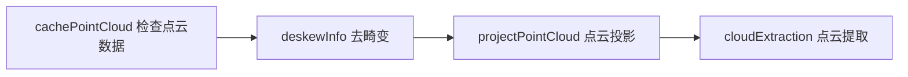
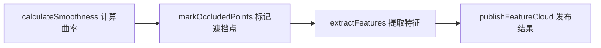
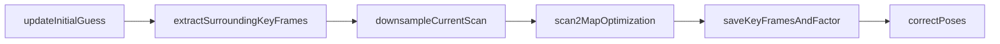

# LIO-SAM

## 图片投影计算（预处理）

### cachePointCloud 检查点云数据

1. 检查数据的格式 [x, y, z, ring, intensity, timestamp]

### deskewInfo 纠正信息

1. 更正 IMU 数据 和 里程计数据

### projectPointCloud 点云投影

1. 过滤无效点：距离太远或太近的点都舍弃
2. 将3D点云投影到2D的距离图像中并进行下采样
3. 运动畸变补偿
4. 存储2D投影的图像信息

### cloudExtraction 点云提取

从距离图像中提取有效点云，主要作用是将有组织的距离图像数据转换回无序点云格式，同时记录重要的索引信息。

1. 遍历每一行(扫描线)，遍历每一列(水平角度)
2. 如果是有效点，记录列索引、距离值，并添加到点云中

## 特征提取

###  calculateSmoothness 曲率计算 

曲率 = 二阶导数, 这里使用二阶差分来近似

这段代码计算的并非严格数学意义上的二阶导数，但核心思想与二阶导数一致 —— 通过量化 “局部测距值的变化率的变化” 来反映点的平滑程度（曲率），本质是一种离散化的 “近似二阶导数”，专门适配激光雷达点云的 “有序性”（按扫描线时序排列）。

#### 原理讲解

1. 首先计算雷达各个点的径向测距值 $r_i = \sqrt{x^2 + y^2 + z^2}$
2. 计算某一点的一阶差分：$f^,(r) = r_i - r_{i-1}$
3. 计算耨个点的二阶差分：$f^{,,}(r) = (r_{i+1} - r_i) - (r_i - r_{i-1}) = r_{i+1} + r_{i-1} - 2r_i = \Delta^2r_i$

#### 流程讲解

1. 为了强化局部形状的特征（减少噪声），代码取第i点的前后 5 个点（共 10 个邻点）
2. 左边的一阶差分 $A = (r_i - r_{i-1}) + (r_i - r_{i-2})+ (r_i - r_{i-3})+ (r_i - r_{i-4})+ (r_i - r_{i-5})$
3. 右边的一阶差分 $B = (r_{i+1} - r_i) + (r_{i+2} - r_i) + (r_{i+3} - r_i) + (r_{i+4} - r_i) + (r_{i+5} - r_i)$
4. 那么 i 点的二阶差分 $\Delta^2r_i = B - A = (r_{i-5} + r_{i-4} + r_{i-3} + r_{i-2} + r_{i-1} + r_{i+1} + r_{i+2} + r_{i+3} + r_{i+4}+ r_{i+5}) - 10r_i$
5. 因为我们只关心曲率的大小，不关心曲率的正负，所以适应 $(\Delta^2r_i)^2$ 替代 $\Delta^2$

###  markOccludedPoints 标记遮挡点 

提取的特征点只希望包含物体内部的特点，所以排除

+ 相邻点差距大于0.3m的点
+ 连续帧的深度变化大于2%， 也就是排除可能和激光束平行的平面

###  extractFeatures 提取特征 

提取两种特征，分别是曲率最大的角点和曲率最小的平面点

#### 流程讲解

1. 将一个扫描线分割成六份，并对每份中的曲率按照大小进行排序
2. 选择前20个曲率最大且超过阈值的点，每选择一个曲率最大点，标记前后10个点，防止角点聚集
3. 如果当前的曲率小于阈值，标记前后10个点，防止平面点聚集, 不仅要防止扫描线内的平面点，还要防止扫描线间的，因此最后还需要通过降采样，减少平面点

## IMU 预积分

## 图优化

### updateInitialGuess 更新初始位姿估计

为当前激光帧提供准确的初始位姿估计：IMU预积分 > IMU增量 > 上一帧位姿

1. 如果是第一帧，就作为IMU的初始状态
2. 如果有 IMU 预积分里程计
    + 获取当前位姿 transBack
    + 位姿增量 transIncre = lastImuPreTransformation.inverse() * transBack;
    + 更新世界坐标 transTobe = transTobe * transIncre
3. 如果没有里程计，只有原始的IMU预积分数据
    + 使用欧拉角初始化 当前位姿 transBack
    + 更新增量 transIncre = lastImuPreTransformation.inverse() * transBack
    + 更新世界坐标 transTobe = transTobe * transIncre

### extractSurroundingKeyFrames 提取周围关键帧构建局部地图

提取附近关键帧构建局部地图， 是LIO-SAM中scan-to-map优化的核心预处理步骤。

主要作用：提取当前位置周围的关键帧，构建局部地图用于当前帧的匹配，包含两种关键帧：空间邻近 + 时间邻近

1. 维护 cloudKeyPoses3D 关键帧的位姿信息，并针对 cloudKeyPoses3D 构建KD-tree
2. 在 KD-tree 内查找临近的关键帧
3. 对提取的关键帧位姿进行降采样，避免过于密集，降采样后保留一个节点
4. 提取最近10s的关键帧的位姿
5. 对于存储的每个关键帧，根据当前的位姿进行坐标变换，获取角点和平面点云
6. 再次对角点和平面点进行降采样

这样就形成针对当前点的局部角点和平面点的局部特征地图

### downsampleCurrentScan 下采样当前扫描

对当前的 角点和平面点集进行降采样

### scan2MapOptimization 扫描到地图的优化（核心ICP匹配）

最核心的扫描匹配优化函数，实现了基于点线/点面距离最小二乘的ICP优化。

将当前帧与局部地图进行ICP匹配，优化当前位姿算法：基于点-线、点-面距离的LM非线性优化

1. 首先检查当前的角点和平面点的数目是否满足要求，最小有效角点数 10，最小有效面点数 100
2. 进行迭代优化，设置最多的迭代优化次数为30
3. 每次迭代进行角点优化 (点线距离)
    + 对于每一个当前帧的角点，首先转化成世界坐标系下，在局部地图查找5个近邻点
    + 如果五个点距离都小于 1m，就认为这5个点是合理的匹配点
    + 判断这五个点是否呈线性排列：
        + 计算5个点的质心$(\overline{x}, \overline{y}, \overline{z})$
        + 计算这5个点距质心的距离和协方差 $a_x = x - \overline{x}, a_y = y - \overline{y}, a_z = z - \overline{z}$
        + 协方差 $a_{11} = a_x * a_x, a_{12} = a_x * a_y, a_{13} += a_x * a_z; a_{22} += a_y * a_y;a_{23} += a_y * a_z;a_{33} += a_z * a_z$
        + 对协方差矩阵进行特征值分解，如果特征值是$\lambda_1 >> \lambda_2 > \lambda_3$, 即点云沿一个主方向分布，在另两个方向分布很集中，即5个点沿着一条直线分布
    + 计算点到直线的距离：
        + 在质心沿第一个特征值的特征向量选取两个点P1, P2, 当前的角点 P0
        + 计算四边形面积 S = |(P0-P1) x (P0-P2)|，线段长度 L = |P1-P2|
        + 那么点到直线的距离,也就是残差 h = S / L
        + 计算残差对P0的导数 dx, dy, dz
        + 计算权重系数 s = 1 - 0.9h
        + 更新雅可比系数 J = s[dx, dy, dz],残差 r = s*h
        + 如果权重值大于阈值才作为参数考虑
4. 每次迭代进行面点优化（点面距离）
    + 对每一个当前帧的平面点，首先转化成世界坐标系下，在局部地图查找5个近邻点
    + 如果这五个点距离都小于1m，就认为这5个点是合理的匹配点，
    + 求解平面方程：
        + 对这些点构建5行3列的矩阵 A
        + 若这五个点在一个平面上，那么平面的法向量 B，那么 AB = -d, 因为平面方程是 ax+by+cz+d = 0, 设d为1，对上面的式子进行求解，得到平面法向量 n
        + 计算法向量的模长，对平面方程归一化，并用之前的五个点验证这个平面方程，距离都小于0.2米才认为求解的方程有效
    + 求解点到面的距离 h 以及 距离对平面点的偏导数 dx, dy, dz，构建雅可比矩阵
    + 计算权重系数 s = 1.0 - 0.9*s / 径向距离， 因为放射的原因，即使近处的残差很小，远处的很大，所以添加一个与径向的比值
5. 将角点和面点的优化数据合并，为LM优化做准备，将雷达坐标转换到LOAM的"相机坐标系"
6. 求解 $J^T * J * \Delta x = -J^Tr$ 进行QR分解

### saveKeyFramesAndFactor 保存关键帧并添加因子

执行因子图优化，保存关键帧，更新地图

1. 关键帧选择：
    + 运动距离足够大，旋转角度足够大，时间间隔足够长，避免过于密集的关键帧

### correctPoses 校正位姿（闭环检测后）
