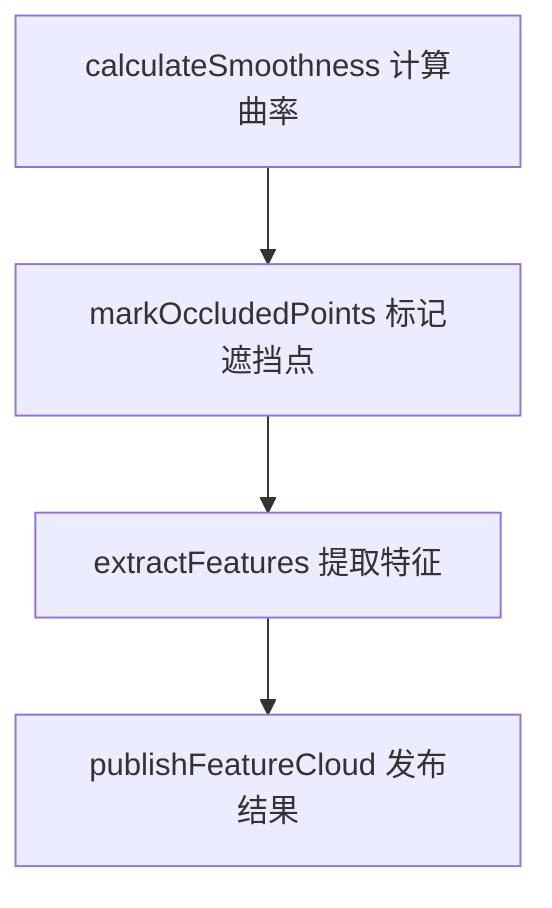

# LIO-SAM

## 特征提取

###  calculateSmoothness 曲率计算 

曲率 = 二阶导数, 这里使用二阶差分来近似

这段代码计算的并非严格数学意义上的二阶导数，但核心思想与二阶导数一致 —— 通过量化 “局部测距值的变化率的变化” 来反映点的平滑程度（曲率），本质是一种离散化的 “近似二阶导数”，专门适配激光雷达点云的 “有序性”（按扫描线时序排列）。

#### 原理讲解

1. 首先计算雷达各个点的径向测距值 $r_i = \sqrt{x^2 + y^2 + z^2}$
2. 计算某一点的一阶差分：$f^,(r) = r_i - r_{i-1}$
3. 计算耨个点的二阶差分：$f^{,,}(r) = (r_{i+1} - r_i) - (r_i - r_{i-1}) = r_{i+1} + r_{i-1} - 2r_i = \Delta^2r_i$

#### 流程讲解

1. 为了强化局部形状的特征（减少噪声），代码取第i点的前后 5 个点（共 10 个邻点

## IMU 预积分

## 图片投影

## 图优化