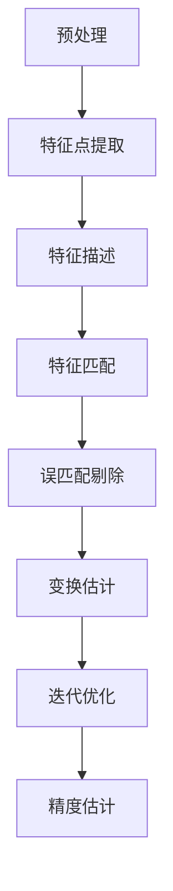

# 点云配准的基本流程

点云配准的核心目标是找到两个点云之间的最优空间变换（旋转R和平移t），使得它们在同一坐标系下对齐。

+ 输入：源点云（Source Cloud）和目标点云（Target Cloud）
+ 输出：最优变换矩阵 T = [R|t]



## 详细流程解析

### 预处理（Preprocessing）

提升点云质量，为后续处理做准备

```cpp
class PointCloudPreprocessor {
public:
    PointCloud::Ptr preprocess(const PointCloud::Ptr& cloud) {
        PointCloud::Ptr processed_cloud(new PointCloud);
        
        // 1. 离群点去除（统计滤波）
        // 假设点云在空间内均匀分布，会围绕均值正态分布，如果是离群点，会偏离这个分布
        // 对每个点，搜索最近的50个最近邻点，计算该点到邻点的欧氏距离，求这些点的均值 A_i
        // 计算所有点的 A_i 的均值 u 和 标准差 d
        // 正常点应该在 u - k*d <= d_i <= u + k*d
        // 其中 k 为 标准差倍数阈值
        pcl::StatisticalOutlierRemoval<PointT> sor;
        sor.setInputCloud(cloud);
        sor.setMeanK(50);           // 近邻点数
        sor.setStddevMulThresh(1.0); // 标准差倍数阈值
        sor.filter(*processed_cloud);
        
        // 2. 体素网格降采样（保持形状，减少点数）
        pcl::VoxelGrid<PointT> voxel_grid;
        voxel_grid.setInputCloud(processed_cloud);
        voxel_grid.setLeafSize(0.01f, 0.01f, 0.01f); // 1cm体素
        voxel_grid.filter(*processed_cloud);
        
        // 3. 去噪平滑（可选）
        // MLS 的核心思想是：通过局部邻域的点拟合光滑曲面，并用新的曲面点替换原始点，从而消除噪声、填补稀疏区域，同时保留物体的整体几何结构。
        // 具体来说，对于点云中的每个原始点p
        // 1. 搜索局部邻域：找到p周围的若干近邻点（类似统计滤波的 K 近邻，但范围更大）。
        // 构建局部坐标系：以p为中心，通过邻域点的协方差矩阵确定局部法向量和切线方向，建立局部坐标系（确保拟合方向与曲面垂直）。
        // 多项式拟合：在局部坐标系下，用低阶多项式（如二次多项式）对邻域点进行最小二乘拟合，得到一个光滑的局部曲面模型。
        // 更新点坐标：将原始点p投影到拟合的曲面上，用投影后的新坐标替换原始坐标，实现平滑效果。
        pcl::MovingLeastSquares<PointT, PointT> mls;
        mls.setInputCloud(processed_cloud);
        mls.setPolynomialOrder(2);
        mls.process(*processed_cloud);
        
        return processed_cloud;
    }
};
```

### 关键点提取（Keypoint Extraction）

提取具有代表性的点，减少计算量

```cpp
class KeypointDetector {
public:
    // 基于曲率的关键点检测
    std::vector<int> detectByCurvature(const PointCloud::Ptr& cloud) {
        std::vector<int> keypoint_indices;
        std::vector<float> curvatures;
        
        // 计算每个点的曲率
        for (size_t i = 0; i < cloud->size(); ++i) {
            float curvature = calculateCurvature(cloud, i, 0.1); // 10cm邻域半径
            curvatures.push_back(curvature);
        }
        
        // 选择曲率最大的前N个点作为关键点
        auto indices = argsort(curvatures, false); // 降序排列
        int num_keypoints = std::min(500, (int)indices.size());
        
        keypoint_indices.assign(indices.begin(), 
                               indices.begin() + num_keypoints);
        return keypoint_indices;
    }
    
    // ISS (Intrinsic Shape Signatures) 关键点
    pcl::PointCloud<PointT>::Ptr detectISSKeypoints(const PointCloud::Ptr& cloud) {
        pcl::ISSKeypoint3D<PointT, PointT> iss_detector;
        pcl::PointCloud<PointT>::Ptr keypoints(new pcl::PointCloud<PointT>);
        
        iss_detector.setInputCloud(cloud);
        iss_detector.setSalientRadius(0.1);   // 显著半径
        iss_detector.setNonMaxRadius(0.05);    // 非极大值抑制半径
        iss_detector.setMinNeighbors(5);
        iss_detector.compute(*keypoints);
        
        return keypoints;
    }
};
```

### 特征描述（Feature Description）

为每个关键点生成具有区分度的特征向量

```cpp
class FeatureDescriptor {
public:
    // FPFH (Fast Point Feature Histograms) 特征
    pcl::PointCloud<pcl::FPFHSignature33>::Ptr computeFPFH(
        const PointCloud::Ptr& cloud, 
        const std::vector<int>& keypoint_indices) {
        
        pcl::FPFHEstimation<PointT, PointT, pcl::FPFHSignature33> fpfh;
        pcl::PointCloud<pcl::FPFHSignature33>::Ptr features(new pcl::PointCloud<pcl::FPFHSignature33>);
        
        // 计算法线（特征描述的基础）
        pcl::PointCloud<pcl::Normal>::Ptr normals = computeNormals(cloud);
        
        fpfh.setInputCloud(cloud);
        fpfh.setInputNormals(normals);
        fpfh.setIndices(std::make_shared<std::vector<int>>(keypoint_indices));
        fpfh.setRadiusSearch(0.2); // 20cm特征计算半径
        fpfh.compute(*features);
        
        return features;
    }
    
    // SHOT (Signature of Histograms of OrienTations) 特征
    pcl::PointCloud<pcl::SHOT352>::Ptr computeSHOT(
        const PointCloud::Ptr& cloud,
        const std::vector<int>& keypoint_indices) {
        
        pcl::SHOTEstimation<PointT, PointT, pcl::SHOT352> shot;
        pcl::PointCloud<pcl::SHOT352>::Ptr features(new pcl::PointCloud<pcl::SHOT352>);
        
        pcl::PointCloud<pcl::Normal>::Ptr normals = computeNormals(cloud);
        
        shot.setInputCloud(cloud);
        shot.setInputNormals(normals);
        shot.setIndices(std::make_shared<std::vector<int>>(keypoint_indices));
        shot.setRadiusSearch(0.3); // 30cm特征半径
        shot.compute(*features);
        
        return features;
    }
};
```

### 特征匹配（Feature Matching）

建立源点云和目标点云之间的对应关系

```cpp
class FeatureMatcher {
public:
    std::vector<cv::DMatch> matchFeatures(
        const pcl::PointCloud<pcl::FPFHSignature33>::Ptr& source_features,
        const pcl::PointCloud<pcl::FPFHSignature33>::Ptr& target_features) {
        
        std::vector<cv::DMatch> matches;
        
        // 转换为OpenCV格式便于匹配
        cv::Mat source_mat = pclFeaturesToCVMat(source_features);
        cv::Mat target_mat = pclFeaturesToCVMat(target_features);
        
        // 使用FLANN进行最近邻匹配
        cv::FlannBasedMatcher matcher;
        std::vector<std::vector<cv::DMatch>> knn_matches;
        matcher.knnMatch(source_mat, target_mat, knn_matches, 2);
        
        // Lowe's ratio test 剔除误匹配
        for (const auto& knn_match : knn_matches) {
            if (knn_match.size() == 2) {
                if (knn_match[0].distance < 0.8 * knn_match[1].distance) {
                    matches.push_back(knn_match[0]);
                }
            }
        }
        
        return matches;
    }
    
    // 基于特征相似度的匹配
    std::vector<Correspondence> findCorrespondences(
        const PointCloud::Ptr& source_keypoints,
        const PointCloud::Ptr& target_keypoints,
        const pcl::PointCloud<pcl::FPFHSignature33>::Ptr& source_features,
        const pcl::PointCloud<pcl::FPFHSignature33>::Ptr& target_features) {
        
        std::vector<Correspondence> correspondences;
        
        for (size_t i = 0; i < source_features->size(); ++i) {
            int best_match_idx = -1;
            float best_distance = std::numeric_limits<float>::max();
            
            // 在目标特征中寻找最相似的特征
            for (size_t j = 0; j < target_features->size(); ++j) {
                float distance = calculateFeatureDistance(
                    source_features->points[i], 
                    target_features->points[j]);
                
                if (distance < best_distance) {
                    best_distance = distance;
                    best_match_idx = j;
                }
            }
            
            if (best_match_idx != -1 && best_distance < distance_threshold) {
                correspondences.push_back({i, best_match_idx, best_distance});
            }
        }
        
        return correspondences;
    }
};
```

### 误匹配剔除（Outlier Rejection）

去除错误的对应关系，提高配准精度

```cpp
class OutlierRejector {
public:
    // RANSAC (Random Sample Consensus) 误匹配剔除
    std::vector<Correspondence> ransacRejection(
        const PointCloud::Ptr& source_keypoints,
        const PointCloud::Ptr& target_keypoints,
        const std::vector<Correspondence>& correspondences) {
        
        std::vector<Correspondence> inliers;
        
        if (correspondences.size() < 3) return inliers;
        
        int max_iterations = 1000;
        float inlier_threshold = 0.05; // 5cm内点阈值
        int best_inlier_count = 0;
        Eigen::Matrix4f best_transform = Eigen::Matrix4f::Identity();
        
        for (int iter = 0; iter < max_iterations; ++iter) {
            // 1. 随机选择3个对应点
            std::vector<int> random_indices = getRandomIndices(3, correspondences.size());
            
            // 2. 计算变换矩阵（三点法）
            Eigen::Matrix4f transform = calculateTransformFrom3Points(
                source_keypoints, target_keypoints, correspondences, random_indices);
            
            // 3. 计算内点数量
            int inlier_count = 0;
            for (const auto& corr : correspondences) {
                PointT transformed_point = transformPoint(
                    source_keypoints->points[corr.source_idx], transform);
                
                float distance = calculateDistance(
                    transformed_point, 
                    target_keypoints->points[corr.target_idx]);
                
                if (distance < inlier_threshold) {
                    inlier_count++;
                }
            }
            
            // 4. 更新最优解
            if (inlier_count > best_inlier_count) {
                best_inlier_count = inlier_count;
                best_transform = transform;
            }
        }
        
        // 5. 提取最终内点
        for (const auto& corr : correspondences) {
            PointT transformed_point = transformPoint(
                source_keypoints->points[corr.source_idx], best_transform);
            
            float distance = calculateDistance(
                transformed_point, 
                target_keypoints->points[corr.target_idx]);
            
            if (distance < inlier_threshold) {
                inliers.push_back(corr);
            }
        }
        
        return inliers;
    }
};
```

### 变换估计（Transformation Estimation）

基于正确的对应关系计算最优变换矩阵

```cpp
class TransformEstimator {
public:
    // SVD (Singular Value Decomposition) 方法
    Eigen::Matrix4f estimateTransformSVD(
        const PointCloud::Ptr& source_points,
        const PointCloud::Ptr& target_points,
        const std::vector<Correspondence>& correspondences) {
        
        if (correspondences.size() < 3) {
            return Eigen::Matrix4f::Identity();
        }
        
        // 1. 计算质心
        Eigen::Vector3f source_centroid = Eigen::Vector3f::Zero();
        Eigen::Vector3f target_centroid = Eigen::Vector3f::Zero();
        
        for (const auto& corr : correspondences) {
            source_centroid += source_points->points[corr.source_idx].getVector3fMap();
            target_centroid += target_points->points[corr.target_idx].getVector3fMap();
        }
        
        source_centroid /= correspondences.size();
        target_centroid /= correspondences.size();
        
        // 2. 构建协方差矩阵
        Eigen::Matrix3f H = Eigen::Matrix3f::Zero();
        for (const auto& corr : correspondences) {
            Eigen::Vector3f source_vec = source_points->points[corr.source_idx].getVector3fMap() - source_centroid;
            Eigen::Vector3f target_vec = target_points->points[corr.target_idx].getVector3fMap() - target_centroid;
            H += source_vec * target_vec.transpose();
        }
        
        // 3. SVD分解
        Eigen::JacobiSVD<Eigen::Matrix3f> svd(H, Eigen::ComputeFullU | Eigen::ComputeFullV);
        Eigen::Matrix3f U = svd.matrixU();
        Eigen::Matrix3f V = svd.matrixV();
        
        // 4. 计算旋转矩阵
        Eigen::Matrix3f R = V * U.transpose();
        
        // 检查反射情况
        if (R.determinant() < 0) {
            V.col(2) *= -1;
            R = V * U.transpose();
        }
        
        // 5. 计算平移向量
        Eigen::Vector3f t = target_centroid - R * source_centroid;
        
        // 6. 构建变换矩阵
        Eigen::Matrix4f transform = Eigen::Matrix4f::Identity();
        transform.block<3,3>(0,0) = R;
        transform.block<3,1>(0,3) = t;
        
        return transform;
    }
};
```

## 主流配准算法实现

### ICP (Iterative Closest Point) 算法

```cpp
class ICPRegistration {
public:
    RegistrationResult icp(const PointCloud::Ptr& source,
                           const PointCloud::Ptr& target,
                           const Eigen::Matrix4f& initial_guess = Eigen::Matrix4f::Identity()) {
        
        PointCloud::Ptr source_transformed(new PointCloud);
        pcl::transformPointCloud(*source, *source_transformed, initial_guess);
        
        Eigen::Matrix4f final_transform = initial_guess;
        float prev_error = std::numeric_limits<float>::max();
        
        for (int iter = 0; iter < max_iterations_; ++iter) {
            // 1. 最近邻搜索建立对应关系
            std::vector<int> correspondences = findNearestNeighbors(source_transformed, target);
            
            // 2. 剔除误匹配（基于距离阈值）
            std::vector<int> inliers = rejectOutliers(source_transformed, target, correspondences);
            
            // 3. 计算变换矩阵
            Eigen::Matrix4f transform = estimateTransform(source_transformed, target, inliers);
            
            // 4. 应用变换
            pcl::transformPointCloud(*source_transformed, *source_transformed, transform);
            final_transform = transform * final_transform;
            
            // 5. 计算误差并检查收敛
            float error = calculateError(source_transformed, target, inliers);
            if (std::abs(prev_error - error) < convergence_threshold_) {
                break;
            }
            prev_error = error;
        }
        
        return {final_transform, prev_error};
    }
};
```

### NDT (Normal Distributions Transform) 算法

```cpp
class NDTRegistration {
public:
    RegistrationResult ndt(const PointCloud::Ptr& source,
                          const PointCloud::Ptr& target) {
        
        // 1. 将目标点云转换为NDT体素网格
        std::vector<NDTVoxel> ndt_voxels = buildNDTVoxels(target);
        
        Eigen::Matrix4f transform = initial_guess_;
        float score = 0.0;
        
        for (int iter = 0; iter < max_iterations_; ++iter) {
            // 2. 计算当前变换下的得分函数和雅可比矩阵
            auto [current_score, jacobian, hessian] = computeNDTScore(source, ndt_voxels, transform);
            
            // 3. 牛顿法优化
            Eigen::Matrix<float, 6, 1> delta = hessian.ldlt().solve(-jacobian);
            Eigen::Matrix4f delta_transform = exponentialMap(delta);
            
            // 4. 更新变换
            transform = delta_transform * transform;
            score = current_score;
            
            // 5. 检查收敛
            if (delta.norm() < convergence_threshold_) {
                break;
            }
        }
        
        return {transform, score};
    }
    
private:
    std::vector<NDTVoxel> buildNDTVoxels(const PointCloud::Ptr& cloud) {
        std::vector<NDTVoxel> voxels;
        
        // 创建体素网格
        float voxel_size = 1.0f; // 1m体素大小
        std::map<VoxelKey, NDTVoxel> voxel_map;
        
        for (const auto& point : cloud->points) {
            VoxelKey key = getVoxelKey(point, voxel_size);
            voxel_map[key].addPoint(point);
        }
        
        // 计算每个体素的均值和协方差
        for (auto& [key, voxel] : voxel_map) {
            voxel.computeDistribution();
            if (voxel.getNumPoints() > min_points_per_voxel_) {
                voxels.push_back(voxel);
            }
        }
        
        return voxels;
    }
};
```

## 配准质量评估

```cpp
class RegistrationEvaluator {
public:
    struct EvaluationResult {
        double rmse;                    // 均方根误差
        double mean_error;              // 平均误差
        double inlier_ratio;            // 内点比例
        double overlap_ratio;           // 重叠区域比例
        Eigen::Matrix4f ground_truth;   // 真值变换（如有）
        double rotation_error;          // 旋转误差（度）
        double translation_error;       // 平移误差（米）
    };
    
    EvaluationResult evaluate(const PointCloud::Ptr& source,
                             const PointCloud::Ptr& target,
                             const Eigen::Matrix4f& transform) {
        
        EvaluationResult result;
        
        // 变换源点云
        PointCloud::Ptr transformed_source(new PointCloud);
        pcl::transformPointCloud(*source, *transformed_source, transform);
        
        // 建立对应关系并计算误差
        pcl::KdTreeFLANN<PointT> kdtree;
        kdtree.setInputCloud(target);
        
        std::vector<float> errors;
        std::vector<int> inlier_indices;
        
        for (const auto& point : transformed_source->points) {
            std::vector<int> indices(1);
            std::vector<float> distances(1);
            
            if (kdtree.nearestKSearch(point, 1, indices, distances) > 0) {
                float error = std::sqrt(distances[0]);
                errors.push_back(error);
                
                if (error < inlier_threshold_) {
                    inlier_indices.push_back(indices[0]);
                }
            }
        }
        
        // 计算评估指标
        result.rmse = calculateRMSE(errors);
        result.mean_error = calculateMean(errors);
        result.inlier_ratio = (float)inlier_indices.size() / errors.size();
        result.overlap_ratio = calculateOverlapRatio(transformed_source, target);
        
        // 如有真值，计算变换误差
        if (!ground_truth_.isIdentity()) {
            Eigen::Matrix4f error_transform = ground_truth_.inverse() * transform;
            result.rotation_error = getRotationError(error_transform);
            result.translation_error = getTranslationError(error_transform);
        }
        
        return result;
    }
};
```

## 完整配准 pipeline 示例

```cpp
class CompleteRegistrationPipeline {
public:
    RegistrationResult registerPointClouds(const PointCloud::Ptr& source,
                                          const PointCloud::Ptr& target) {
        
        // 1. 预处理
        auto processed_source = preprocessor_.preprocess(source);
        auto processed_target = preprocessor_.preprocess(target);
        
        // 2. 关键点检测
        auto source_keypoints = keypoint_detector_.detectISSKeypoints(processed_source);
        auto target_keypoints = keypoint_detector_.detectISSKeypoints(processed_target);
        
        // 3. 特征描述
        auto source_features = feature_descriptor_.computeFPFH(processed_source, 
                                                               getKeypointIndices(source_keypoints));
        auto target_features = feature_descriptor_.computeFPFH(processed_target,
                                                               getKeypointIndices(target_keypoints));
        
        // 4. 特征匹配
        auto correspondences = feature_matcher_.findCorrespondences(source_keypoints, target_keypoints,
                                                                   source_features, target_features);
        
        // 5. 误匹配剔除
        auto inliers = outlier_rejector_.ransacRejection(source_keypoints, target_keypoints, correspondences);
        
        // 6. 粗配准（特征匹配得到初始变换）
        Eigen::Matrix4f coarse_transform = transform_estimator_.estimateTransformSVD(
            source_keypoints, target_keypoints, inliers);
        
        // 7. 精配准（ICP或NDT）
        RegistrationResult fine_result;
        if (use_ndt_) {
            fine_result = ndt_registrator_.ndt(source, target, coarse_transform);
        } else {
            fine_result = icp_registrator_.icp(source, target, coarse_transform);
        }
        
        // 8. 评估配准质量
        auto evaluation = evaluator_.evaluate(source, target, fine_result.transform);
        
        std::cout << "Registration Evaluation:" << std::endl;
        std::cout << "RMSE: " << evaluation.rmse << " m" << std::endl;
        std::cout << "Inlier Ratio: " << evaluation.inlier_ratio * 100 << "%" << std::endl;
        std::cout << "Overlap: " << evaluation.overlap_ratio * 100 << "%" << std::endl;
        
        return fine_result;
    }
    
private:
    PointCloudPreprocessor preprocessor_;
    KeypointDetector keypoint_detector_;
    FeatureDescriptor feature_descriptor_;
    FeatureMatcher feature_matcher_;
    OutlierRejector outlier_rejector_;
    TransformEstimator transform_estimator_;
    ICPRegistration icp_registrator_;
    NDTRegistration ndt_registrator_;
    RegistrationEvaluator evaluator_;
    bool use_ndt_ = true;
};
```
