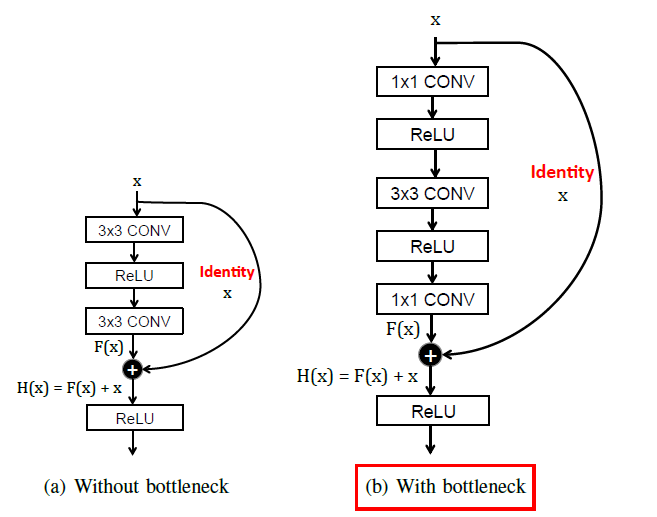

# Bottleneck 瓶颈的核心理念

bottleneck层最初是在ResNet网络中初次提出，通过降低计算量使得神经网络网络深度可以进一步增加。

**Bottleneck 设计是为了减少计算量和参数数量，同时保持甚至提升网络性能。**

## 计算对比

假设一个输入64通道，输出128通道的普通计算

### 1. 情况A：不使用 Bottleneck（普通残差块）

输入：64通道 → 128通道

直接使用 3x3 的卷积，每一次的卷积核为 64x3x3 = 576
需要128通道，所以 共需要优化的参数为 576x128 = 73728

### 2. 情况B: 使用 Bottleneck

输入：64通道 → 中间：32通道 → 输出：128通道

+ 首先是 1x1卷积降为 32 通道：需要的参数为 32x64x1x1 = 2048
+ 接着进行一次 3x3 卷积：需要的参数为 32x32x3x3 = 9216
+ 最后再扩大通道数：需要的参数为 32x128x1x1 = 4096

总计需要的参数为 2048 + 9216 + 4096 = 15360

相比较可以看出来，两者所需要的参数大幅降低了, 一般来说，参数能减少 3/4

## 为什么需要残差

如果只保留 Bottleneck 的三层卷积（没有残差连接），在深层网络中会出现两个致命问题：

### 1. 深层网络梯度消失 / 爆炸

深层网络的梯度是通过链式法则从输出层反向传播到输入层的。

+ 普通卷积块：每经过一层卷积 + 激活，梯度就会被削弱一次；
+ 无残差 Bottleneck：比普通卷积块多了两层 1×1 卷积，相当于多了两次梯度衰减 —— 网络层数超过 20 层后，梯度会趋近于 0，参数完全无法更新。

### 2. 特征信息 “丢失”

Bottleneck 的 1×1 降维 会主动压缩通道数，虽然 3×3 卷积能提取特征，但升维后的特征和原始输入特征是完全割裂的 —— 原始输入的细节信息（比如车道线的边缘）会被多层卷积 “稀释”。

而残差连接提供了一条 原始输入 → 输出 的直连通路，相当于让网络 “学习输入和输出的差值”，而非直接学习输出：

$$
out=residual+Bottleneck(x)
$$

这样即使 Bottleneck 提取的特征有损失，原始输入的细节也能通过残差通路保留下来。