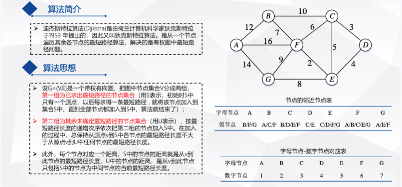

# Dijkstra 算法

Dijkstra算法的功能是在带权图中计算从​​单个起点​​到所有其他节点的最短路径。权值必须为非负数（适用于距离、时间等代价）。

## 输入

+ 带权图 G=(V, E)，其中 V 是节点集合，E 是边集合
+ 起点 start

## 输出

起点到所有节点的最短距离 dist 和路径 prev。

## 算法步骤

+ ​初始化​​：
  + 设置 dist[start] = 0，其他节点 dist[v] = ∞。
  + 将所有节点放入优先队列（最小堆）Q，按 dist 排序。
  + 记录路径的父节点 prev[v] = null。

+ 循环处理队列​​：
  + ​​While​​ Q 不为空：
    1. 从 Q 中取出 dist 最小的节点 u（当前最近节点）。
    2. For each​​ 节点 v 是 u 的邻居：
       + 计算从起点经 u 到 v 的临时距离 alt = dist[u] + weight(u, v)。
       + If​​ alt < dist[v]（发现更短路径）：
            更新 dist[v] = alt。
            更新 prev[v] = u。
       + 调整 Q 中 v 的优先级（若支持）或重新插入。
+ 终止​​：
    当 Q 为空时，dist 中存储起点到所有节点的最短距离，prev 存储路径。
