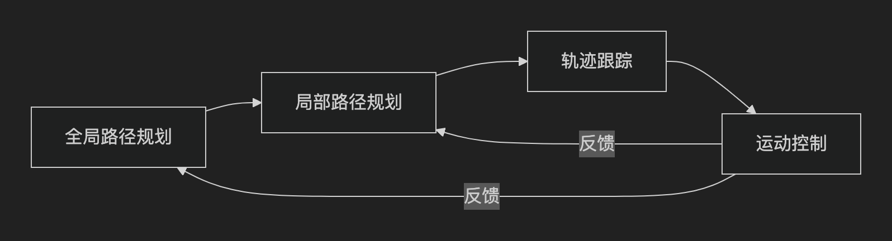

# 路径规划和轨迹跟踪和控制

完整的自动驾驶或机器人运动控制链条实际上包含 ​​四大核心模块​​：

​​全局路径规划 → 局部路径规划 → 轨迹跟踪（Trajectory Tracking） → 运动控制（Motion Control）​​。

(1) 全局路径规划

基于环境先验信息（如地图），计算从起点到终点的​​全局最优或可行路径​​，不考虑实时动态障碍物。低频更新​​（1~10Hz），仅在环境变化或任务变更时重新规划。

+ 输入​​：
静态地图（栅格地图、矢量路网）
起点、终点、约束条件（如限速、单行道）

+ 输出：
粗粒度路径（车道序列、关键航点）例如：**[车道A → 路口X → 车道B → 终点]**

+ 经典算法: Dijkstra算法，A*算法，蚁群算法，动态规划算法，​​RRT​​*，​​Hybrid A​​*等

(2) 局部路径规划

在全局路径的基础上，结合实时传感器数据，生成​​避障的细粒度轨迹​​（含速度、时间信息）。高频实时​​（50~100Hz），快速响应动态障碍物。

+ 输入​​：
全局路径 + 实时传感器数据（激光雷达、相机、毫米波雷达）
动态障碍物信息（位置、速度）

+ 输出：时间参数化轨迹（位置+速度+时间）示例：[(x1,y1,v1,t1), (x2,y2,v2,t2), ...]

+ 经典算法: 多项式曲线法，势场法，贝塞尔曲线，B样条曲线，**动态窗口法（DWA），TEB，MPC**

（3）轨迹跟踪

将局部规划生成的参考轨迹转化为​​车辆/机器人的目标状态​​（速度、转向角），确保实际运动贴合轨迹。核心挑战​​：
减小​​横向误差​​（偏离轨迹的距离）和​​纵向误差​​（速度延迟）。

+ 输入​​：参考轨迹（来自局部规划）当前状态（位置、速度、航向角）

+ 输出​​：目标控制量（目标速度、目标转向角）示例：{speed: 1.5m/s, steering_angle: 0.2rad}

+ 经典算法: 纯跟踪法，Stanley法，PID法，MPC法

（4）运动控制

将轨迹跟踪的目标状态转化为​​底层执行器的物理指令​​（如电机扭矩、刹车压力）。​​核心挑战​​：处理执行器延迟、轮胎打滑、负载变化等物理限制。

+ ​输入​​：目标状态（来自轨迹跟踪）车辆动力学参数（质量、轮胎摩擦等）
​
+ ​输出​​：执行器指令（电机扭矩、方向盘转角、刹车压力）示例：{motor_torque: 10Nm, brake: 0%, steering: 5°}

+ ​​典型算法​​：
  + ​​PID控制​​：简单场景的速度/位置控制。
​​  + 模型预测控制（MPC）​​：考虑动力学约束的多步优化。
​​  + 滑模控制（SMC）​​：抗干扰能力强（如路面湿滑）。
