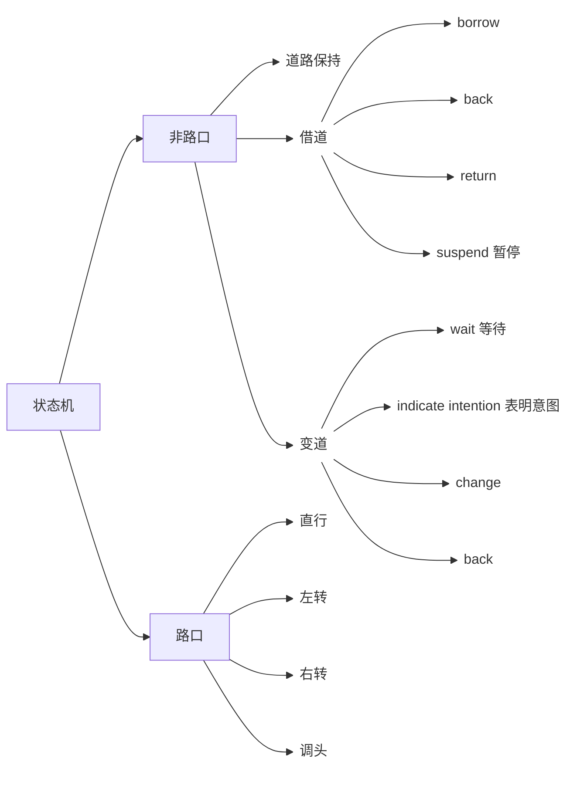

# 整体介绍

## 功能定义

在自动驾驶、机器人导航等领域，​​PNC​​ 通常指 ​​Planning and Control（规划与控制）​​，即：

+ ​​规划（Planning）​​：生成从起点到目标点的可行路径（如使用A*、RRT*等算法）。
+ ​控制（Control）​​：通过控制器（如PID、MPC）跟踪规划路径，确保系统稳定执行。

目前PNC在整个自动驾驶系统中主要负责基于上游感知，地图也预测的输入实时规划出一条安全且符合导航任务的运动轨迹交由下游控制模块执行

PNC内部按照功能和层级可以分成 **行为规划** 和 **运动规划**

+ 行为规划决定自车是保持当前车道还是进行变道或者借道动作以及确定合适的障碍物横纵向决策
+ 运动规划则基于具体的行为和决策产生合理的规划轨迹

本质上PNC对不同驾驶场景采取不同的策略，而场景定义的要素主要包括: 路口（通行方向）/ 非路口、车道保持/变道/借道等不同维度，组合成状态机中的不同子状态，通过不同状态的跳转和对应状态下的细分的障碍物避让超车决策和轨迹规划，最终完成 PNC 模块的整体职能

单纯的自顶向下的状态机很难维护，且很难规避上下游的不一致性。当前PNC框架引入仲裁机制，通过针对当前状态可跳转的目标状态集合中每个状态进行单独计算，并基于不同状态下的决策和规划结果进行最终的评估和状态跳转。这种方式实现了上游决策和下游规划的反馈机制，兼顾效率和完备性

也就是一方面维护状态机，而状态机之间的切换由仲裁器进行决策

## 状态机介绍

状态机的状态由多级维度共同定义，最上层时路口和非路口的区分，路口内又分为 直行，左转，右转和调头等通行方向。在此之下，进一步区分车道保持、变道和借道，变道和借到又同时划分为多个阶段，形成最终状态



## 仲裁机制介绍

仲裁机制的主要目的是对一组状态集合每一状态对应场景计算的结果进行评价，并输出最终的跳转状态。

根据地图任务的内容（必须执行的变道和非必须执行的变道），以及当时所处的具体状态，可能会采用不同的仲裁逻辑。

比如完全基于轨迹评价和打分择优的仲裁逻辑，比如基于优先级排序和可行性评估的仲裁逻辑，或者是基于时序依赖关系依次执行和可行性评估的仲裁逻辑

```mermaid
flowchart LR
    n1["变道仲裁逻辑"] --> n2["车道保持"] & n3["变道等待"] & n4[变道执行] & n5["变道返回"]
    subgraph s1["必须的变道"]
        n6["优先级仲裁: gap insertable: change > wait gap not insertable: wait"] n7["优先仲裁: gap insertable: change > wait gap not insertable: wait"]
    end

    subgraph s2["非必须的变道"]
        n7["merit "]
    end
    n2 --> n6
```

