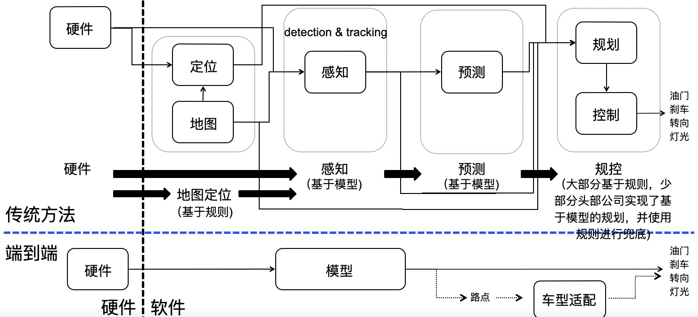

# 自动驾驶-系统架构

## 请简述自动驾驶系统的整体架构，包括感知、决策和控制模块

自动驾驶系统是一个复杂的多模块系统，通常由感知、决策和控制三个核心模块组成。每个模块都有其特定的功能和任务，它们协同工作以实现车辆的自动驾驶。以下是自动驾驶系统的整体架构及其主要模块的简述：

---

### **1. 自动驾驶系统整体架构**

自动驾驶系统通常包括以下几个主要部分：

1. **感知模块（Perception）**：负责感知车辆周围的环境。
2. **决策模块（Decision Making）**：根据感知信息做出决策。
3. **控制模块（Control）**：执行决策模块的指令，控制车辆的运动。
4. **高精地图（HD Map）**：提供详细的环境信息，辅助感知和决策。
5. **通信模块（Communication）**：实现车辆与车辆（V2V）、车辆与基础设施（V2I）之间的通信。
6. **硬件平台**：包括传感器（摄像头、激光雷达、毫米波雷达等）、计算单元（GPU/FPGA）、存储设备等。

这些模块通过高速通信总线（如 CAN 总线、以太网）连接，形成一个完整的自动驾驶系统。

---

### **2. 感知模块（Perception）**

感知模块是自动驾驶系统的眼睛和耳朵，负责收集和处理车辆周围的环境信息。其主要任务包括：

- **目标检测与分类**：识别车辆、行人、交通标志、车道线等。
- **环境建模**：构建车辆周围环境的三维模型。
- **传感器融合**：将不同传感器的数据融合，提高感知的准确性和可靠性。

#### **常用传感器**

- **摄像头**：用于视觉信息的采集，可检测车道线、交通标志、行人等。
- **激光雷达（LiDAR）**：通过发射激光脉冲测量距离，生成环境的点云图。
- **毫米波雷达**：用于检测车辆的速度和距离，适用于恶劣天气条件。
- **超声波传感器**：用于近距离检测，常用于停车辅助。

#### **感知流程**

1. **数据采集**：传感器采集原始数据。
2. **数据预处理**：去除噪声、校准数据。
3. **目标检测与分类**：使用深度学习算法（如 YOLO、SSD）识别目标。
4. **环境建模**：构建环境的三维模型，用于路径规划。
5. **传感器融合**：将不同传感器的数据融合，提高感知的准确性。

---

### **3. 决策模块（Decision Making）**

决策模块是自动驾驶系统的大脑，负责根据感知模块提供的信息做出决策。其主要任务包括：

- **路径规划**：规划全局路径和局部路径。
- **行为决策**：决定车辆的行为，如加速、减速、变道、超车等。
- **运动规划**：生成车辆的运动轨迹。

#### **决策流程**

1. **全局路径规划**：根据高精地图和目的地，规划最优路径。
2. **局部路径规划**：根据实时感知信息，调整局部路径。
3. **行为决策**：根据交通规则和环境信息，决定车辆的行为。
4. **运动规划**：生成车辆的运动轨迹，确保行驶安全和舒适。

---

### **4. 控制模块（Control）**

控制模块是自动驾驶系统的执行部分，负责根据决策模块的指令控制车辆的运动。其主要任务包括：

- **纵向控制**：控制车辆的速度。
- **横向控制**：控制车辆的方向。
- **底盘控制**：协调车辆的制动、转向和动力输出。

#### **控制流程**

1. **接收指令**：从决策模块接收运动轨迹和行为指令。
2. **控制算法**：使用 PID 控制器、MPC（模型预测控制）等算法实现精确控制。
3. **执行控制**：通过车辆的底盘系统执行控制指令。
4. **反馈调整**：根据车辆的实际状态调整控制指令，确保行驶安全。

---

### **5. 高精地图（HD Map）**

高精地图是自动驾驶系统的重要组成部分，提供详细的环境信息，包括：

- **道路网络**：车道线、交通标志、信号灯等。
- **静态障碍物**：建筑物、护栏等。
- **动态信息**：实时交通流量、施工区域等。

高精地图通过 OTA（Over-The-Air）技术实时更新，确保信息的时效性。

---

### **6. 通信模块（Communication）**

通信模块实现车辆与车辆（V2V）、车辆与基础设施（V2I）之间的通信，主要功能包括：

- **数据共享**：共享车辆的速度、位置、意图等信息。
- **交通信号同步**：与交通信号灯同步，优化行驶效率。
- **紧急预警**：在危险情况下发出预警信号。

---

### **7. 硬件平台**

自动驾驶系统的硬件平台包括：

- **传感器**：摄像头、激光雷达、毫米波雷达等。
- **计算单元**：高性能 GPU/FPGA，用于实时数据处理。
- **存储设备**：用于存储高精地图和传感器数据。

硬件平台需要具备高性能、低延迟和高可靠性。

---

### **总结**

自动驾驶系统是一个复杂的多模块系统，包括感知、决策和控制三个核心模块。感知模块负责感知环境，决策模块负责做出决策，控制模块负责执行决策。高精地图和通信模块辅助整个系统，硬件平台提供支持。这些模块协同工作，实现车辆的自动驾驶功能。

## 在感知模块中，如何处理不同环境下的数据（如白天、夜晚、雨天）？

在自动驾驶系统的感知模块中，处理不同环境下的数据（如白天、夜晚、雨天）是一个关键挑战。以下是针对不同环境条件的数据处理方法：

---

### **1. 不同环境下的数据处理方法**

#### **1.1 光照条件（白天、夜晚）**

- **白天**：在光照充足的情况下，视觉传感器（如摄像头）能够获取高质量的图像数据，适合进行车道线检测、交通标志识别和物体检测。
- **夜晚**：夜间光照不足，摄像头的性能会下降。此时，激光雷达（LiDAR）和毫米波雷达的作用更加突出，因为它们不受光照条件的影响。此外，一些系统会使用红外摄像头或夜视系统来增强感知能力。

#### **1.2 恶劣天气条件（雨天、雪天）**

- **雨天**：雨水会影响摄像头的成像质量，导致图像模糊和反射干扰。为了应对这种情况，可以使用雨滴检测和去除算法，如 Raindrop Clarity 数据集中的方法。此外，激光雷达和毫米波雷达在雨天仍然可以正常工作，因为它们对雨水的干扰不敏感。
- **雪天**：雪天不仅会降低摄像头的成像质量，还会覆盖地面标志和车道线。此时，激光雷达和毫米波雷达的性能也会受到影响，因为雪可能会干扰传感器的信号。为了提高感知的可靠性，可以结合多源数据融合技术，如将激光雷达、摄像头和毫米波雷达的数据进行融合。

---

### **2. 多源数据融合**

为了提高感知模块在不同环境下的鲁棒性，通常会采用多源数据融合技术。例如，将摄像头的视觉数据与激光雷达的点云数据融合，可以同时利用视觉信息的丰富性和激光雷达的深度信息。常见的融合策略包括：

- **早期融合**：在数据处理之前将不同传感器的数据融合，例如将激光雷达点云投影到摄像头图像上。
- **中期融合**：在特征提取阶段进行融合，例如将摄像头的特征图与激光雷达的特征图结合。
- **后期融合**：在决策阶段进行融合，例如将摄像头和激光雷达的检测结果进行综合判断。

---

### **3. 环境感知技术**

为了适应不同的环境条件，自动驾驶系统通常会采用多种环境感知技术：

- **视觉SLAM**：使用摄像头进行定位和地图构建，适用于光照条件较好的环境。
- **激光雷达SLAM**：使用激光雷达进行定位和地图构建，对光照和天气条件的适应性更强。
- **毫米波雷达**：用于检测车辆的速度和距离，在恶劣天气条件下表现出色。

---

### **4. 数据集与模拟环境**

为了测试和优化感知模块在不同环境下的性能，研究人员会使用各种数据集和模拟环境。例如：

- **ISETHDR 数据集**：包含模拟高动态范围驾驶场景的数据，用于评估和优化 HDR 传感器设计。
- **Raindrop Clarity 数据集**：包含白天和夜晚雨滴图像的数据集，用于研究雨滴去除算法。
- **Stereo Image Dataset (SID)**：包含多种天气和光照条件下的立体图像数据集，用于开发和测试感知算法。

---

## 如何设计自动驾驶系统的安全机制？如何确保系统的可靠性？

设计自动驾驶系统的安全机制并确保其可靠性是一个复杂且多维度的任务。以下是基于最新标准和行业实践的建议，涵盖安全机制设计和可靠性保障的关键方面：

### **1. 安全机制设计**

#### **1.1 功能安全与网络安全**

- **功能安全**：自动驾驶系统需遵循国际标准（如 ISO 26262），确保系统在故障或异常情况下仍能安全运行。例如，采用冗余设计和故障诊断机制，以应对传感器或计算单元的故障。
- **网络安全**：遵循 GB 44495-2024 标准，保护车辆免受网络攻击，确保数据传输的安全性和完整性。

#### **1.2 多传感器融合与冗余设计**

- **多传感器融合**：结合摄像头、激光雷达、毫米波雷达等传感器数据，提高环境感知的准确性和鲁棒性。
- **冗余设计**：在关键模块（如传感器、计算单元、电源系统）采用冗余设计，确保单点故障不会导致系统失效。

#### **1.3 实时风险评估与预警机制**

- **风险评估**：通过实时监测环境和系统状态，识别潜在危险并及时发出预警。
- **最小风险策略**：在系统故障或复杂场景下，执行最小风险策略，如自动减速、安全停车。

#### **1.4 AI 安全机制**

- **AI 设计与实施**：采用深度学习和传统软件相结合的 AI 平台，确保算法的可靠性和可解释性。
- **数据增强与对抗训练**：通过数据增强和对抗训练提升感知算法在极端条件下的鲁棒性。

#### **1.5 高精度地图与定位技术**

- **高精度地图**：结合高精度地图和定位技术（如 GPS、IMU），确保车辆在复杂环境下的精准导航。

### **2. 可靠性保障**

#### **2.1 硬件与软件的可靠性设计**

- **硬件可靠性**：采用经过验证的元器件，遵循 ASIL（汽车安全完整性等级）标准进行硬件设计。
- **软件可靠性**：通过模块化设计、代码审查和测试，确保软件的稳定性和容错能力。

#### **2.2 测试与验证**

- **极端场景测试**：通过模拟极端天气、复杂路况等场景，验证系统的鲁棒性。
- **持续测试**：利用仿真环境和真实道路测试，持续优化系统性能。

#### **2.3 软件升级与维护**

- **软件升级**：遵循 GB 44496-2024 标准，确保软件升级的安全性和可靠性。
- **定期维护**：建立定期维护机制，及时发现并修复潜在问题。

### **3. 法规与标准**

- **遵循国家和国际标准**：自动驾驶系统需遵循相关法规和标准，如 GB/T 44721-2024，以确保系统的安全性和可靠性。
- **行业最佳实践**：参考行业领先企业的实践，如 NVIDIA 的自动驾驶安全报告，确保系统设计的先进性和安全性。

### **4. 人机交互与驾驶员接管**

- **人机交互**：设计直观的交互界面，确保驾驶员在必要时能够迅速接管车辆。
- **接管流程**：明确驾驶员接管的条件和流程，确保在系统故障或复杂场景下，驾驶员能够安全接管。

通过上述措施，自动驾驶系统可以在复杂环境下安全可靠地运行，保障车辆和乘客的安全。
