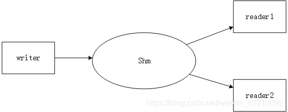

以一个writer和多个reader为例子介绍：


从图中我们可以看到需要通过一定的互斥完成几个进程之间的交互，但是对于加锁而言，当一个writer写的reader不能读，
这样就白白浪费了时间。所以我们可以使用循环队列代替锁机制，这样保证writer reader都能访问这片内存，writer一直写，
直到写满了，reader一直读，读一个就移动一下指针，注意，对于我们这种消息传递机制，每个reader只需要实时读到消息即可，
不用在意历史信息。所以所有的reader只需要跟着一个读的指针读即可，读指针往前移动一次，就空出一个空位留待写者去写。
共享内存的结构设计如下：

```c++
#include <stdio.h>
#include <unistd.h>
#include <sys/ipc.h>
#include <sys/shm.h>
#include <sys/types.h>
#include <stdlib.h>

using namespace std;

struct Message {
    int x;
    int y;
    int z;
    int w;
    Message(int xval, int yval, int zval, int wval) :
        x(xval), y(yval), z(zval), w(wval) {}
};

template <class T>
class wriShm {
public:
    
        
};
```