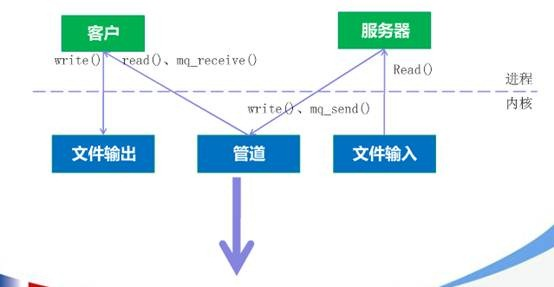
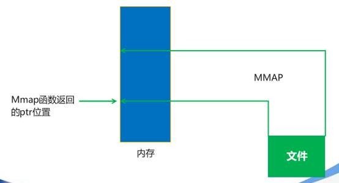
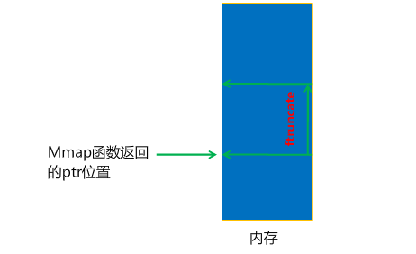
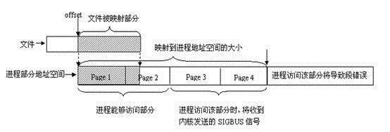
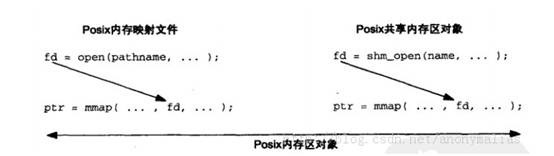
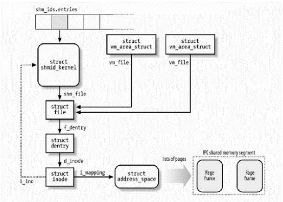

参考链接 https://www.cnblogs.com/linuxbug/p/4882776.html

# 共享内存
### 共享内存的优势
采用共享内存通信的一个显而易见的好处是效率高，因为进程可以直接读写内存，而不需要任何数据的拷贝。对于像管道和消息队列等通信方式，则需要在内核
和用户空间进行四次的数据拷贝，而共享内存则只拷贝两次数据：一次从输入文件到共享内存区，另一次从共享内存区到输出文件。实际上，进程之间在共享内存
时，并不总是读写少量数据后就解除映射，有新的通信时，再重新建立共享内存区域。而是保持共享区域，直到通信完毕为止，这样，数据内容一直保存在共享
内存中，并没有写回文件。共享内存中的内容往往是在解除映射时才写回文件的。因此，采用共享内存的通信方式效率是非常高的。

图1：POSIX消息队列  
  
图2：共享内存  
 

Linux的2.6.x内核支持多种共享内存方式，如mmap()系统调用，Posix共享内存，以及System V共享内存。本文对3种共享内存形式都将进行介绍。

### mmap 系统调用
mmap()系统调用使得进程之间通过映射同一个普通文件实现共享内存。普通文件被映射到进程地址空间后，进程可以像访问普通内存一样对文件进行访问，
不必再调用read()，write（）等操作。

**注：** 实际上，mmap()系统调用并不是完全为了用于共享内存而设计的。它本身提供了不同于一般对普通文件的访问方式，进程可以像读写内存一样对普通
文件的操作。而Posix或System V的共享内存IPC则纯粹用于共享目的，当然mmap()实现共享内存也是其主要应用之一。

图3：直接映射文件  
  

图4：开辟共享内存空间  


linux采用的是页式管理机制。对于用mmap()映射普通文件来说，进程会在自己的地址空间新增一块空间，空间大小由mmap()的length参数指定，注意，进程
并不一定能够对全部新增空间都能进行有效访问。进程能够访问的有效地址大小取决于文件被映射部分的大小。简单的说，能够容纳文件被映射部分大小的
最少页面个数决定了进程从mmap()返回的地址开始，能够有效访问的地址空间大小。超过这个空间大小，内核会根据超过的严重程度返回发送不同的信号给进
程。如下图所示：  
图5：mmap映射  


这个具体差异跟系统实现有关，这里不做详细讨论。

#### 数据结构
文件详细信息
```c++
struct stat {
dev_t     st_dev;     /* ID of device containing file */
ino_t     st_ino;     /* inode number */
mode_t    st_mode;    /* protection */
nlink_t   st_nlink;   /* number of hard links */
uid_t     st_uid;     /* user ID of owner */
gid_t     st_gid;     /* group ID of owner */
dev_t     st_rdev;    /* device ID (if special file) */
off_t     st_size;    /* total size, in bytes */
blksize_t st_blksize; /* blocksize for file system I/O */
blkcnt_t  st_blocks;  /* number of 512B blocks allocated */
time_t    st_atime;   /* time of last access */
time_t    st_mtime;   /* time of last modification */
time_t    st_ctime;   /* time of last status change */
};
```

#### 函数说明
```c++
#include <sys/mman.h>
void *mmap(void *addr, size_t length, int prot, int flags, int fd, off_t offset);
void *mmap64(void *addr, size_t length, int prot, int flags, int fd, off64_t offset);
```
+ **fd：** 为即将映射到进程空间的文件描述字，一般由open()返回，同时，fd可以指定为-1，此时须指定flags参数中的MAP_ANON，表明进行的是匿
名映射（不涉及具体的文件名，避免了文件的创建及打开，很显然只能用于具有亲缘关系的进程间通信）。
+ **Length：** 映射到调用进程地址空间的字节数，它从被映射文件开头offset个字节开始算起。
+ **prot：** 指定共享内存的访问权限。可取如下几个值的或：PROT_READ（可读），PROT_WRITE（可写），PROT_EXEC（可执行），PROT_NONE（不可访问）。
+ **flags：** 由以下几个常值指定MAP_SHARED, MAP_PRIVATE, MAP_FIXED等，其中，MAP_SHARED, MAP_PRIVATE必选其一，而MAP_FIXED则不推荐使用。 
  + MAP_SHARED 对映射区域的写入数据会复制回文件内，而且允许其他映射该文件的进程共享。
  + MAP_PRIVATE 对映射区域的写入操作会产生一个映射文件的复制，即私人的“写入时复制”（copy on write）对此区域作的任何修改都不会写回原来的文件内容。
  + MAP_FIXED 如果参数start所指的地址无法成功建立映射时，则放弃映射，不对地址做修正。通常不鼓励用此旗标。
  + MAP_ANONYMOUS 建立匿名映射。此时会忽略参数fd，不涉及文件，而且映射区域无法和其他进程共享。
  + MAP_LOCKED 将映射区域锁定住，这表示该区域不会被置换（swap）。
+ **offset：** 一般设为0，表示从文件头开始映射。
+ **addr：** 指定文件应被映射到进程空间的起始地址，一般被指定一个空指针，此时选择起始地址的任务留给内核来完成。函数的返回值为最后文件映射到进程空间的地址，进程可直接操作起始地址为该值的有效地址。


```c++
int munmap(void *addr, size_t length);
```
该调用在进程地址空间中解除一个映射关系，addr是调用mmap()时返回的地址，length是映射区的大小。当映射关系解除后，对原来映射地址的访问将导致段错误发生。


```c++
int msync(void *addr, size_t length, int flags);
```
一般说来，进程在映射空间的对共享内容的改变并不直接写回到磁盘文件中，往往在调用munmap()后才执行该操作。可以通过调用msync()实现磁盘上
文件内容与共享内存区的内容一致。

```c++
int ftruncate(int fd, off_t length);
```
调整fd所指的文件的大小到length

```c++
int fstat(int fd, struct stat *buf);
```
获取fd所指的文件的详细信息

#### 代码说明
**写共享内存**
```c++
#include <sys/mman.h>
#include <fcntl.h>
#include <sys/mman.h>
#include <sys/types.h>
#include <unistd.h>
#include <stdio.h>
#include <stdlib.h>
#include <errno.h>
#include <string.h>

typedef struct
{
    char name[32];
    int age;
} people;

main(int argc, char** argv) {
    people* p_map;
    char temp = 'a';
    
    int fd = open(argv[1], O_CREAT|O_RDWR|O_TRUNC, 00777);
    if (-1 == fd)
    {
        printf("open file error = %s\n", strerror(errno));
        return -1;
    }
    ftruncate(fd, sizeof(people)*10);
    p_map = (people*)mmap(NULL, sizeof(people)*10, PROT_READ|PROT_WRITE, MAP_SHARED, fd, 0);
    if (MAP_FAILED == p_map)
    {
        printf("mmap file error = %s\n", strerror(errno));
        return -1;
    }
    
    for(int i = 0; i < 10; i++)
    {
        memcpy( ( *(p_map+i) ).name, &temp, 1);
        ( *(p_map+i) ).name[1] = 0;
        ( *(p_map+i) ).age = 20+i;
        temp += 1;
    }
    printf("initialize over\n");
        
    close(fd);
    munmap(p_map, sizeof(people)*10);
    printf("umap ok \n");
    return 0;
}
```

**读共享内存**
```c++
#include <fcntl.h>
#include <sys/mman.h>
#include <sys/types.h>
#include <unistd.h>
#include <stdio.h>
#include <stdlib.h>
#include <errno.h>
#include <string.h>
#include <sys/stat.h>

typedef struct
{
    char name[32];
    int age;
} people;

main(int argc, char** argv) {
    people* p_map;
    struct stat filestat;
    
    int fd = open(argv[1], O_CREAT|O_RDWR, 00777);
    if (-1 == fd)
    {
        printf("open file error = %s\n", strerror(errno));
        return -1;
    }
    fstat(fd, &filestat);
    p_map = (people*)mmap(NULL, filestat.st_size, PROT_READ|PROT_WRITE, MAP_SHARED, fd, 0);
    if (MAP_FAILED == p_map)
    {
        printf("mmap file error = %s\n", strerror(errno));
        return -1;
    }
    
    for(int i = 0; i < 10; i++)
    {
        printf("name = %s, age = %d\n",(*(p_map+i)).name, (*(p_map+i)).age);
    }
    
    close(fd);
    munmap(p_map, sizeof(people)*10);
    printf("umap ok \n");
    return 0;
}
```

**运行结果**
```shell
[root@rocket ipc]# ./ipc_mmap_writer /tmp/mmap_text.file
initialize over
umap ok
[root@rocket ipc]# g++ -g -o ipc_mmap_reader ipc_mmap_reader.cpp
[root@rocket ipc]# ./ipc_mmap_reader /tmp/mmap_text.file
name = a, age = 20
name = b, age = 21
name = c, age = 22
name = d, age = 23
name = e, age = 24
name = f, age = 25
name = g, age = 26
name = h, age = 27
name = i, age = 28
name = j, age = 29
umap ok
```

**查看mmap文件**
```shell
[root@rocket ipc]# ll /tmp/mmap_text.file
-rwxr-xr-x. 1 root root 360 Oct 14 02:55 /tmp/mmap_text.file
```

### POSIX 共享内存
POSIX共享内存使用方法有以下两个步骤：
+ 通过shm_open创建或打开一个POSIX共享内存对象
+ 调用mmap将它映射到当前进程的地址空间

和通过内存映射文件进行通信的使用上差别在于mmap描述符参数获取方式不一样：通过open或shm_open。如下图所示：  
图6：Posix内存映射文件  
  

POSIX共享内存和POSIX消息队列，有名信号量一样都是具有随内核持续性的特点。  
在Linux 2.6.x中，对于POSIX信号量和共享内存的名字会在/dev/shm下建立对应的路径名
```shell
[root@rocket shm]# ll /dev/shm/|grep mem
-rwxr-xr-x. 1 root root      360 Oct 14 05:23 shm_from_mem.txt
```

#### 函数说明
```c++
#include <sys/mman.h>
#include <sys/stat.h>        /* For mode constants */
#include <fcntl.h>           /* For O_* constants */
// 打开一个共享内存的文件句柄
int shm_open(const char *name, int oflag, mode_t mode); // 注意这里的名字具有形式 /somename，即必须以 / 为开头，因为POSIX共享内存对应的文件是位于/dev/shm这个特殊的文件系统内。

// 删除一个共享内存的名字，但只有所有程序都关闭，才会真的删除
int shm_unlink(const char *name);
```
#### 代码说明
写共享内存
```c++
#include <sys/mman.h>
#include <fcntl.h>
#include <sys/mman.h>
#include <sys/types.h>
#include <unistd.h>
#include <stdio.h>
#include <stdlib.h>
#include <errno.h>
#include <string.h>

typedef struct
{
char name[32];
int age;
} people;

main(int argc, char** argv)
{
people* p_map;
char temp = 'a';

    int fd = shm_open(argv[1], O_CREAT|O_RDWR, 00777);
    if (-1 == fd)
    {
        printf("open file error = %s\n", strerror(errno));
        return -1;
    }
    ftruncate(fd, sizeof(people)*10);
    p_map = (people*)mmap(NULL, sizeof(people)*10, PROT_READ|PROT_WRITE, MAP_SHARED, fd, 0);
    if (MAP_FAILED == p_map)
    {
        printf("mmap file error = %s\n", strerror(errno));
        return -1;
    }
    
    for(int i = 0; i < 10; i++)
    {
        memcpy( ( *(p_map+i) ).name, &temp, 1);
        ( *(p_map+i) ).name[1] = 0;
        ( *(p_map+i) ).age = 20+i;
        temp += 1;
    }
    printf("initialize over\n");
        
    close(fd);
    munmap(p_map, sizeof(people)*10);
    printf("umap ok \n");
    return 0;
}
```
**读共享内存**
```c++
#include <fcntl.h>
#include <sys/mman.h>
#include <sys/types.h>
#include <unistd.h>
#include <stdio.h>
#include <stdlib.h>
#include <errno.h>
#include <string.h>
#include <sys/stat.h>

typedef struct
{
char name[32];
int age;
} people;

main(int argc, char** argv)
{
people* p_map;
struct stat filestat;

    int fd = shm_open(argv[1], O_CREAT|O_RDWR, 00777);
    if (-1 == fd)
    {
        printf("open file error = %s\n", strerror(errno));
        return -1;
    }
    fstat(fd, &filestat);
    p_map = (people*)mmap(NULL, filestat.st_size, PROT_READ|PROT_WRITE, MAP_SHARED, fd, 0);
    if (MAP_FAILED == p_map)
    {
        printf("mmap file error = %s\n", strerror(errno));
        return -1;
    }
    
    for(int i = 0; i < 10; i++)
    {
        printf("name = %s, age = %d\n",(*(p_map+i)).name, (*(p_map+i)).age);
    }
    
    close(fd);
    munmap(p_map, sizeof(people)*10);
    printf("umap ok \n");
    return 0;
}
```
**删除共享内存**
```c++
#include <fcntl.h>
#include <sys/mman.h>
#include <sys/types.h>
#include <unistd.h>
#include <stdio.h>
#include <stdlib.h>
#include <errno.h>
#include <string.h>
#include <sys/stat.h>

main(int argc, char** argv)
{
int ret = shm_unlink(argv[1]);
if (-1 == ret)
{
printf("unlink shm error = %s\n", strerror(errno));
return -1;
}

    printf("unlink ok \n");
    return 0;
}
```
**结果说明**
```shell
[root@rocket ipc]# g++ -g -o ipc_posix_mmap_writer ipc_posix_mmap_writer.cpp -lrt
[root@rocket ipc]# ./ipc_posix_mmap_writer /shm_from_mem.txt
initialize over
umap ok
[root@rocket ipc]# g++ -g -o ipc_posix_mmap_reader ipc_posix_mmap_reader.cpp -lrt
[root@rocket ipc]# ./ipc_posix_mmap_reader /shm_from_mem.txt
name = a, age = 20
name = b, age = 21
name = c, age = 22
name = d, age = 23
name = e, age = 24
name = f, age = 25
name = g, age = 26
name = h, age = 27
name = i, age = 28
name = j, age = 29
umap ok
[root@rocket ipc]# ./ipc_posix_mmap_unlink /shm_from_mem.txt
unlink ok
[root@rocket ipc]# ./ipc_posix_mmap_unlink /shm_from_mem.txt
unlink shm error = No such file or directory
[root@rocket ipc]# ll /dev/shm/|grep mem
[root@rocket ipc]#
```
可以看到/dev/shm下面的shm_from_mem.txt已经被删除了。
### System V共享内存
系统调用mmap()通过映射一个普通文件实现共享内存。System V则是通过映射特殊文件系统shm中的文件实现进程间的共享内存通信。也就是说，每个共享内存
区域对应特殊文件系统shm中的一个文件（这是通过shmid_kernel结构联系起来的）。进程间需要共享的数据被放在一个叫做IPC共享内存区域的地方，所有需
要访问该共享区域的进程都要把该共享区域映射到本进程的地址空间中去。System V共享内存通过shmget获得或创建一个IPC共享内存区域，并返回相应的标识
符。内核在保证shmget获得或创建一个共享内存区，初始化该共享内存区相应的shmid_kernel结构注同时，还将在特殊文件系统shm中，创建并打开一个同名
文件，并在内存中建立起该文件的相应dentry及inode结构，新打开的文件不属于任何一个进程（任何进程都可以访问该共享内存区）。所有这一切都是系统调用shmget完成的。

每一个共享内存区都有一个控制结构struct shmid_kernel，shmid_kernel是共享内存区域中非常重要的一个数据结构，它是存储管理和文件系统结合起来的桥梁，定义如下：
```c++
struct shmid_kernel /* private to the kernel */
{
         struct kern_ipc_perm      shm_perm;
         struct file *                shm_file;
         int                       id;
         unsigned long           shm_nattch;
         unsigned long           shm_segsz;
         time_t                         shm_atim;
         time_t                         shm_dtim;
         time_t                         shm_ctim;
         pid_t                            shm_cprid;
         pid_t                            shm_lprid;
};
```
该结构中最重要的一个域应该是shm_file，它存储了将被映射文件的地址。每个共享内存区对象都对应特殊文件系统shm中的一个文件，一般情况下，特殊文件
系统shm中的文件是不能用read()、write()等方法访问的，当采取共享内存的方式把其中的文件映射到进程地址空间后，可直接采用访问内存的方式对其访问。  

图7：System V共享内存内核结构


内核通过数据结构struct ipc_ids shm_ids维护系统中的所有共享内存区域。上图中的shm_ids.entries变量指向一个ipc_id结构数组，而每个ipc_id
结构数组中有个指向kern_ipc_perm结构的指针。到这里读者应该很熟悉了，对于系统V共享内存区来说，kern_ipc_perm的宿主是shmid_kernel结构，
shmid_kernel是用来描述一个共享内存区域的，这样内核就能够控制系统中所有的共享区域。同时，在shmid_kernel结构的file类型指针shm_file指向
文件系统shm中相应的文件，这样，共享内存区域就与shm文件系统中的文件对应起来。

在创建了一个共享内存区域后，还要将它映射到进程地址空间，系统调用shmat()完成此项功能。由于在调用shmget()时，已经创建了文件系统shm中的一个同
名文件与共享内存区域相对应，因此，调用shmat()的过程相当于映射文件系统shm中的同名文件过程，原理与mmap()大同小异。

#### 函数说明
```c++
#include <sys/ipc.h>
#include <sys/shm.h>

// 获取共享内存区域
int shmget(key_t key, size_t size, int shmflg);

// 连接共享内存区域
void *shmat(int shmid, const void *shmaddr, int shmflg);

// 断开共享内存区域
int shmdt(const void *shmaddr);

// 对共享内存区域进行控制
int shmctl(int shmid, int cmd, struct shmid_ds *buf);

// 将path和proj_id转换成System V IPC key
key_t ftok(const char *pathname, int proj_id);
```

#### 代码说明
**写共享内存**
```c++
#include <sys/mman.h>
#include <fcntl.h>
#include <sys/mman.h>
#include <sys/types.h>
#include <unistd.h>
#include <stdio.h>
#include <stdlib.h>
#include <errno.h>
#include <string.h>
#include <sys/ipc.h>
#include <sys/shm.h>

typedef struct
{
char name[32];
int age;
} people;

int main(int argc, char** argv)
{
int shm_id,i;
key_t key;
people* p_map;
char temp = 'a';

    const char* name = "/dev/shm/my_systemv_shm1";
    key = ftok(name,0);
    if (key == -1)
    {
        perror("ftok error");
        return -1;
    }
    shm_id=shmget(key, 4096, IPC_CREAT);
    if(shm_id == -1)
    {
        perror("shmget error");
        return -1;
    }
    p_map=(people*)shmat(shm_id,NULL,0);
    
    for(int i = 0; i < 10; i++)
    {
        memcpy( ( *(p_map+i) ).name, &temp, 1);
        ( *(p_map+i) ).name[1] = 0;
        ( *(p_map+i) ).age = 20+i;
        temp += 1;
    }
    printf("initialize over\n");
    
    if(shmdt(p_map) == -1)
    {
        perror(" detach error ");
        return -1;
    }
    
    return 0;
}
```
**读共享内存**
```c++
#include <sys/mman.h>
#include <fcntl.h>
#include <sys/mman.h>
#include <sys/types.h>
#include <unistd.h>
#include <stdio.h>
#include <stdlib.h>
#include <errno.h>
#include <string.h>
#include <sys/ipc.h>
#include <sys/shm.h>

typedef struct
{
char name[32];
int age;
} people;

int main(int argc, char** argv)
{
int shm_id,i;
key_t key;
people* p_map;

    const char* name = "/dev/shm/my_systemv_shm1";
    key = ftok(name,0);
    if (key == -1)
    {
        perror("ftok error");
        return -1;
    }
    shm_id=shmget(key, 4096, IPC_CREAT);
    if(shm_id == -1)
    {
        perror("shmget error");
        return -1;
    }
    p_map=(people*)shmat(shm_id,NULL,0);
    
    for(int i = 0; i < 10; i++)
    {
        printf( "name:%s, ",(*(p_map+i)).name );
        printf( "age %d\n",(*(p_map+i)).age );
    }
    
    if(shmdt(p_map) == -1)
    {
        perror(" detach error ");
        return -1;
    }
    
    return 0;
}
```
**结果说明**
```c++
[root@rocket ipc]# g++ -g -o ipc_systemv_mmap_writer ipc_systemv_mmap_writer.cpp
[root@rocket ipc]# touch /dev/shm/my_systemv_shm1
[root@rocket ipc]# ./ipc_systemv_mmap_writer
initialize over
[root@rocket ipc]# g++ -g -o ipc_systemv_mmap_reader ipc_systemv_mmap_reader.cpp
[root@rocket ipc]# ./ipc_systemv_mmap_reader
name:a, age 20
name:b, age 21
name:c, age 22
name:d, age 23
name:e, age 24
name:f, age 25
name:g, age 26
name:h, age 27
name:i, age 28
name:j, age 29
```


观察一下共享内存：
```shell
[root@rocket ipc]# ./get_ipc_key /dev/shm/my_systemv_shm1
key = 1084739
[root@rocket ipc]# ipcs
------ Shared Memory Segments --------
key        shmid      owner      perms      bytes      nattch     status
0x00000000 0          gdm        600        393216     2          dest
0x00000000 32769      gdm        600        393216     2          dest
0x00000000 65538      gdm        600        393216     2          dest
0x00000000 98307      gdm        600        393216     2          dest
0x00108d43 131076     root       0          4096       0
```
看到我们新建的共享内存了吧？删除也很简单：
```shell
[root@rocket ipc]# ipcrm -m 131076
[root@rocket ipc]# ipcs
------ Shared Memory Segments --------
key        shmid      owner      perms      bytes      nattch     status
0x00000000 0          gdm        600        393216     2          dest
0x00000000 32769      gdm        600        393216     2          dest
0x00000000 65538      gdm        600        393216     2          dest
0x00000000 98307      gdm        600        393216     2          dest
```

总结及3种共享内存比较
共享内存是最快的IPC形式，在开发中，我们一定要充分利用好共享内存的特性，取得事半功倍的效果。

| 类型 | 原理  | 易失性 |
| ---- | ---- | ---- |
| mmap | 利用文件(open)映射共享内存区域 | 会保存在磁盘上，不会丢失 |
| Posix shared memory | 利用/dev/shm文件系统(mmap)映射共享内存区域 | 随内核持续，内核自举后会丢失 |
| SystemV shared memory | 利用/dev/shm文件系统(shmat)映射共享内存区域 | 随内核持续，内核自举后会丢失 |


