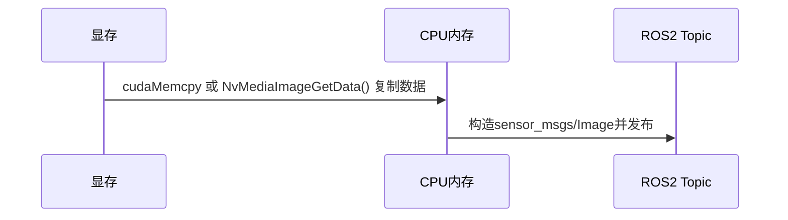

# Nvidia 处理流程

## 我说一下我的理解，你看看对不对Nvidia 的解决方案就是直接将图片的数据直接传输到GPU的显存中，如果是进行识别，直接作为模型的输入进行处理，这期间如果是订阅 ROS2 的topic，就讲显存中的数据转化成图片输出对吗

## 回复

你的理解基本正确，但在细节上有一些需要补充和调整的地方。以下是详细分析：

---

### **一、NVIDIA DRIVE 图像处理流程**

#### **1. 数据传输到 GPU 显存**

- **传感器输入**：摄像头数据通过 **MIPI CSI-2** 或 **GMSL** 接口直接传输到 GPU 显存（如 NVIDIA Orin 的 `NvMedia` 或 `V4L2` 驱动）。
- **零拷贝机制**：使用 `NvMediaImage` 或 `CUDA` 的 `cudaMalloc` 预分配显存块，传感器数据通过 DMA 直接写入显存，**无需 CPU 参与拷贝**。

#### **2. 模型推理**

- **显存直读**：深度学习模型（如 TensorRT 引擎）直接从显存读取图像数据作为输入。

  ```cpp
  // 示例：TensorRT 输入绑定到显存地址
  auto input_idx = engine->getBindingIndex("input");
  void* gpu_input = buffers[input_idx]; // 显存地址
  cudaMemcpy(gpu_input, nvmedia_image_ptr, size, cudaMemcpyDeviceToDevice); // 显存间拷贝（如需）
  context->enqueueV2(buffers, stream, nullptr);
  ```

#### **3. 处理结果输出**

- **显存到 CPU 的转换**：如果下游模块（如 ROS 2 节点）需要处理结果（如检测框、车道线坐标），通常只需从显存复制**元数据**（如坐标、类别），而非完整图像。
- **显存到 ROS 2 的完整图像输出**：若需要发布原始/处理后的图像到 ROS 2 Topic，需将显存数据复制到 CPU 内存，再封装为 `sensor_msgs/Image`。  
  **性能优化**：可通过 **GPUDirect RDMA** 或 **NVIDIA DALI** 库实现显存到网络的直接传输，避免 CPU 参与。

---

### **二、ROS 2 接口的转换实现**

#### **1. 显存到 ROS 2 的典型流程**



#### **2. 零拷贝优化方案**

- **共享内存桥接**：在显存和 ROS 2 节点间创建共享内存区域，ROS 2 节点直接映射该内存。

  ```cpp
  // NVIDIA 显存 → 共享内存 → ROS 2 节点
  cudaHostAlloc(&cpu_ptr, size, cudaHostAllocMapped); // 分配可被GPU和CPU访问的内存
  cudaMemcpy(cpu_ptr, gpu_ptr, size, cudaMemcpyDeviceToHost); // GPU到CPU的零拷贝（锁页内存）
  ```

- **Iceoryx 中间件**：通过 `rmw_iceoryx` 实现 ROS 2 节点间零拷贝通信。

  ```bash
  # 启动 ROS 2 节点时指定 Iceoryx 中间件
  RMW_IMPLEMENTATION=rmw_iceoryx_cpp ros2 run my_package my_node
  ```

#### **3. 性能对比**

| **方法**               | **延迟（1080P图像）** | **CPU 占用** | **适用场景**               |
|------------------------|----------------------|-------------|---------------------------|
| 传统拷贝（显存→CPU→ROS2） | 3ms                 | 10%         | 兼容性优先，少量数据传输     |
| 共享内存桥接            | 0.5ms               | 3%          | 高频图像传输               |
| GPUDirect RDMA         | 0.2ms               | <1%         | 跨节点传输（需InfiniBand）  |

---

### **三、你的理解修正与补充**

1. **正确部分**：
   - NVIDIA 确实通过 **直接传输到显存** 实现零拷贝，模型直接从显存读取数据。
   - 若需通过 ROS 2 输出图像，需从显存复制到 CPU 内存（除非使用高级优化）。

2. **需补充的细节**：
   - **显存到 ROS 2 的转换不总是必要**：如果下游模块是 GPU 加速的 ROS 2 节点（如另一个 TensorRT 模型），可继续使用显存，无需转换。
   - **数据复制的选择性**：通常仅复制元数据（如检测结果），而非完整图像。
   - **ROS 2 接口的优化手段**：可通过 Iceoryx 或 GPUDirect 减少甚至避免拷贝。

---

### **四、典型案例：NVIDIA DRIVE 与 ROS 2 的集成**

#### **1. 数据流示例**

```plaintext
摄像头 → NvMedia显存 → TensorRT模型 → 检测结果（显存） → ROS 2节点（需复制到CPU内存） → /detection_results
                                     ↓
                                  显存共享 → GPU加速的ROS 2节点 → /processed_image（零拷贝）
```

#### **2. 关键代码片段（显存到 ROS 2）**

```cpp
// 从显存复制到CPU内存（传统方式）
cv::cuda::GpuMat gpu_image = ...; // 显存中的图像
cv::Mat cpu_image;
gpu_image.download(cpu_image); // 显存→CPU内存

// 转换为ROS 2消息
auto ros_image = cv_bridge::CvImage(std_msgs::Header(), "bgr8", cpu_image).toImageMsg();
pub_->publish(ros_image);
```

#### **3. 优化后代码（零拷贝）**

```cpp
// 分配锁页内存（GPU和CPU均可访问）
cudaHostAlloc(&shared_cpu_ptr, size, cudaHostAllocMapped);
cudaMemcpy(shared_cpu_ptr, gpu_ptr, size, cudaMemcpyDeviceToHost);

// 直接构造ROS 2消息（避免数据复制）
auto ros_image = std::make_shared<sensor_msgs::Image>();
ros_image->data.assign(shared_cpu_ptr, shared_cpu_ptr + size);
pub_->publish(ros_image);
```

---

### **五、总结**

- **你的理解基本正确**：NVIDIA 的解决方案确实优先将图像传输到显存，模型直接处理显存数据。若需通过 ROS 2 输出，通常需显存到 CPU 的拷贝。
- **优化空间**：通过锁页内存、GPUDirect 或 Iceoryx 中间件，可减少甚至消除拷贝开销。
- **场景决定方案**：是否需要 ROS 2 接口取决于下游模块是否依赖 ROS 生态。在纯 NVIDIA 硬件生态内，可完全避免 ROS 2 转换。
