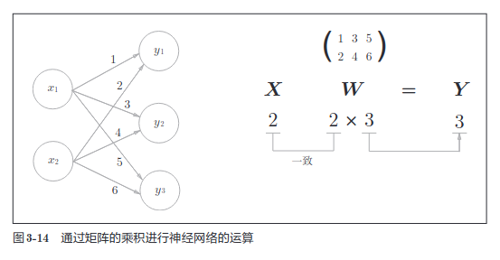

## 激活函数

$y$ = $h(b+w_1x_1 + w_2x_2)$  
b 是被称为偏置的参数，用于控制神经元被激活的容易程度；而 w1 和 w2
是表示各个信号的权重的参数，用于控制各个信号的重要性。


输入信号的总和会被函数 h(x) 转换，转换后的值就是输出 y。

刚才登场的 h（x）函数会将输入信号的总和转换为输出信号，这种函数
一般称为激活函数（activation function）。如“激活”一词所示，激活函数的
作用在于决定如何来激活输入信号的总和

### 阶跃函数
```
def step_function(x):
    if x > 0:
        return 1
    else:
        return 0
```
这个实现简单易于理解， 但参数x只能接受实数，但不能接受参数为 Numpy数组， 比如 `step_function(np.array([1.0 2.0]))`。 为了方便后面的操作， 我们把它改为支持 Numpy 数组的实现
```
def step_function(x):
    y = x > 0
    return y.astype(np.int)
```

### sigmod函数

神经网络中经常使用的一个激活函数就是sigmod函数

$h(x)$ = $1 \over 1 + exp(-x)$

```
def sigmod(x):
    return 1/(1 + np.exp(-x))
```

这个实现没有什么难度， 当 x 为 Numpy 数组时， 结果也是正确的

sigmoid 函数是一条平
滑的曲线，输出随着输入发生连续性的变化。而阶跃函数以 0 为界，输出发
生急剧性的变化。sigmoid 函数的平滑性对神经网络的学习具有重要意义

另一个不同点是，相对于阶跃函数只能返回 0 或 1，sigmoid 函数可以返
回 0.731 . . .、0.880 . . . 等实数（这一点和刚才的平滑性有关）。也就是说，感
知机中神经元之间流动的是 0 或 1 的二元信号，而神经网络中流动的是连续
的实数值信号。

阶跃函数和 sigmoid 函数还有其他共同点，就是两者均为非线性函数。
sigmoid 函数是一条曲线，阶跃函数是一条像阶梯一样的折线，两者都属于
非线性的函数

### ReLU函数
阶跃函数和 sigmoid 函数。在
神经网络发展的历史上，sigmoid 函数很早就开始被使用了，而最近则主要
使用 ReLU（Rectified Linear Unit）函数。
```
def relu(x):
    if x > 0:
        return x
    else:
        return 0

# 为了方便 numpy
def relu(x):
    return np.maximum(x, 0)
```

### 神经网络的内积



结点的个数对应着转换矩阵的列数， 每一列对应着一个结点的参数 
矩阵的行数对应着每个节点输入参数的个数

$a_1^{(1)}=w_{1 1}^{(1)}x_1+w_{1 2}^{(1)}x_2+b_1^{(1)}$

上角的 表示层数， (1) 表示为第一层的权重

下角的 第一个参数 表示 输出层的 第几个神经元
下角的 第二个参数 表示 输入层的 第几个神经元

整个神经网络的表示

```python
def init_network():
    network = {}
    network["w1"] = np.array([[0.1, 0.3, 0.5], [0.2, 0.4, 0.6]])
    network["b1"] = np.array([0.1, 0.2, 0.3])
    network["w2"] = np.array([[0.1, 0.4], [0.2, 0.5], [0.3, 0.6]])
    network["b2"] = np.array([0.1, 0.2])
    network["w3"] = np.array([[0.1, 0.3], [0.2, 0.4]])
    network["b3"] = np.array([0.1, 0.2])
    return network

def forward(network, x):
    W1, W2, W3 = network["w1"],network["w2"],network["w3"]
    b1, b2, b3 = network["b1"],network["b2"],network["b3"]

    a1 = np.dot(x, W1) + b1
    z1 = sigmod(a1)
    a2 = np.dot(z1, W2) + b2
    z2 = sigmod(a2)
    a3 = np.dot(z2, W3) + b3
    y = identity_function(a3)

    return y

if __name__ == "__main__":
    network = init_network()
    x = np.array([1.0, 0.5])
    y = forward(network, x)
    print(y)
```

这里定义了 init_network() 和 forward() 函数。init_network() 函数会进
行权重和偏置的初始化，并将它们保存在字典变量 network 中。这个字典变
量 network 中保存了每一层所需的参数（权重和偏置）。forward() 函数中则封
装了将输入信号转换为输出信号的处理过程。
另外，这里出现了 forward（前向）一词，它表示的是从输入到输出方向
的传递处理。后面在进行神经网络的训练时，我们将介绍后向（backward，
从输出到输入方向）的处理。
至此，神经网络的前向处理的实现就完成了。通过巧妙地使用 NumPy
多维数组，我们高效地实现了神经网络

### 输出层的设计
神经网络可以用在分类问题和回归问题上，不过需要根据情况改变输出
层的激活函数。一般而言，回归问题用恒等函数，分类问题用 softmax 函数。

恒等函数会将输入按原样输出，对于输入的信息，不加以任何改动地直
接输出。因此，在输出层使用恒等函数时，输入信号会原封不动地被输出。

分类问题中使用softmax函数

$y_i = {{e^{a_k}} \over {\sum_{i=1}^ne^{a_i}}}$

假设输出层共有 n 个神经元，计算第 k 个神经元的输出 yk。 分子是输入信号 a k 的指数函数，分母是所有输入信号的指数
函数的和。
```
def softmax(a):
    exp_a = np.exp(a)
    sum_exp_a = np.sum(exp_a)
    y = exp_a / sum_exp_a
    return y
```

上面的 softmax 函数的实现虽然正确描述了公式，但在计算机的运算
上有一定的缺陷。这个缺陷就是溢出问题。softmax 函数的实现中要进行指
数函数的运算，但是此时指数函数的值很容易变得非常大。比如，$e^{10}$ 的值
会超过 20000，$e^{100}$ 会变成一个后面有 40 多个 0 的超大值，$e^{1000}$ 的结果会返回
一个表示无穷大的 inf。如果在这些超大值之间进行除法运算，结果会出现“不确定”的情况。

$y_k$ = $e^{a_k} \over {\sum_{i=1}^ne^{a_i}}$ = $Ce^{a^k} \over C \sum_{i=1}^ne^{a_i}$ 
= $e^{a_k + logC} \over \sum_{i=1}^ne^{a_i+logC}$ = $e^{a_k + C^*} \over \sum_{i=1}^ne^{a_i+C^*}$  

